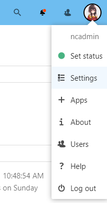
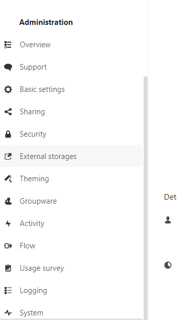
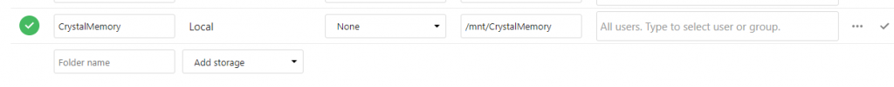

https://www.youtube.com/watch?v=G21w49zLnM0&t=443s

The video above shows how to add a mount point to NextCloud. But for an existing dataset, the procedure is its own thing — and worth writing down.

In my case I had a dataset (`CrystalMemory`) backed by SMB, and wanted to expose it to NextCloud as-is.

Step 1: open Edit Permissions.

Set the dataset's user to `www` and group to `www`. Don't forget to tick **Apply User** and **Apply Group**, otherwise the change won't actually persist.

Step 2: configure the mount point.

`Source` is the dataset path you just adjusted. `Destination` is the path inside the jail — generally `mnt/<your pool>/iocage/jails/<your nextcloud>/root/...`. The trailing portion is up to you. I went with `mnt/<your pool>/iocage/jails/<your nextcloud>/root/mnt/CrystalMemory`; the `mnt/CrystalMemory` part is arbitrary and could be `/media` like in the video.

Step 3: enable the service. Open NextCloud, click your avatar, and choose **Apps**.

Make sure **External Storage** is enabled.

If it isn't, click **Disabled apps** and turn it on.

Open **Settings**.

Under the Administration section, choose **External storages**.

Add the mount point you just defined.

Back in the main view, the new storage is now available.

