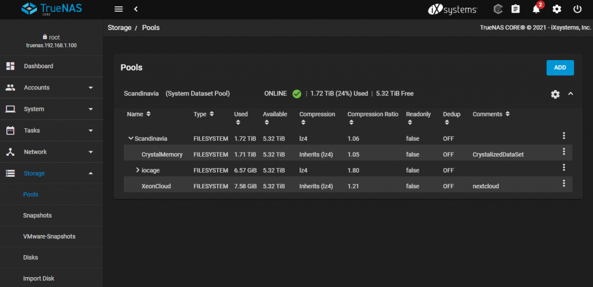
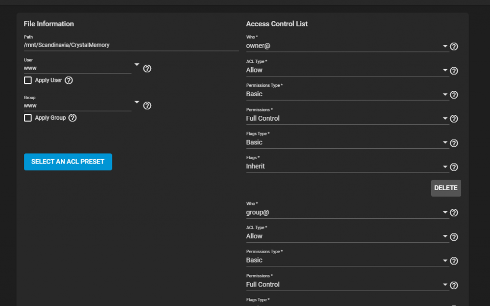
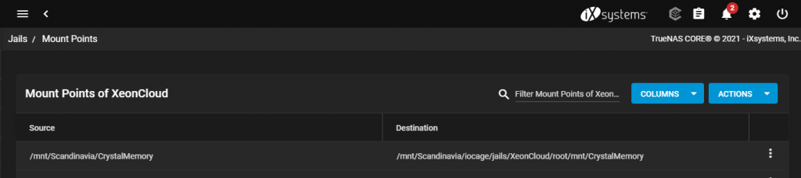
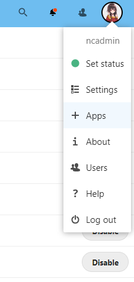
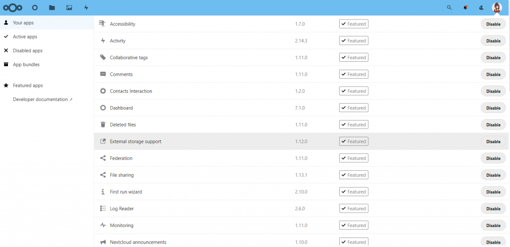
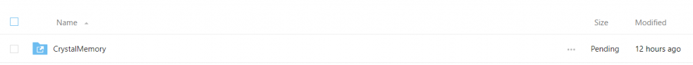

https://www.youtube.com/watch?v=G21w49zLnM0&t=443s

上の動画では NextCloud にマウントポイントを追加する方法を紹介している。ただし、既存のデータセットを追加する場合は別途手順をまとめておく価値がある。

筆者の場合、SMB で使っていたデータセット（`CrystalMemory`）をそのまま NextCloud から見えるようにしたかった。

ステップ 1: Edit Permissions を開く。

データセットの User を `www`、Group を `www` に変更する。**Apply User** と **Apply Group** にチェックを入れるのを忘れない。チェックしないと変更は保存されない。

ステップ 2: Mount Point を設定する。

`Source` は今変更したデータセットのパス。`Destination` は Jail 内のパスで、たいていは `mnt/<your pool>/iocage/jails/<your nextcloud>/root/...` の形になる。末尾は自由に決めてよい。ここでは `mnt/<your pool>/iocage/jails/<your nextcloud>/root/mnt/CrystalMemory` とした。`mnt/CrystalMemory` の部分は任意で、動画の例のように `/media` でもよい。

ステップ 3: サービスを有効化する。NextCloud にログインしてアバターをクリックし、**Apps** を選ぶ。

**External Storage** が有効になっていることを確認する。

無効になっている場合は **Disabled apps** から有効化する。

**Settings** を選ぶ。

Administration セクションから **External storages** を選ぶ。

先ほどの Mount Point を追加する。

元の画面に戻ると追加されているはず。

