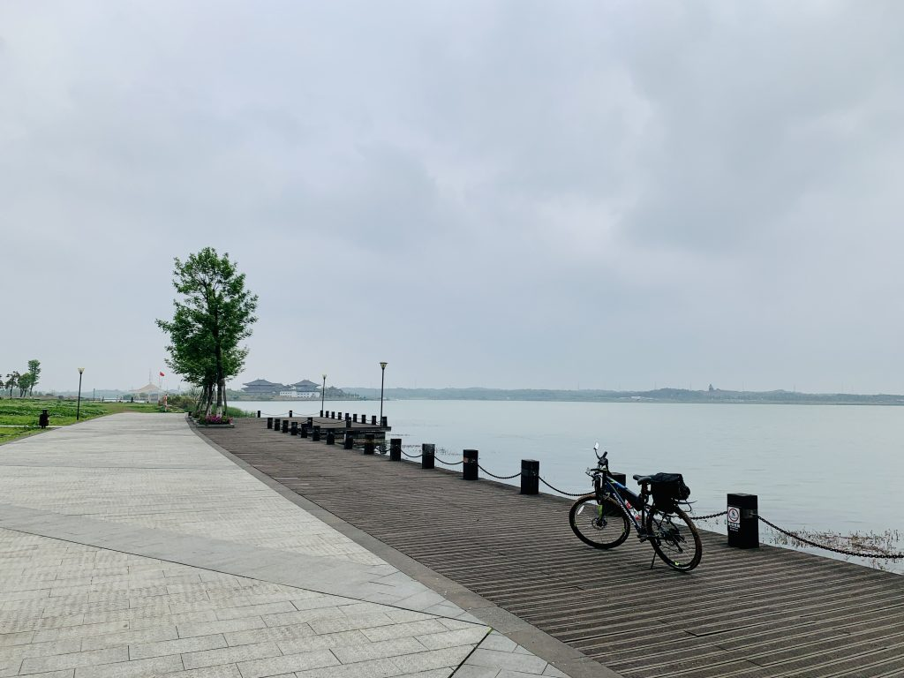
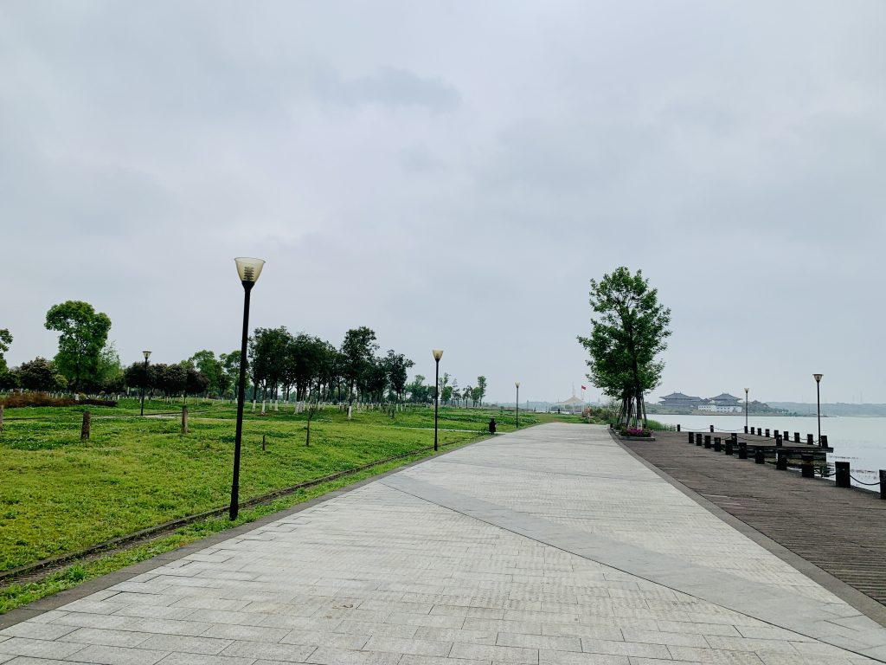

  During Changsha's plum-rain season the sky is always overcast, perpetually about to rain but never quite doing it — that's exactly what the day was like when I reached Songya Lake. Before coming here I never imagined Changsha could hide a lake this large. If not for the bicycle, I might never have found it.  Because of the cloudy weather, there were hardly any people along the lakeside. The ride was smooth. There's also a bike-rental spot here; I often saw families pedaling around the lake on big four-wheel cycles. Being lakeside, the terrain has no real ups and downs — flat all the way. The wetlands along the bank have their own kind of charm: under the heavy sky, life slowly takes shape. The scenery never repeats itself; every stretch is a new visual.   Looking back, I realized I had circled the entire lake.

| Criterion | Rating |
| --- | --- |
| Crowd density | Moderate |
| Road comfort | Excellent — smooth all the way, with a dedicated bike lane |
| Riding distance | Moderate |
| Overall recommendation | A great place to unwind |
