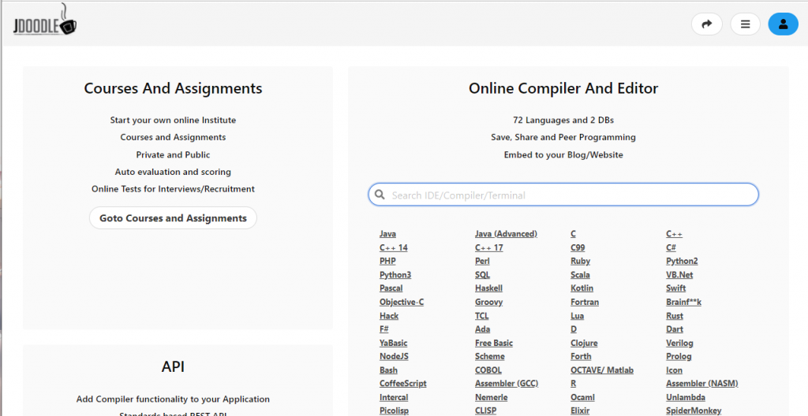
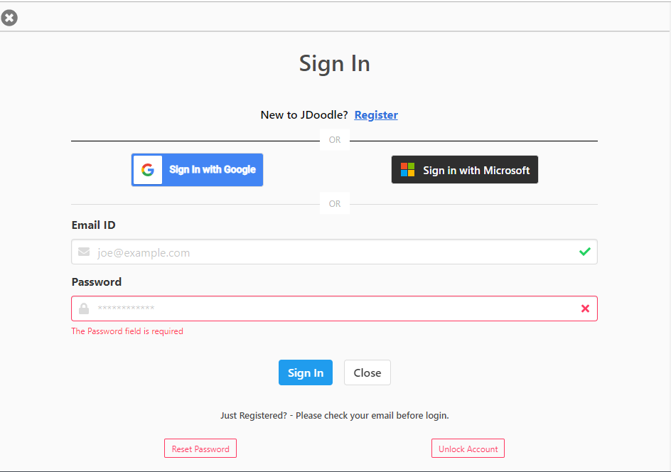
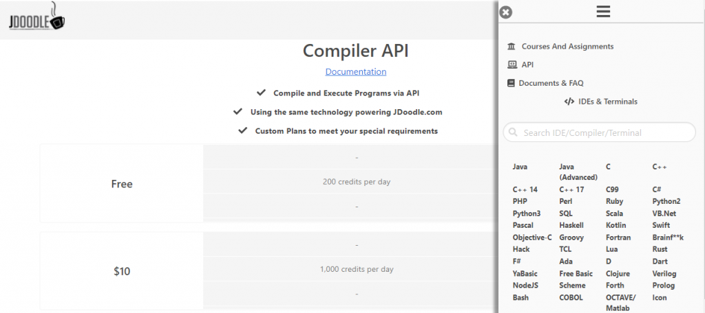
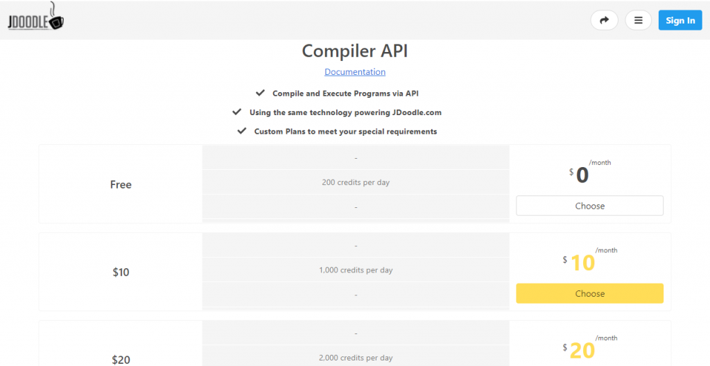
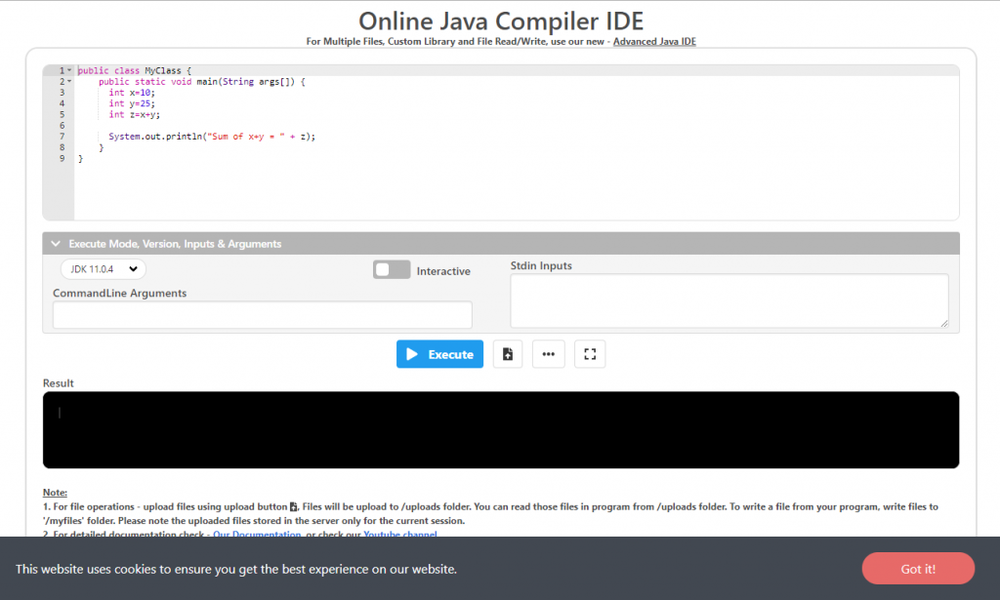
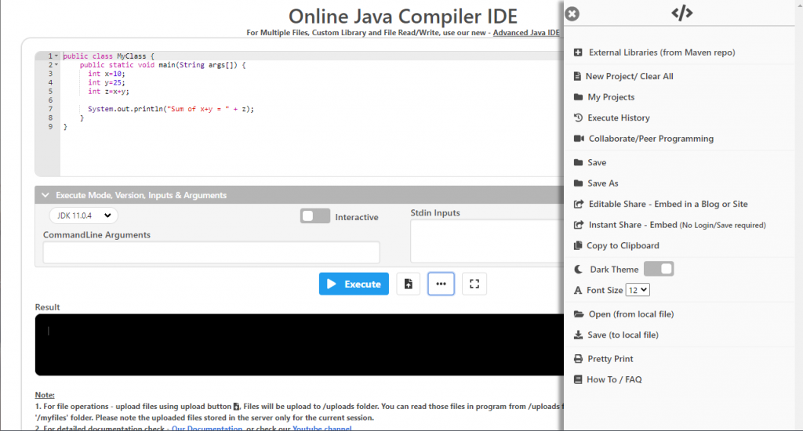
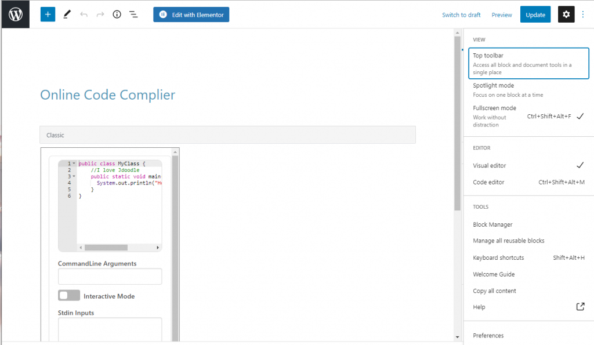
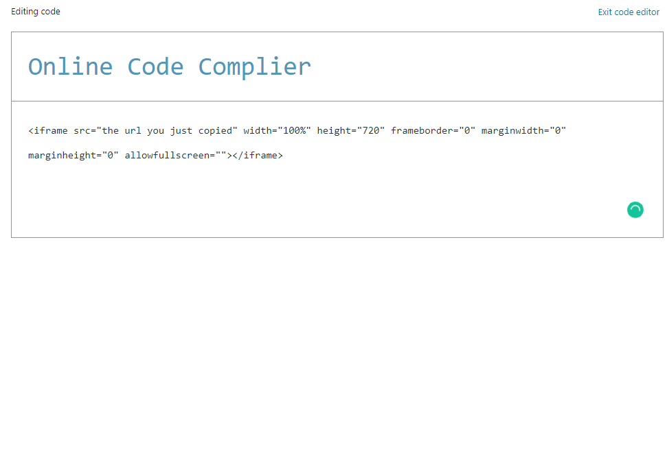
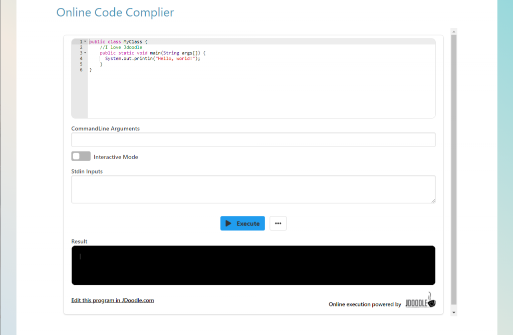

推荐资料：  
https://www.youtube.com/watch?v=LeBqxEbM2dg  
https://docs.jdoodle.com/  
https://www.jdoodle.com/

第一步：注册jdoodle账号。



点击Register开始注册



第二步，登录成功后点击菜单，选择API



白嫖就完事了，200个文件一天可以撑死



选择Free直接白嫖

第三步，上传默认代码，分享到自己的网页



先点下面的三个小点，然后保存代码



再点击Editable Share嵌入自己的网页中


会弹出来一个url，直接放进自己的网页就可以啦



用Wordpress新建一个网页，选择 Code Editor



按照这个格式放进自己的网页，记得用自己刚复制的代码替换"the url you just copied"并保存

```
<iframe src="the url you just copied" width="100%" height="720" frameborder="0" marginwidth="0" marginheight="0" allowfullscreen=""></iframe>
```



打开自己的网页，就可以看到了
