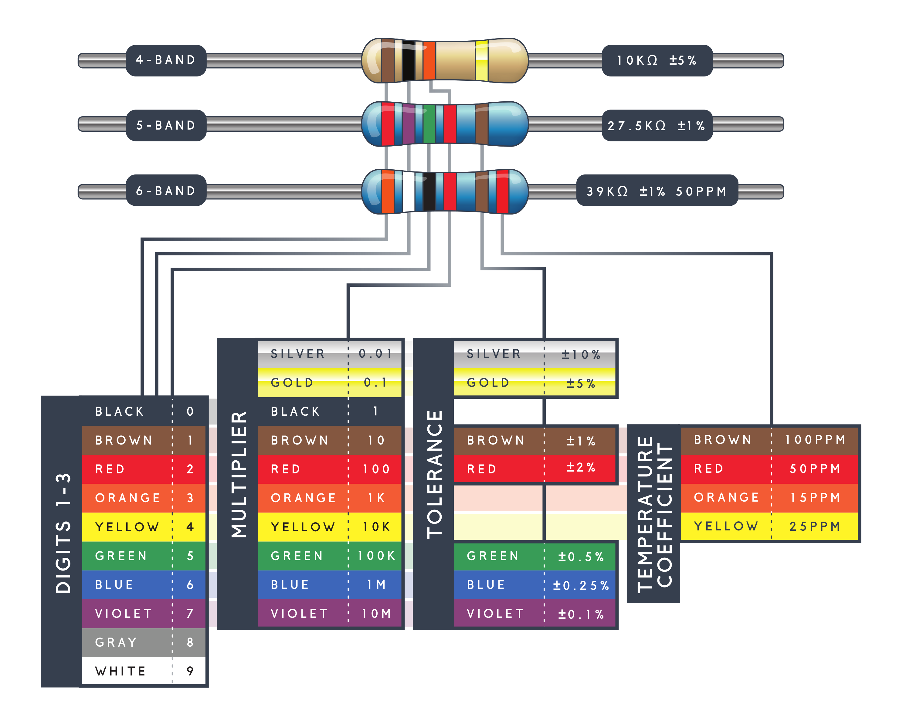

## Ohm's law

## Breadboards

terminal line and power rails

## Resistors

 Another common coding system is **E96**, and it's the most cryptic of the bunch. E96 resistors will be marked with three characters -- two numbers at the beginning and a letter at the end. The two numbers tell you the first _three_ digits of the value, by corresponding to one of the not-so-obvious values on this lookup table.

Code

Value

 

Code

Value

 

Code

Value

 

Code

Value

 

Code

Value

 

Code

Value

01

100

 

17

147

 

33

215

 

49

316

 

65

464

 

81

681

02

102

 

18

150

 

34

221

 

50

324

 

66

475

 

82

698

03

105

 

19

154

 

35

226

 

51

332

 

67

487

 

83

715

04

107

 

20

158

 

36

232

 

52

340

 

68

499

 

84

732

05

110

 

21

162

 

37

237

 

53

348

 

69

511

 

85

750

06

113

 

22

165

 

38

243

 

54

357

 

70

523

 

86

768

07

115

 

23

169

 

39

249

 

55

365

 

71

536

 

87

787

08

118

 

24

174

 

40

255

 

56

374

 

72

549

 

88

806

09

121

 

25

178

 

41

261

 

57

383

 

73

562

 

89

825

10

124

 

26

182

 

42

267

 

58

392

 

74

576

 

90

845

11

127

 

27

187

 

43

274

 

59

402

 

75

590

 

91

866

12

130

 

28

191

 

44

280

 

60

412

 

76

604

 

92

887

13

133

 

29

196

 

45

287

 

61

422

 

77

619

 

93

909

14

137

 

30

200

 

46

294

 

62

432

 

78

634

 

94

931

15

140

 

31

205

 

47

301

 

63

442

 

79

649

 

95

953

16

143

 

32

210

 

48

309

 

64

453

 

80

665

 

96

976

  The letter at the end represents a multiplier, matching up to something on this table:

Letter

Multiplier

 

Letter

Multiplier

 

Letter

Multiplier

Z

0.001

 

A

1

 

D

1000

Y or R

0.01

 

B or H

10

 

E

10000

X or S

0.1

 

C

100

 

F

100000

## LED

### LED Wavelength

The second row on this table tells us the wavelength of the light. Wavelength is basically a very precise way of explaining what color the light is. There may be some variation in this number so the table gives us a minimum and a maximum. In this case it's 620 to 625nm, which is just at the lower red end of the spectrum (620 to 750nm). Again, we'll go over wavelength in more detail in the [delving deeper](https://learn.sparkfun.com/tutorials/light-emitting-diodes-leds/delving-deeper) section.

### LED Brightness

The last row (labeled "Luminous Intensity") is a measure of how bright the LED can get. The unit mcd, or **millicandela**, is a standard unit for measuring the intensity of a light source. This LED has an maximum intensity of 200 mcd, which means it's just bright enough to get your attention but not quite flashlight bright. At 200 mcd, this LED would make a good indicator.

## Wire LED in Arduino

**Take the fucking resistors!** There are sample codes in Arduino
