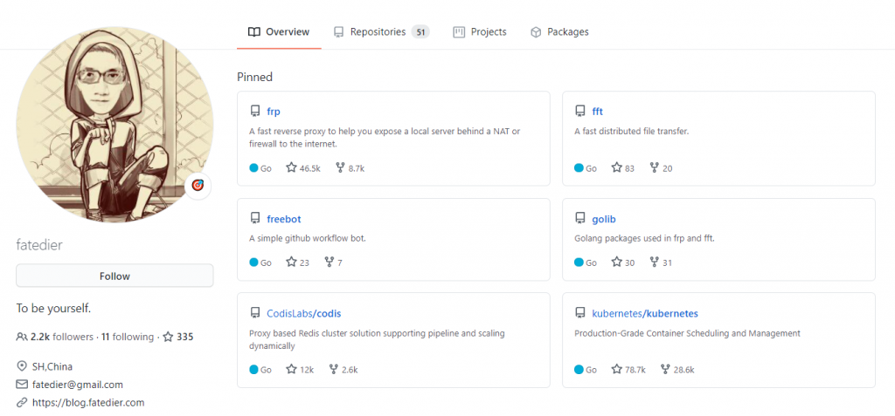
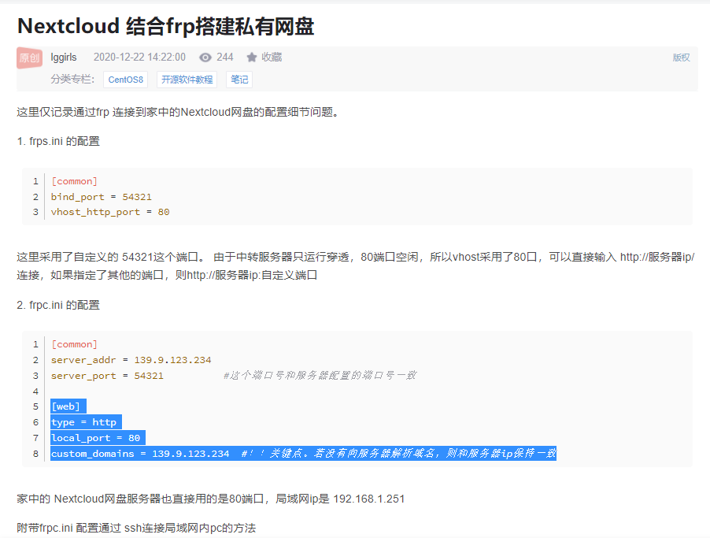
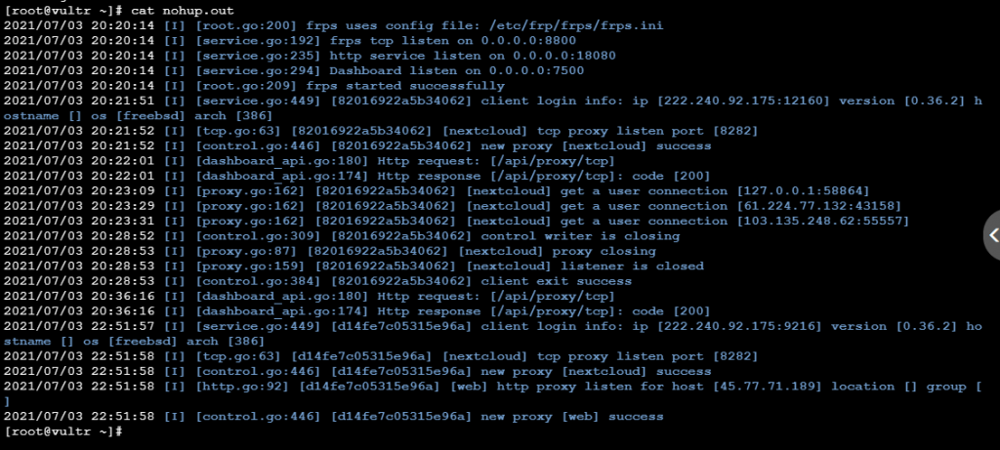

Acknowledgements:

The Great One: fatedier, the author of frp, who massively simplifies the tedium of reverse-proxy setup.
[https://github.com/fatedier/frp](https://github.com/fatedier/frp)

The blog that finally cleared up my confusion: `custom_domains = 139.9.123.234` _#!! the key bit. If you haven't pointed a domain at the server, just use the server's IP._ [https://blog.csdn.net/lggirls/article/details/111544017](https://blog.csdn.net/lggirls/article/details/111544017)

Other helpful blogs:
[https://blog.csdn.net/Yuan\_Hang723/article/details/112254237](https://blog.csdn.net/Yuan_Hang723/article/details/112254237)
[https://blog.csdn.net/m0\_37520980/article/details/89228361](https://blog.csdn.net/m0_37520980/article/details/89228361)

Intranet penetration up and running.
