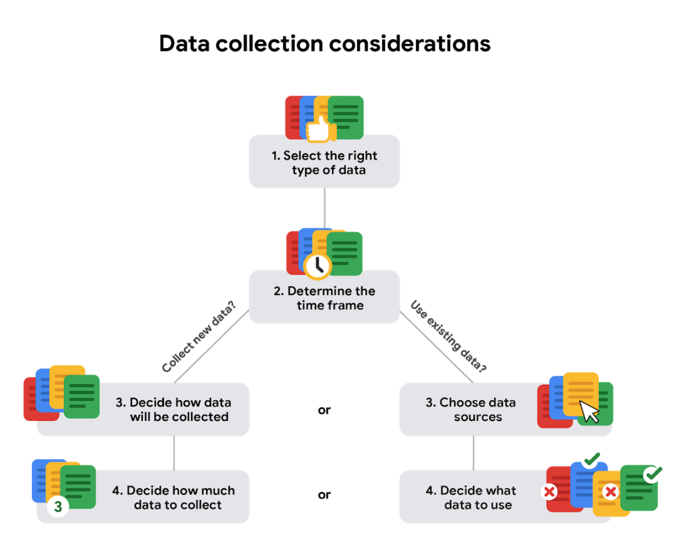
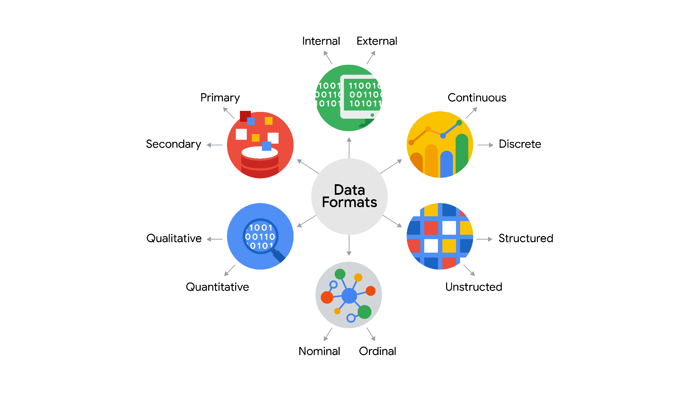
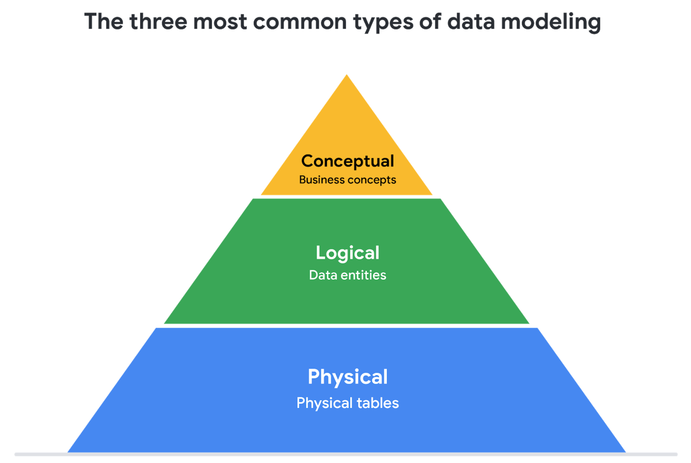
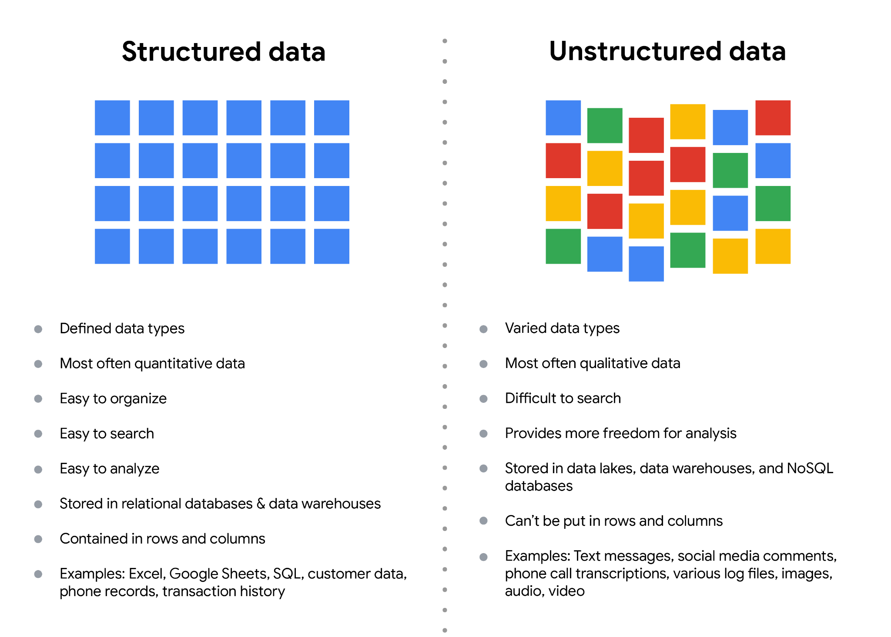

Week 10

How data is collected:

- Interview
- Observations \(most used\)
- Forms
- Survey
- Questionnaires
- Cockies

Data collection considerations

- How the data will be collected
- Choose data sources
- Decide what data to use
- How much data to collect
- Select the right data type: population or sample
- Determine the time frame

Types of data:

- First\-party data: Data that was collected in the first place
- Second\-party data: Data collected by a group directly from its audience and then told
- Third\-party data: Data collected from outside sources who did not collect it directly

Quantitative data: Data can be measured, or easily expressed using numbers\.

- Discrete data: Data that is counted and has a limited number of values\.
- Continuous data: Data that is measured and can have almost any numeric value\.

Qualitative data: Data cannot be measured, or easily expressed using numbers\.

- Nominal data: A type of qualitative data that is categorized without a set order
- Ordinal data: A type of qualitative data with a set order or scale

Internal data: Data that lives in a company’s own system

External data: Data that lives and is generated outside of an organization

## Data format examples

As with most things, it is easier for definitions to click when we can pair them with real life examples\. Review each definition first and then use the examples to lock in your understanding of each data format\.

the following table highlights the differences between primary and secondary data and examples of each

Data Format Classification

Definition

Examples

Primary data

Collected by a researcher from first\-hand sources

\- Data from an interview you conducted

\- Data from a survey returned from 20 participants

\- Data from questionnaires you got back from a group of workers

Secondary data

Gathered by other people or from other research

\- Data you bought from a local data analytics firm’s customer profiles

\- Demographic data collected by a university

\- Census data gathered by the federal government

the following table highlights the differences between internal and external data and examples of each

Data Format Classification

Definition

Examples

Internal data

Data that lives inside a company’s own systems

\- Wages of employees across different business units tracked by HR

\- Sales data by store location

\- Product inventory levels across distribution centers

External data

Data that lives outside of a company or organization

\- National average wages for the various positions throughout your organization

\- Credit reports for customers of an auto dealership

the following table highlights the differences between continuous and discrete data and examples of each

Data Format Classification

Definition

Examples

Continuous data

Data that is measured and can have almost any numeric value

\- Height of kids in third grade classes \(52\.5 inches, 65\.7 inches\)

\- Runtime markers in a video

\- Temperature

Discrete data

Data that is counted and has a limited number of values

\- Number of people who visit a hospital on a daily basis \(10, 20, 200\)

\- Room’s maximum capacity allowed

\- Tickets sold in the current month

the following table highlights the differences between qualitative and quantitative data and examples of each

Data Format Classification

Definition

Examples

Qualitative

Subjective and explanatory measures of qualities and characteristics

\- Exercise activity most enjoyed

\- Favorite brands of most loyal customers

\- Fashion preferences of young adults

Quantitative

Specific and objective measures of numerical facts

\- Percentage of board certified doctors who are women

\- Population of elephants in Africa

\- Distance from Earth to Mars

the following table highlights the differences between nominal and ordinal data and examples of each

Data Format Classification

Definition

Examples

Nominal

A type of qualitative data that isn’t categorized with a set order

\- First time customer, returning customer, regular customer

\- New job applicant, existing applicant, internal applicant

\- New listing, reduced price listing, foreclosure

Ordinal

 A type of qualitative data with a set order or scale

\- Movie ratings \(number of stars: 1 star, 2 stars, 3 stars\)

\- Ranked\-choice voting selections \(1st, 2nd, 3rd\)

\- Income level \(low income, middle income, high income\)

the following table highlights the differences between structured and unstructured data and examples of each

Data Format Classification

Definition

Examples

Structured data

Data organized in a certain format, like rows and columns

\- Expense reports

\- Tax returns

\- Store inventory

Unstructured data

Data that isn’t organized in any easily identifiable manner

\- Social media posts

\- Emails

\- Videos

## Levels of data modeling

Each level of data modeling has a different level of detail\.

1. __Conceptual data modeling__ gives a high\-level view of the data structure, such as how data interacts across an organization\. For example, a conceptual data model may be used to define the business requirements for a new database\. A conceptual data model doesn't contain technical details\.
2. __Logical data modeling__ focuses on the technical details of a database such as relationships, attributes, and entities\. For example, a logical data model defines how individual records are uniquely identified in a database\. But it doesn't spell out actual names of database tables\. That's the job of a physical data model\.
3. __Physical data modeling__ depicts how a database operates\. A physical data model defines all entities and attributes used; for example, it includes table names, column names, and data types for the database\.

More information can be found in this[ comparison of data models​\.](https://www.1keydata.com/datawarehousing/data-modeling-levels.html)

## Data\-modeling techniques

There are a lot of approaches when it comes to developing data models, but two common methods are the __Entity Relationship Diagram \(ERD\)__ and the __Unified Modeling Language \(UML\) __diagram\. ERDs are a visual way to understand the relationship between entities in the data model\. UML diagrams are very detailed diagrams that describe the structure of a system by showing the system's entities, attributes, operations, and their relationships\. As a junior data analyst, you will need to understand that there are different data modeling techniques, but in practice, you will probably be using your organization’s existing technique\.

__Wide data is preferred when  __

__Long data is preferred when __

Creating tables and charts with a few variables about each subject

Storing a lot of variables about each subject\. For example, 60 years worth of interest rates for each bank

Comparing straightforward line graphs

Performing advanced statistical analysis or graphing
