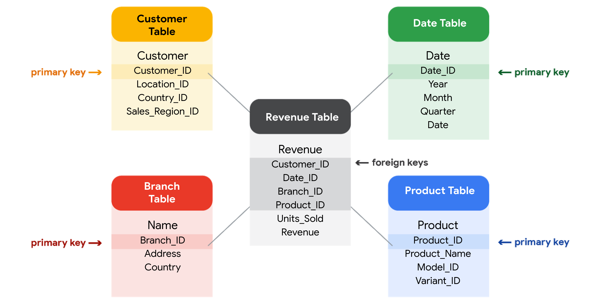

Week 12

All about databases.

Metadata: data about data

Relational database: a database that contains a series of related tables that can be connected via their relationships.

Primary key: An identifier that references a column in which each value is unique.

Foreign key: A field within a table that is a primary key in another table.

3 Common types of metadata:

- Descriptive: The metadata that describes a piece of data and can be used to identify it at a later point in time. (ID number, ISBN)
- Structural: Metadata that indicates how a piece of data is organized and whether it is part of one, or more than one, data collection. (index, database belongs)
- Administrative: Metadata that indicated the technical source of a digital asset. (when  the data was taken, the methodologies, the size.)

## Elements of metadata

Before looking at metadata examples, it is important to understand what type of information metadata typically provides.

### __Title and description__

What is the name of the file or website you are examining? What type of content does it contain?

### __Tags and categories__

What is the general overview of the data that you have? Is the data indexed or described in a specific way?

### __Who created it and when__

Where did the data come from, and when was it created? Is it recent, or has it existed for a long time?

### __Who last modified it and when__

Were any changes made to the data?  If yes, were the modifications recent?

### __Who can access or update it__

Is this dataset public? Are special permissions needed to customize or modify the dataset?

## Examples of metadata

In today’s digital world, metadata is everywhere, and it is becoming a more common practice to provide metadata on a lot of media and information you interact with. Here are some real-world examples of where to find metadata:

### __Photos__

Whenever a photo is captured with a camera, metadata such as camera filename, date, time, and geolocation are gathered and saved with it.

### __Emails__

When an email is sent or received, there is lots of visible metadata such as subject line, the sender, the recipient and date and time sent. There is also hidden metadata that includes server names, IP addresses, HTML format, and software details.

### __Spreadsheets and documents__

Spreadsheets and documents are already filled with a considerable amount of data so it is no surprise that metadata would also accompany them. Titles, author, creation date, number of pages, user comments as well as names of tabs, tables, and columns are all metadata that one can find in spreadsheets and documents.

### __Websites__

Every web page has a number of standard metadata fields, such as tags and categories, site creator’s name, web page title and description, time of creation and any iconography.

### __Digital files__

Usually, if you right-click on any computer file, you will see its metadata. This could consist of the file name, file size, date of creation and modification, and type of file.

### __Books__

Metadata is not only digital. Every book has a number of standard metadata on the covers and inside that will inform you of its title, author’s name, a table of contents, publisher information, copyright description, index, and a brief description of the book’s contents.

Metadata is used to create consistency, reliability.

Metadata repositories:

- Describe the state and location of the metadata.
- Describe the structure of the tables inside.
- Describe how the data flows through the repository.
- Keep track of who accessed the metadata and when.

Data governance: A process to ensure the formal management of a company’s data assets.

Import data from spreadsheets and databases:

CSV: Comma-separated values

## Exploring public datasets

Open data helps create a lot of public datasets that you can access to make data-driven decisions. Here are some resources you can use to start searching for public datasets on your own:

- The[ Google Cloud Public Datasets](https://cloud.google.com/public-datasets) allow data analysts access to high-demand public datasets, and make it easy to uncover insights in the cloud.
- The[ Dataset Search](https://datasetsearch.research.google.com/) can help you find available datasets online with keyword searches.
- [Kaggle](https://www.kaggle.com/datasets?utm_medium=paid&utm_source=google.com+search&utm_campaign=datasets&gclid=CjwKCAiAt9z-BRBCEiwA_bWv-L6PpACh6RzmrJjQjmNGCCE7kky1FCtc6Jf1qld-4NwDMYL0WsUyxBoCdwAQAvD_BwE) has an Open Data search function that can help you find datasets to practice with.
- Finally,[ BigQuery](https://cloud.google.com/bigquery/public-data) hosts 150+ public datasets you can access and use.

### __Public health datasets__

1. [Global Health Observatory data](https://www.who.int/data/collections): You can search for datasets from this page or explore featured data collections from the World Health Organization.
2. [The Cancer Imaging Archive (TCIA) dataset](https://cloud.google.com/healthcare/docs/resources/public-datasets/tcia): Just like the earlier dataset, this data is hosted by the Google Cloud Public Datasets and can be uploaded to BigQuery.
3. [1000 Genomes](https://cloud.google.com/life-sciences/docs/resources/public-datasets/1000-genomes): This is another dataset from the Google Cloud Public resources that can be uploaded to BigQuery.

### __Public climate datasets__

1. [National Climatic Data Center](https://www.ncdc.noaa.gov/data-access/quick-links): The NCDC Quick Links page has a selection of datasets you can explore.
2. [NOAA Public Dataset Gallery](https://www.climate.gov/maps-data/datasets): The NOAA Public Dataset Gallery contains a searchable collection of public datasets.

### __Public social-political datasets__

1. [UNICEF State of the World’s Children](https://data.unicef.org/resources/dataset/sowc-2019-statistical-tables/): This dataset from UNICEF includes a collection of tables that can be downloaded.
2. [CPS Labor Force Statistics](https://www.bls.gov/cps/tables.htm): This page contains links to several available datasets that you can explore.
3. [The Stanford Open Policing Project](https://openpolicing.stanford.edu/): This dataset can be downloaded as a .CSV file for your own use.

Sorting data: Arranging data into a meaningful order to make it easier to understand, analyze, and visualize.

Filtering: Showing only the data that meets specific criteria while hiding the rest.
