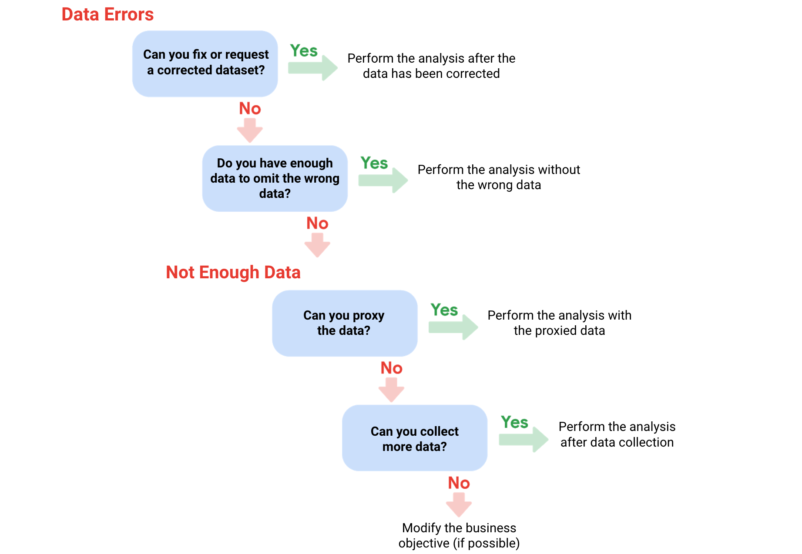

Week 15

**Data integrity**: The accuracy, completeness, consistency, and trustworthiness of data throughout its lifecycle.

**Data replication**: The process of storing data in multiple locations.

**Data transfer**: The process of copying data from a storage device to memory, or from one computer to another.

**Data manipulation**: The process of changing the data to make it more organized and easier to read.

Type of insufficient data:

- Data form only one source
- Data that keeps updating
- Outdated data
- Geographically-limited data

Common ways to address these questions:

- Identify trends with the available data
- Wait for more data if time allows
- Takes with stakeholders and adjust your objective
- Look for a new dataset

Data issue 1: no data

Possible Solutions

Examples of solutions in real life

Gather the data on a small scale to perform a preliminary analysis and then request additional time to complete the analysis after you have collected more data.

If you are surveying employees about what they think about a new performance and bonus plan, use a sample for a preliminary analysis. Then, ask for another 3 weeks to collect the data from all employees.

If there isn’t time to collect data, perform the analysis using proxy data from other datasets.

This is the most common workaround.

If you are analyzing peak travel times for commuters but don’t have the data for a particular city, use the data from another city with a similar size and demographic.

Data issue 2: too little data

Possible Solutions

Examples of solutions in real life

Do the analysis using proxy data along with actual data.

If you are analyzing trends for owners of golden retrievers, make your dataset larger by including the data from owners of labradors.

Adjust your analysis to align with the data you already have.

If you are missing data for 18- to 24-year-olds, do the analysis but note the following limitation in your report: this conclusion applies to adults 25 years and older only.

Data issue 3: wrong data, including data with errors*

Possible Solutions

Examples of solutions in real life

If you have the wrong data because requirements were misunderstood, communicate the requirements again.

If you need the data for female voters and received the data for male voters, restate your needs.

Identify errors in the data and, if possible, correct them at the source by looking for a pattern in the errors.

If your data is in a spreadsheet and there is a conditional statement or boolean causing calculations to be wrong, change the conditional statement instead of just fixing the calculated values.

If you can’t correct data errors yourself, you can ignore the

wrong data and go ahead with the analysis if your sample size is still large enough and ignoring the data won’t cause systematic bias.

If your dataset was translated from a different language and some of the translations don’t make sense, ignore the data with bad translation and go ahead with the analysis of the other data.

* Important note: sometimes data with errors can be a warning sign that the data isn’t reliable. Use your best judgment.

Use the following decision tree as a reminder of how to deal with data errors or not enough data:

This illustration is a decision tree showing four possible decisions to make in order to work around data issues.

 Before you dig deeper into sample size, familiarize yourself with these terms and definitions:

Terminology

Definitions

Population

The entire group that you are interested in for your study. For example, if you are surveying people in your company, the population would be all the employees in your company.

Sample

A subset of your population. Just like a food sample, it is called a sample because it is only a taste. So if your company is too large to survey every individual, you can survey a representative sample of your population.

Margin of error

Since a sample is used to represent a population, the sample’s results are expected to differ from what the result would have been if you had surveyed the entire population. This difference is called the margin of error. The smaller the margin of error, the closer the results of the sample are to what the result would have been if you had surveyed the entire population.

Confidence level

How confident you are in the survey results. For example, a 95% confidence level means that if you were to run the same survey 100 times, you would get similar results 95 of those 100 times. Confidence level is targeted before you start your study because it will affect how big your margin of error is at the end of your study.

Confidence interval

The range of possible values that the population’s result would be at the confidence level of the study. This range is the sample result +/- the margin of error.

Statistical significance

The determination of whether your result could be due to random chance or not. The greater the significance, the less due to chance.

Things to remember when determining the size of your sample

When figuring out a sample size, here are things to keep in mind:

Don’t use a sample size less than 30. It has been statistically proven that 30 is the smallest sample size where an average result of a sample starts to represent the average result of a population.

The confidence level most commonly used is 95%, but 90% can work in some cases.

Increase the sample size to meet specific needs of your project:

For a higher confidence level, use a larger sample size

To decrease the margin of error, use a larger sample size

For greater statistical significance, use a larger sample size

**Note**: Sample size calculators use statistical formulas to determine a sample size. More about these are coming up in the course!  Stay tuned.

Why a minimum sample of 30?

This recommendation is based on the Central Limit Theorem (CLT) in the field of probability and statistics. As sample size increases, the results more closely resemble the normal (bell-shaped) distribution from a large number of samples. A sample of 30 is the smallest sample size for which the CLT is still valid. Researchers who rely on regression analysis – statistical methods to determine the relationships between controlled and dependent variables – also prefer a minimum sample of 30.

Still curious? Without getting too much into the math, check out these articles:

**Central Limit Theorem (CLT)**: This article by Investopedia explains the Central Limit Theorem and briefly describes how it can apply to an analysis of a stock index.

**Sample Size Formula**: This article by Statistics Solutions provides a little more detail about why some researchers use 30 as a minimum sample size.

Sample sizes vary by business problem

Sample size will vary based on the type of business problem you are trying to solve.

For example, if you live in a city with a population of 200,000 and get 180,000 people to respond to a survey, that is a large sample size. But without actually doing that, what would an acceptable, smaller sample size look like?

Would 200 be alright if the people surveyed represented every district in the city?

**Answer**: It depends on the stakes.

A sample size of 200 might be large enough if your business problem is to find out how residents felt about the new library

A sample size of 200 might not be large enough if your business problem is to determine how residents would vote to fund the library

You could probably accept a larger margin of error surveying how residents feel about the new library versus surveying residents about how they would vote to fund it. For that reason, you would most likely use a larger sample size for the voter survey.

Larger sample sizes have a higher cost

You also have to weigh the cost against the benefits of more accurate results with a larger sample size. Someone who is trying to understand consumer preferences for a new line of products wouldn’t need as large a sample size as someone who is trying to understand the effects of a new drug. For drug safety, the benefits outweigh the cost of using a larger sample size. But for consumer preferences, a smaller sample size at a lower cost could provide good enough results.

Knowing the basics is helpful

Knowing the basics will help you make the right choices when it comes to sample size. You can always raise concerns if you come across a sample size that is too small. A sample size calculator is also a great tool for this. Sample size calculators let you enter a desired confidence level and margin of error for a given population size. They then calculate the sample size needed to statistically achieve those results.

Refer to the Determine the Best Sample Size video for a demonstration of a sample size calculator, or refer to the Sample Size Calculator reading for additional information.

**Statistical power**: The probability of getting meaningful results from a test.

**Hypothesis testing**: A way to see if a survey or experiment has meaningful results.

If a test is statistically significant, it means the results of the test are real and not an error caused by random chance.

0.8 at least.

Determine the best sample size.

**Confidence level**: The probability that your sample size accurately reflects the greater population.

95% to 90% confidence level is usually enough.

Hahaha, there are sample size calculator for you to choose.

**Margin of error**: The maximum amount that the sample results are expected to differ from those of the actual population.

Margin of error is counted in two side.
