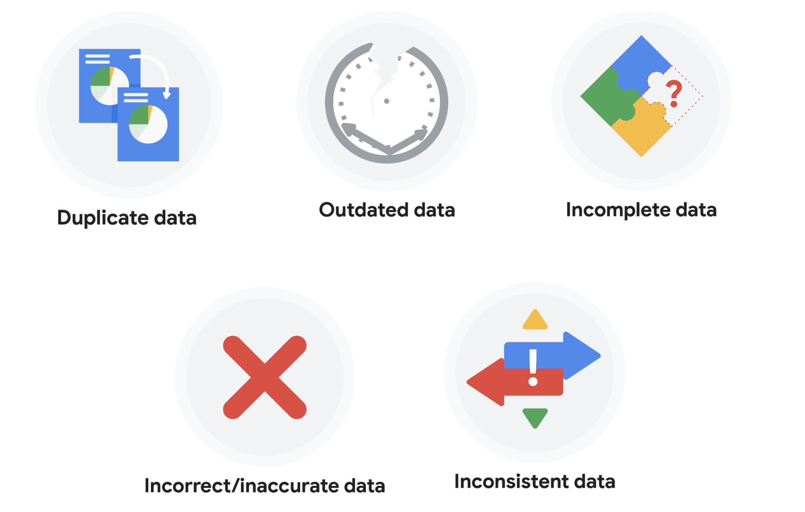
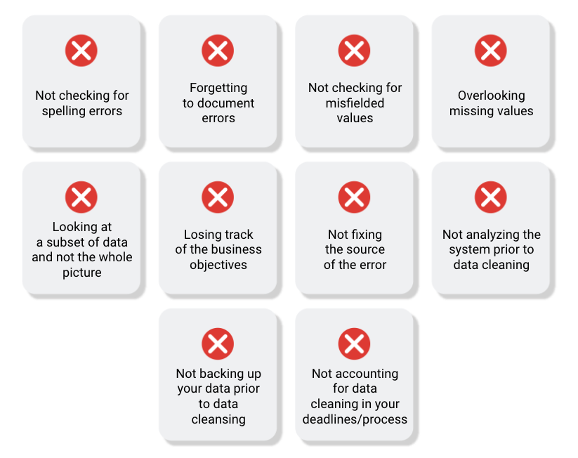

Week16

Dirty data: Data that is incomplete, incorrect, or irrelevant to the problem you’re trying to solve.

Clean data: Data that is coplete, correct, and relevant to the problem you’re trying to solve.

Data engineers: Transform data into a useful format for analysis and give it a reliable infrastructure.

Data warehousing specialists: Develop processes and procedures to effectively store and organize data.

## __Types of dirty data__

### __Duplicate data__

Description

Possible causes

Potential harm to businesses

Any data record that shows up more than once

Manual data entry, batch data imports, or data migration

Skewed metrics or analyses, inflated or inaccurate counts or predictions, or confusion during data retrieval

### __Outdated data__

Description

Possible causes

Potential harm to businesses

Any data that is old which should be replaced with newer and more accurate information

People changing roles or companies, or software and systems becoming obsolete

Inaccurate insights, decision-making, and analytics

### __Incomplete data__

Description

Possible causes

Potential harm to businesses

Any data that is missing important fields

Improper data collection or incorrect data entry

Decreased productivity, inaccurate insights, or inability to complete essential services

### __Incorrect/inaccurate data__

Description

Possible causes

Potential harm to businesses

Any data that is complete but inaccurate

Human error inserted during data input, fake information, or mock data

Inaccurate insights or decision-making based on bad information resulting in revenue loss

### __Inconsistent data__

Description

Possible causes

Potential harm to businesses

Any data that uses different formats to represent the same thing

Data stored incorrectly or errors inserted during data transfer

Contradictory data points leading to confusion or inability to classify or segment customers

### __Business impact of dirty data__

For further reading on the business impact of dirty data, enter the term “dirty data” into your preferred browser’s search bar to bring up numerous articles on the topic. Here are a few impacts cited for certain industries from a previous search:

- Banking: Inaccuracies cost companies between 15% and 25% of revenue ([source](https://sloanreview.mit.edu/article/seizing-opportunity-in-data-quality/)).
- Digital commerce: Up to 25% of B2B database contacts contain inaccuracies ([source](https://www.demandgen.com/dirty-data-what-is-it-costing-you/)).
- Marketing and sales: 8 out of 10 companies have said that dirty data hinders sales campaigns ([source](https://www.dqglobal.com/2011/05/04/obsolete-or-dirty-data/)).
- Healthcare: Duplicate records can be 10% and even up to 20% of a hospital’s electronic health records ([source](https://searchhealthit.techtarget.com/feature/Hospitals-battle-duplicate-medical-records-with-technology)).

Data validation: A tool for checking the accuracy and quality of data before adding or importing it.

Data merging: The process of combinging two or more datasets into a single dataset.

Compatiblity: How well two or more datasets are able to work together.

Questions for data cleaning:

- Do I have all the data I need?
- Does the data I need exist within these datasets?
- Does the data need to be cleaned, or are they ready for me to use?

## Common data-cleaning pitfalls

In this reading, you will learn the importance of data cleaning and how to identify common mistakes. Some of the errors you might come across while cleaning your data could include:

## __Common mistakes to avoid__

- Not checking for spelling errors: Misspellings can be as simple as typing or input errors. Most of the time the wrong spelling or common grammatical errors can be detected, but it gets harder with things like names or addresses. For example, if you are working with a spreadsheet table of customer data, you might come across a customer named “John” whose name has been input incorrectly as “Jon” in some places. The spreadsheet’s spellcheck probably won’t flag this, so if you don’t double-check for spelling errors and catch this, your analysis will have mistakes in it.
- Forgetting to document errors: Documenting your errors can be a big time saver, as it helps you avoid those errors in the future by showing you how you resolved them. For example, you might find an error in a formula in your spreadsheet. You discover that some of the dates in one of your columns haven’t been formatted correctly. If you make a note of this fix, you can reference it the next time your formula is broken, and get a head start on troubleshooting. Documenting your errors also helps you keep track of changes in your work, so that you can backtrack if a fix didn’t work.
- Not checking for misfielded values: A misfielded value happens when the values are entered into the wrong field. These values might still be formatted correctly, which makes them harder to catch if you aren’t careful. For example, you might have a dataset with columns for cities and countries. These are the same type of data, so they are easy to mix up. But if you were trying to find all of the instances of Spain in the country column, and Spain had mistakenly been entered into the city column, you would miss key data points. Making sure your data has been entered correctly is key to accurate, complete analysis.
- Overlooking missing values: Missing values in your dataset can create errors and give you inaccurate conclusions. For example, if you were trying to get the total number of sales from the last three months, but a week of transactions were missing, your calculations would be inaccurate.  As a best practice, try to keep your data as clean as possible by maintaining completeness and consistency.
- Only looking at a subset of the data: It is important to think about all of the relevant data when you are cleaning. This helps make sure you understand the whole story the data is telling, and that you are paying attention to all possible errors. For example, if you are working with data about bird migration patterns from different sources, but you only clean one source, you might not realize that some of the data is being repeated. This will cause problems in your analysis later on. If you want to avoid common errors like duplicates, each field of your data requires equal attention.
- Losing track of business objectives: When you are cleaning data, you might make new and interesting discoveries about your dataset-- but you don’t want those discoveries to distract you from the task at hand. For example, if you were working with weather data to find the average number of rainy days in your city, you might notice some interesting patterns about snowfall, too. That is really interesting, but it isn’t related to the question you are trying to answer right now. Being curious is great! But try not to let it distract you from the task at hand.
- Not fixing the source of the error: Fixing the error itself is important. But if that error is actually part of a bigger problem, you need to find the source of the issue. Otherwise, you will have to keep fixing that same error over and over again. For example, imagine you have a team spreadsheet that tracks everyone’s progress. The table keeps breaking because different people are entering different values. You can keep fixing all of these problems one by one, or you can set up your table to streamline data entry so everyone is on the same page. Addressing the source of the errors in your data will save you a lot of time in the long run.
- Not analyzing the system prior to data cleaning: If we want to clean our data and avoid future errors, we need to understand the root cause of your dirty data. Imagine you are an auto mechanic. You would find the cause of the problem before you started fixing the car, right? The same goes for data. First, you figure out where the errors come from. Maybe it is from a data entry error, not setting up a spell check, lack of formats, or from duplicates. Then, once you understand where bad data comes from, you can control it and keep your data clean.
- Not backing up your data prior to data cleaning: It is always good to be proactive and create your data backup before you start your data clean-up. If your program crashes, or if your changes cause a problem in your dataset, you can always go back to the saved version and restore it. The simple procedure of backing up your data can save you hours of work-- and most importantly, a headache.
- Not accounting for data cleaning in your deadlines/process: All good things take time, and that includes data cleaning. It is important to keep that in mind when going through your process and looking at your deadlines. When you set aside time for data cleaning, it helps you get a more accurate estimate for ETAs for stakeholders, and can help you know when to request an adjusted ETA.

## __Additional resources__

Refer to these "top ten" lists for data cleaning in Microsoft Excel and Google Sheets to help you avoid the most common mistakes:

- [Top ten ways to clean your data](https://support.microsoft.com/en-us/office/top-ten-ways-to-clean-your-data-2844b620-677c-47a7-ac3e-c2e157d1db19): Review an orderly guide to data cleaning in Microsoft Excel.
- [10 Google Workspace tips to clean up data](https://support.google.com/a/users/answer/9604139?hl=en#zippy=): Learn best practices for data cleaning in Google Sheets.

Some other tools for processing data:

Conditional formatting: A spreadsheet tool that changes how cells appear when values meet specific conditions.

Text string: A group of characters within a cell, most often composed of letters.

Split: A tool that divides text around a specified character and puts each fragment into a new, separate cell.

Concatenate: A function that joins multiple text strings into a single string.

COUNTIF: A function that returns the number of cells that match a specified value.

Syntax: A predetermined structure that includes all required information and its proper placement.

LEN: A function that tells you the length of a text string by counting the number of characters it contains.

LEFT: A function that gives you a set number of characters from the left side of a text string.

RIGHT: A function that gives you a set number of characters from the right side of a text string.

MID: A function that gives you a segment from the middle of a text string.

TRIM: A function that removes leading, trailing, and repeated speces in data.

VLOOKUP: A function that searches for a certian value in a column to return a corresponding piece of information.

Data mapping: The process of matching fields from one data source to another.

Schema: A way of describing how something is organized.
