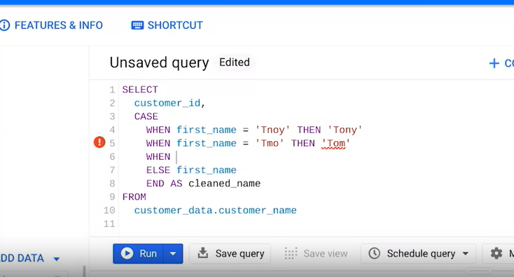
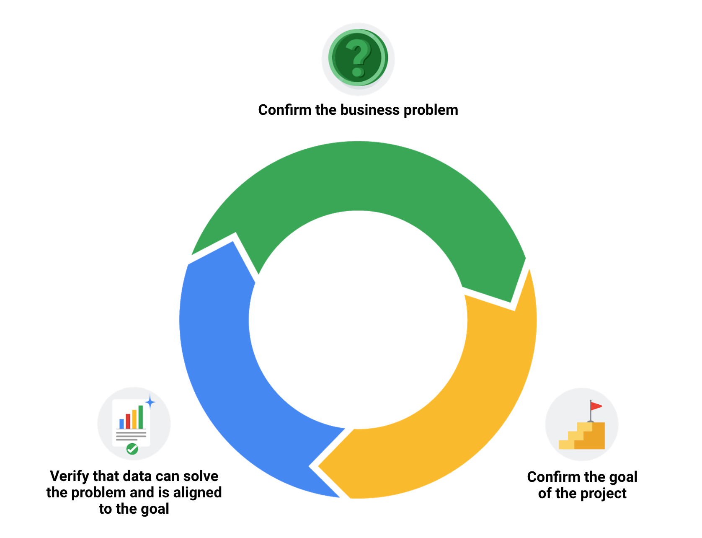
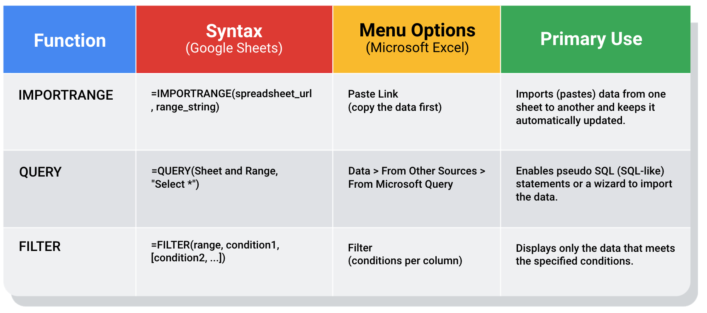
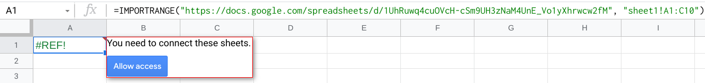

Week 18

TRIM: A fucntion that removes lkearding, trailing, and prepeated spaces in data\.

Verification: A process to confirm that a date\-cleaning effort was well\-executed and the resulting data is accurate and reliable\.

Changelog: A file containing a chronologically ordered list of modifications made to a project\.

See the big picture when verifying data\-cleaning:

1. Consider the business problem
2. Consider the goal
3. Consider the data

Find and replace

Pivot table

\[Spreadsheet\] COUNTA: A function that counts the total number of values within a specified range\.

\[SQL\] CASE statement: The CASE statement goes through one or more conditions and returns a value as soon as a condition is met\.

## __Correct the most common problems__

Make sure you identified the most common problems and corrected them, including:

- Sources of errors: Did you use the right tools and functions to find the source of the errors in your dataset?
- Null data: Did you search for NULLs using conditional formatting and filters?
- Misspelled words: Did you locate all misspellings?
- Mistyped numbers: Did you double\-check that your numeric data has been entered correctly?
- Extra spaces and characters: Did you remove any extra spaces or characters using the TRIM function?
- Duplicates: Did you remove duplicates in spreadsheets using the Remove Duplicates function or DISTINCT in SQL?
- Mismatched data types: Did you check that numeric, date, and string data are typecast correctly?
- Messy \(inconsistent\) strings: Did you make sure that all of your strings are consistent and meaningful?
- Messy \(inconsistent\) date formats: Did you format the dates consistently throughout your dataset?
- Misleading variable labels \(columns\): Did you name your columns meaningfully?
- Truncated data: Did you check for truncated or missing data that needs correction?
- Business Logic: Did you check that the data makes sense given your knowledge of the business?

## __Review the goal of your project__

Once you have finished these data cleaning tasks, it is a good idea to review the goal of your project and confirm that your data is still aligned with that goal\. This is a continuous process that you will do throughout your project\-\- but here are three steps you can keep in mind while thinking about this:

- Confirm the business problem
- Confirm the goal of the project
- Verify that data can solve the problem and is aligned to the goal

Documentation: The process of tracking changes, additions, deletions, and errors involved in your data\-cleaning effort\.

- Recover data\-cleaning errors
- Inform other users of changes
- Determine quality of data\.

Changelog: A file containing a chronologically ordered list of modifications made to a project\.

Common data errors:

- Human error in data entry
- Flawed processes
- System issues

# Advanced functions for speedy data cleaning

In this reading, you will learn about some advanced functions that can help you speed up the data cleaning process in spreadsheets\. Below is a table summarizing three functions and what they do:

IMPORTRANGE:

       Syntax: =IMPORTRANGE\(spreadsheet\_url, range\_string\)

       Menu Options: Paste Link \(copy the data first\)

       Primary Use: Imports \(pastes\) data from one sheet to another and keeps it automatically updated

QUERY:

       Syntax: =QUERY\(Sheet and Range, "Select \*"\)

       Menu Options: Data > From Other Sources > From Microsoft Query

       Primary Use: Enables pseudo SQL \(SQL\-like\) statements or a wizard to import the data\.

FILTER:

      Syntax: =FILTER\(range, condition1, \[condition2, \.\.\.\]\)

       Menu Options: Filter\(conditions per column\)

       Primary Use: Displays only the data that meets the specified conditions\.

## __Keeping data clean and in sync with a source__

The[ IMPORTRANGE](https://support.google.com/docs/answer/3093340?hl=en) function in Google Sheets and the[ Paste Link](https://professor-excel.com/how-to-paste-cell-links/) feature \(a Paste Special option in Microsoft Excel\) both allow you to insert data from one sheet to another\. Using these on a large amount of data is more efficient than manual copying and pasting\. They also reduce the chance of errors being introduced by copying and pasting the wrong data\. They are also helpful for data cleaning because you can “cherry pick” the data you want to analyze and leave behind the data that isn’t relevant to your project\. Basically, it is like canceling noise from your data so you can focus on what is most important to solve your problem\. This functionality is also useful for day\-to\-day data monitoring; with it, you can build a tracking spreadsheet to share the relevant data with others\. The data is synced with the data source so when the data is updated in the source file, the tracked data is also refreshed\.

If you are using IMPORTRANGE in Google sheets, data can be pulled from another spreadsheet, but you must allow access to the spreadsheet the first time it pulls the data\. The URL shown below is for syntax purposes only\. Don't enter it in your own spreadsheet\. Replace it with a URL to a spreadsheet you have created so you can control access to it by clicking the Allow access button\.

Refer to the[ Google support page for IMPORTRANGE](https://support.google.com/docs/answer/3093340?hl=en#) for the sample usage and syntax\.

### __Example of using IMPORTRANGE__

An analyst monitoring a fundraiser needs to track and ensure that matching funds are distributed\. They use IMPORTRANGE to pull all the matching transactions into a spreadsheet containing all of the individual donations\. This enables them to determine which donations eligible for matching funds still need to be processed\. Because the total number of matching transactions increases daily, they simply need to change the range used by the function to import the most up\-to\-date data\.

On Tuesday, they use the following to import the donor names and matched amounts:

=IMPORTRANGE\(“https://docs\.google\.com/spreadsheets/d/1cOsHnBDzm9tBb8Hk\_aLYfq3\-o5FZ6DguPYRJ57992\_Y”, “Matched Funds\!A1:B4001”\)

On Wednesday, another 500 transactions were processed\. They increase the range used by 500 to easily include the latest transactions when importing the data to the individual donor spreadsheet:

=IMPORTRANGE\(“https://docs\.google\.com/spreadsheets/d/1cOsHnBDzm9tBb8Hk\_aLYfq3\-o5FZ6DguPYRJ57992\_Y”, “Matched Funds\!A1:B4501”\)

Note: The above examples are for illustrative purposes only\. Don't copy and paste them into your spreadsheet\. To try it out yourself, you will need to substitute your own URL \(and sheet name if you have multiple tabs\) along with the range of cells in the spreadsheet that you have populated with data\.

## __Pulling data from other data sources__

The[ QUERY](https://support.google.com/docs/answer/3093343?hl=en) function is also useful when you want to pull data from another spreadsheet\. The QUERY function's SQL\-like ability can extract specific data within a spreadsheet\. For a large amount of data, using the QUERY function is faster than filtering data manually\. This is especially true when repeated filtering is required\. For example, you could generate a list of all customers who bought your company’s products in a particular month using manual filtering\. But if you also want to figure out customer growth month over month, you have to copy the filtered data to a new spreadsheet, filter the data for sales during the following month, and then copy those results for the analysis\. With the QUERY function, you can get all the data for both months without a need to change your original dataset or copy results\.

The QUERY function syntax is similar to IMPORTRANGE\. You enter the sheet by name and the range of data that you want to query from, and then use the SQL SELECT command to select the specific columns\. You can also add specific criteria after the SELECT statement by including a WHERE statement\. But remember, all of the SQL code you use has to be placed between the quotes\!

Google Sheets run the Google Visualization API Query Language across the data\. Excel spreadsheets use a query wizard to guide you through the steps to connect to a data source and select the tables\. In either case, you are able to be sure that the data imported is verified and clean based on the criteria in the query\.

### __Examples of using QUERY__

Check out the[ Google support page for the QUERY function](https://support.google.com/docs/answer/3093343?hl=en) with sample usage, syntax, and examples you can download in a Google sheet\.

Link to make a copy of the sheet:[ QUERY examples](https://docs.google.com/spreadsheets/d/1815H5TCe91LLT6tD6FmxMHmeJAAkr4o5Q6rNpV6xiFk/copy)

### __Real\-life solution__

Analysts can use SQL to pull a specific dataset into a spreadsheet\. They can then use the QUERY function to create multiple tabs \(views\) of that dataset\. For example, one tab could contain all the sales data for a particular month and another tab could contain all the sales data from a specific region\. This solution illustrates how SQL and spreadsheets are used well together\.

## __Filtering data to get what you want__

The[ FILTER](https://support.google.com/docs/answer/3093197?hl=en) function is fully internal to a spreadsheet and doesn’t require the use of a query language\. The FILTER function lets you view only the rows \(or columns\) in the source data that meet your specified conditions\. It makes it possible to pre\-filter data before you analyze it\.

The FILTER function might run faster than the QUERY function\. But keep in mind, the QUERY function can be combined with other functions for more complex calculations\. For example, the QUERY function can be used with other functions like SUM and COUNT to summarize data, but the FILTER function can't\.

### __Example of using FILTER__

Check out the[ Google support page for the FILTER function](https://support.google.com/docs/answer/3093197?hl=en) with sample usage, syntax, and examples you can download in a Google sheet\.

Link to make a copy of the sheet:[ FILTER examples](https://docs.google.com/spreadsheets/d/1caULJLQvQuzBnCN7rO9utg0xSKrYms7wM0Ph7A2JXY4/copy)
