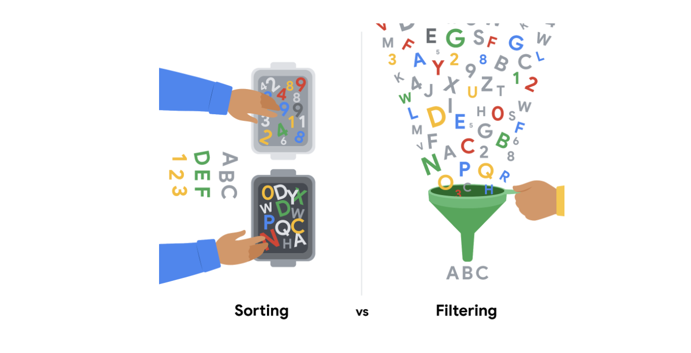
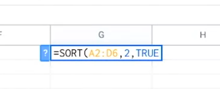
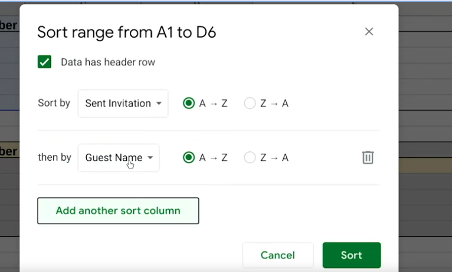
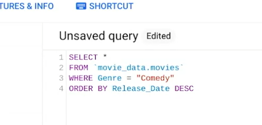

Week 20

Analysis: The process used to make sense of the data collected.

The goal of the analysis is to identify trends and relationships within data so you can accurately answer the question you’re asking.

The 4 phases of analysis:

- Organize data

Checking the data you need

- Format and adjust data

Filtering and sorting

- Get input from others

Seek others perspectives

- Transform data

Identifying relationships and patterns between the data and do calculation

Sorting involves arranging data into a meaningful order to make it easier to understand, analyze, and visualize.

## __Sorting versus filtering__

Sorting is when you arrange data into a meaningful order to make it easier to understand, analyze, and visualize. It ranks your data based on a specific metric you choose. You can sort data in spreadsheets, SQL databases (when your dataset is too large for spreadsheets), and tables in documents.

For example, if you need to rank things or create chronological lists, you can sort by ascending or descending order. If you are interested in figuring out a group’s favorite movies, you might sort by movie title to figure it out. Sorting will arrange the data in a meaningful way and give you immediate insights. Sorting also helps you to group similar data together by a classification. For movies, you could sort by genre -- like action, drama, sci-fi, or romance.

Filtering is used when you are only interested in seeing data that meets a specific criteria, and hiding the rest. Filtering is really useful when you have lots of data. You can save time by zeroing in on the data that is really important or the data that has bugs or errors. Most spreadsheets and SQL databases allow you to filter your data in a variety of ways. Filtering gives you the ability to find what you are looking for without too much effort.

For example, if you are only interested in finding out who watched movies in October, you could use a filter on the dates so only the records for movies watched in October are displayed. Then, you could check out the names of the people to figure out who watched movies in October.

To recap, the easiest way to remember the difference between sorting and filtering is that you can use sort to quickly order the data, and filter to display *only* the data that meets the criteria that you have chosen. Use filtering when you need to reduce the amount of data that is displayed.

It is important to point out that, after you filter data, you can sort the filtered data, too. If you revisit the example of finding out who watched movies in October, after you have filtered for the movies seen in October, you can then sort the names of the people who watched those movies in alphabetical order.

Filter using WHERE.

Sort sheet: All of the data in a spreadsheet is sorted by the ranking of a specific sorted column - data across rows is kept together.

Sort range: Nothing else on the spreadsheet is rearranged besides the specified cells in a column.

The SORT function (spreadsheet)

Syntax: =SORT(form:to,colum_number,A TRUE statement is in ascending order, and FALSE is descending).

eg:

Customized sort order:

When you sort data in a spreadsheet using multiple conditions.

# Sorting and filtering in Sheets and Excel

In this reading, we will describe the sorting and filtering options in Google Sheets and Microsoft Excel. Both offer basic sorting and filtering from set menu options. But, if you need more advanced sorting and filtering capabilities, you can use their respective SORT and FILTER functions.

## __Sorting and filtering in Sheets__

Sorting in Google Sheets helps you quickly spot trends in numbers. One trend might be gross revenue by sales region. In this case, you could sort the gross revenue column in descending (Z to A) order to spot the top performing regions at the top, or sort the gross revenue column in ascending (A-Z) order to spot the lowest performing regions at the top. Although an alphabetical order is implied, these sorting options do sort numbers, as our gross revenue example highlighted.

If you want to learn more about the set menu options for sorting and filtering, start with these resources:

- [Sort and filter data](https://support.google.com/docs/answer/3540681) (Google Help Center): instructions to sort data in alphabetical or numerical order and create filter views
- [Sort data by selecting a range of data in a column](https://www.youtube.com/watch?v=VcRBHXBMKBU): video of steps to achieve the task
- [Sort a range of data using sort criteria for multiple columns](https://www.youtube.com/watch?v=2dO4SDHKoPE): technical tip video to sort data across multiple columns

In addition to the standard menu options, there is a SORT function for more advanced sorting. Use this function to create a custom sort. You can sort the rows of a given range of data by the values in one or more columns. And you get to set the sort criteria per column. Refer to the[ SORT function](https://support.google.com/docs/answer/3093150?hl=en) page for the syntax.

And like the SORT function, you can use the[ FILTER function](https://support.google.com/docs/answer/3093197?hl=en) to filter by any matching criteria you like. This creates a custom filter.

You might recall that you can filter data and then sort the filtered results. Using the FILTER and SORT functions together in a range of cells can programmatically and automatically achieve these results for you.

## __Sorting and filtering in Excel__

You can also sort in ascending (A-Z) and descending (Z-A) order in Microsoft Excel. Excel offers Smallest to Largest and Largest to Smallest sorting when you are working with numbers.

Similar to the SORT function in Google Sheets, Excel includes custom sort capabilities that are available from the menu. After you select the data range, click the Sort & Filter button to select the criteria for sorting. You can even sort by the data in rows instead of by the data in columns if you select Sort left to right under Options. (Sort top to bottom is the default setting to sort the data in columns.)

If you want to learn more about sorting and filtering in Excel, start with these resources:

- [Sort data in a range or table](https://support.microsoft.com/en-us/office/sort-data-in-a-range-or-table-62d0b95d-2a90-4610-a6ae-2e545c4a4654) (Microsoft Support): instructions and video to perform sorting in 11 different use cases
- [Excel training: sort and filter data](https://support.microsoft.com/en-us/office/video-sort-data-in-a-range-or-table-ffb9fcb0-b9cb-48bf-a15c-8bec9fd3a472#ID0EAABAAA=Transcript) (Microsoft Support): sorting and filtering videos with transcripts

[Excel: sorting data](https://www.youtube.com/watch?v=Ep5q1cUhQas): video of how to use the Sort & Filter and Data menu options for sorting

Excel also has[ SORT](https://support.microsoft.com/en-us/office/sort-function-22f63bd0-ccc8-492f-953d-c20e8e44b86c),[ SORTBY](https://support.microsoft.com/en-us/office/sortby-function-cd2d7a62-1b93-435c-b561-d6a35134f28f), and[ FILTER](https://support.microsoft.com/en-us/office/filter-function-f4f7cb66-82eb-4767-8f7c-4877ad80c759) functions. Explore how you can use these functions to automatically sort and filter your data in spreadsheets without having to select any menu options at all.

Sorting queries in SQL:

ORDER BY (null / DESC)

eg:

