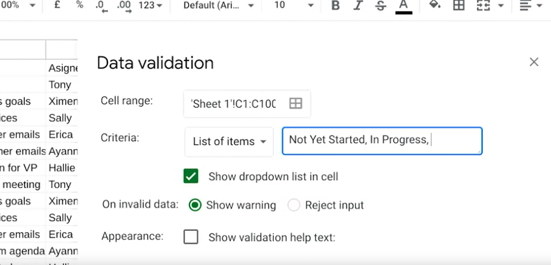
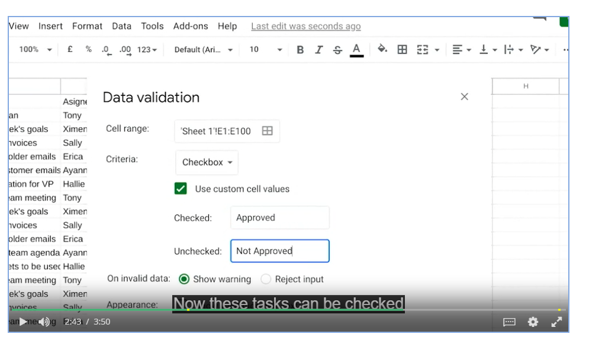
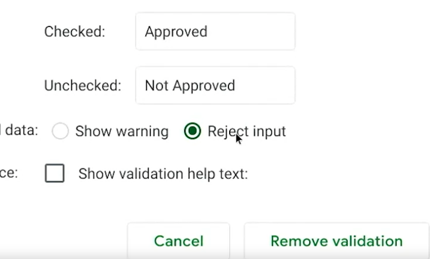
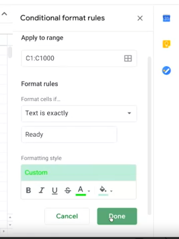
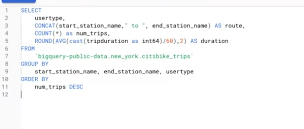
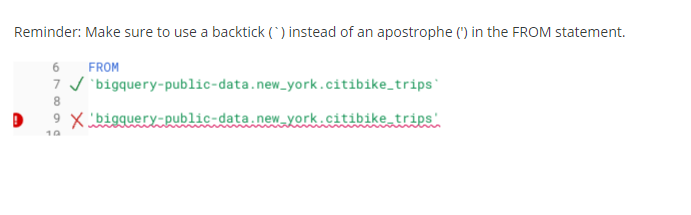

Week 21

Incorrectly formatted data can:

- Lead to mistakes
- Take time to fix
- Affect stakehoder’s decision-making

Convert data type in spreadsheet:

Syntax: =CONVERT()

For details on the correct syntax, refer to the[ Google Help Center documentation for CONVERT](https://support.google.com/docs/answer/6055540?hl=en).

If you're following along, do you want more practice?

Try converting the wind speed in Column D from miles per hour (mph) to meters per second (m/s) using CONVERT.  In cell H2, enter:

=CONVERT(D2, "mph", "m/s")

You can check if your conversion is correct by entering 8.5248 in a metric conversion tool,[ metric-conversions.org/speed/miles-per-hour-to-meters-per-second.htm](https://www.metric-conversions.org/speed/miles-per-hour-to-meters-per-second.htm).

After filling the rest of Column H, your spreadsheet will appear like below. You can also copy and paste values only into Column I (not shown) as you did in Column G for the converted temperatures.

As a data analyst, there are lots of scenarios when you might need to convert data in a spreadsheet:

### __String to date__

- [How to convert text to date in Excel](https://www.ablebits.com/office-addins-blog/2015/03/26/excel-convert-text-date/#:~:text=Excel%20DATEVALUE%20function%20%2D%20change%20text,Excel%20recognizes%20as%20a%20date.&text=So%2C%20the%20formula%20to%20convert,stored%20as%20a%20text%20string.): Transforming a series of numbers into dates is a common scenario you will encounter. This resource will help you learn how to use Excel functions to convert text and numbers to dates, and how to turn text strings into dates without a formula.
- [Google Sheets: Change date format:](https://www.ablebits.com/office-addins-blog/2019/08/13/google-sheets-change-date-format/) If you are working with Google Sheets, this resource will demonstrate how to convert your text strings to dates and how to apply the different date formats available in Google Sheets.

### __String to numbers__

- [How to convert text to number in Excel:](https://www.ablebits.com/office-addins-blog/2018/07/18/excel-convert-text-to-number/) Even though you will have values in your spreadsheet that resemble numbers, they may not actually be numbers. This conversion is important because it will allow your numbers to add up and be used in formulas without errors in Excel.
- [How to convert text to numbers in Google Sheets:](https://productivityspot.com/convert-text-to-numbers-google-sheets/) This resource is useful if you are working in Google Sheets; it will demonstrate how to convert text strings to numbers in Google Sheets. It also includes multiple formulas you can apply to your own sheets, so you can find the method that works best for you.

### __Combining columns__

- [Convert text from two or more cells:](https://support.microsoft.com/en-us/office/combine-text-from-two-or-more-cells-into-one-cell-81ba0946-ce78-42ed-b3c3-21340eb164a6) Sometimes you may need to merge text from two or more cells. This Microsoft Support page guides you through two distinct ways you can accomplish this task without losing or altering your data. It also includes a step-by-step video tutorial to help guide you through the process.
- [How to split or combine cells in Google Sheets:](https://www.techrepublic.com/article/how-to-split-or-combine-text-cells-with-google-sheets/) This guide will demonstrate how to to split or combine cells using Google Sheets specifically. If you are using Google Sheets, this is a useful resource to reference if you need to combine cells. It includes an example using real data.

### __Number to percentage__

- [Format numbers as percentages:](https://support.microsoft.com/en-us/office/format-numbers-as-percentages-de49167b-d603-4450-bcaa-31fba6c7b6b4) Formatting numbers as percentages is a useful skill to have on any project. This Microsoft Support page will provide several techniques and tips for how to display your numbers as percentages.
- [TO_PERCENT:](https://support.google.com/docs/answer/3094284?hl=en) This Google Sheets support page demonstrates how to use the TO_PERCENT formula to convert numbers to percentages. It also includes links to other formulas that can help you convert strings.

Pro tip: Keep in mind that you may have lots of columns of data that require different formats. Consistency is key, and best practice is to make sure an entire column has the same format.

## __Additional resources__

If you find yourself needing to convert other types of data, you can find resources on[ Microsoft Support](https://support.microsoft.com/) for Excel or[ Google Docs Editor Help](https://support.google.com/docs/?hl=en#topic=1382883) for Google Sheets.

Converting data is quick and easy, and the same functions can be used again and again. You can also keep these links bookmarked for future use, so you will always have them ready in case any of these issues arise. Now that you know how to convert data, you are on your way to becoming a successful data analyst.

Data validation: Allows you to control what can and can’t be enterd in your worksheet.

- Add dropdown lists with spredetermined options

- Create custom checkboxes

- Protect structured data and formulas

Conditional formatting: A spreadsheet tool that changes how cells appear when values meet specific conditions.

# Transforming data in SQL

Data analysts usually need to convert data from one format to another to complete an analysis. But what if you are using SQL rather than a spreadsheet? Just like spreadsheets, SQL uses standard rules to convert one type of data to another. If you are wondering why data transformation is an important skill to have as a data analyst, think of it like being a driver who is able to change a flat tire. Being able to convert data to the right format speeds you along in your analysis. You don’t have to wait for someone else to convert the data for you.

In this reading, you will go over the conversions that can be done using the CAST function. There are also more specialized functions like COERCION to work with big numbers, and UNIX_DATE to work with dates. UNIX_DATE returns the number of days that have passed since January 1, 1970 and is used to compare and work with dates across multiple time zones. You will likely use CAST most often.

## __Common conversions __

The following table summarizes some of the more common conversions made with the CAST function. Refer to[ Conversion Rules in Standard SQL](https://cloud.google.com/bigquery/docs/reference/standard-sql/conversion_rules) for a full list of functions and associated rules.

Starting with

CAST function can convert to:

Numeric (number)

- Integer

- Numeric (number)

- Big number

- Floating integer

- String

String

- Boolean

- Integer

- Numeric (number)

- Big number

- Floating integer

- String

- Bytes

- Date

- Date time

- Time

- Timestamp

Date

- String

- Date

- Date time

- Timestamp

## __The CAST function (syntax and examples)__

CAST is an American National Standards Institute (ANSI) function used in lots of programming languages, including BigQuery. This section provides the BigQuery syntax and examples of converting the data types in the first column of the previous table. The syntax for the CAST function is as follows:

CAST (expression AS typename)

Where expression is the data to be converted and typename is the data type to be returned.

### __Converting a number to a string__

The following CAST statement returns a string from a numeric identified by the variable MyCount in the table called MyTable.

SELECT CAST (MyCount AS STRING) FROM MyTable

In the above SQL statement, the following occurs:

- SELECT indicates that you will be selecting data from a table
- CAST indicates that you will be converting the data you select to a different data type
- AS comes before and identifies the data type which you are casting to
- STRING indicates that you are converting the data to a string
- FROM indicates which table you are selecting the data from

### __Converting a string to a number__

The following CAST statement returns an integer from a string identified by the variable MyVarcharCol in the table called MyTable. (An integer is any whole number.)

SELECT CAST(MyVarcharCol AS INT) FROM MyTable

In the above SQL statement, the following occurs:

- SELECT indicates that you will be selecting data from a table
- CAST indicates that you will be converting the data you select to a different data type
- AS comes before and identifies the data type which you are casting to
- INT indicates that you are converting the data to an integer
- FROM indicates which table you are selecting the data from

### __Converting a date to a string__

The following CAST statement returns a string from a date identified by the variable MyDate in the table called MyTable.

In the above SQL statement, the following occurs:

- SELECT indicates that you will be selecting data from a table
- CAST indicates that you will be converting the data you select to a different data type
- AS comes before and identifies the data type which you are casting to
- STRING indicates that you are converting the data to a string
- FROM indicates which table you are selecting the data from

### __Converting a date to a datetime__

Datetime values have the format of YYYY-MM-DD hh: mm: ss format, so date and time are retained together. The following CAST statement returns a datetime value from a date.

In the above SQL statement, the following occurs:

- SELECT indicates that you will be selecting data from a table
- CAST indicates that you will be converting the data you select to a different data type
- AS comes before and identifies the data type which you are casting to
- DATETIME indicates that you are converting the data to a datetime value
- FROM indicates which table you are selecting the data from

## __The SAFE_CAST function__

Using the CAST function in a query that fails returns an error in BigQuery. To avoid errors in the event of a failed query, use the SAFE_CAST function instead. The SAFE_CAST function returns a value of Null instead of an error when a query fails.

The syntax for SAFE_CAST is the same as for CAST. Simply substitute the function directly in your queries. The following SAFE_CAST statement returns a string from a date.

SELECT SAFE_CAST (MyDate AS STRING) FROM MyTable

## __More information__

Browse these resources for more information about data conversion using other SQL dialects (instead of BigQuery):

- [CAST and CONVERT](https://docs.microsoft.com/en-us/sql/t-sql/functions/cast-and-convert-transact-sql?view=sql-server-ver15): SQL Server reference documentation
- [MySQL CAST Functions and Operators](https://dev.mysql.com/doc/refman/8.0/en/cast-functions.html): MySQL reference documentation
- [How to: SQL Type Casting](https://www.blendo.co/blog/how-to-sql-type-casting/): Blog about type casting that has links to other SQL short guides

Merging and multiple sources

CONCATENATE: A function that joins together two or more text strings.

eg

Operating strings in spreadsheets:

=LEN(cell)

=FIND(‘substring’,cell)

=RIGHT(cell,char_length)

=LEFT(cell,char_length)

# Manipulating strings in SQL

Knowing how to convert and manipulate your data for an accurate analysis is an important part of a data analyst’s job. In this reading, you will learn about different SQL functions and their usage, especially regarding string combinations.

A string is a set of characters that helps to declare the texts in programming languages such as SQL. SQL string functions are used to obtain various information about the characters, or in this case, manipulate them. One such function, CONCAT, is commonly used. Review the table below to learn more about the CONCAT function and its variations.

Function

Usage

Example

CONCAT

A function that adds strings together to create new text strings that can be used as unique keys

CONCAT (‘Google’, ‘.com’);

CONCAT_WS

A function that adds two or more strings together with a separator

CONCAT_WS (‘ . ’, ‘www’, ‘google’, ‘com’)

*The separator (being the period) gets input before and after Google when you run the SQL function

CONCAT with +

Adds two or more strings together using the + operator

‘Google’ + ‘.com’

## __CONCAT at work__

When adding two strings together such as ‘Data’ and ‘analysis’, it will be input like this:

- SELECT CONCAT (‘Data’, ‘analysis’);

The result will be:

- Dataanalysis

Sometimes, depending on the strings, you will need to add a space character, so your function should actually be:

- SELECT CONCAT (‘Data’, ‘  ‘, ‘analysis’);

And the result will be:

- Data analysis

The same rule applies when combining three strings together. For example,

- SELECT CONCAT (‘Data’,’ ‘, ‘analysis’, ‘ ‘, ‘is’, ‘ ‘, ‘awesome!’);

And the result will be

- Data analysis is awesome!

## __Practice makes perfect__

W3 Schools is an excellent resource for interactive SQL learning, and the following links will guide you through transforming your data using SQL:

- [SQL functions](https://www.w3schools.com/sql/sql_ref_sqlserver.asp): This is a comprehensive list of functions to get you started. Click on each function, where you will learn about the definition, usage, examples, and even be able to create and run your own query for practice. Try it out for yourself!
- [SQL Keywords](https://www.w3schools.com/sql/sql_ref_keywords.asp): This is a helpful SQL keywords reference to bookmark as you increase your knowledge of SQL. This list of keywords are reserved words that you will use as your need to perform different operations in the database grows.
- While this reading went through the basics of each of these functions, there is still more to learn, and you can even combine your own strings.

1. Practice using[ CONCAT](https://www.w3schools.com/sql/func_sqlserver_concat.asp)
2. Practice using[ CONCAT WS](https://www.w3schools.com/sql/func_sqlserver_concat_ws.asp)
3. Practice using[ CONCAT with +](https://www.w3schools.com/sql/func_sqlserver_concat_with_plus.asp)

Pro tip: The functions presented in the resources above may be applied in slightly different ways depending on the database that you are using (e.g. mySQL versus SQL Server). But, the general description provided for each function will prepare you to customize how you use these functions as needed.

Get support during analysis

# Advanced spreadsheet tips and tricks

Like a lot of the things you’re learning in this program, spreadsheets will get easier the more you practice. This reading provides you with a list of resources that may help advance your knowledge and experience with spreadsheet functions and functionality. The goal is to provide you with access to a variety of advanced tips and tricks that will help make you more efficient and effective when working with spreadsheets to perform data analysis. Review the description of each resource below, click the links to learn more, and save or bookmark any links that are useful to you. You can immediately start practicing anything that you learn to increase the chances of your understanding and to build your familiarity with spreadsheets. This reading provides a range of resources, so feel free to explore the ones that are applicable to you and skip the ones that aren’t.

### __Google Sheets__

- [Keyboard shortcuts for Google Sheets:](https://support.google.com/docs/answer/181110) This is a great resource for quickly learning a range of keyboard shortcuts that can make regular tasks quicker and easier, like navigating your spreadsheet or accessing formulas and functions. This list contains shortcuts for the desktop and mobile versions of Google Sheets so that you can apply them to your work no matter what device you are using.
- [L​ist of Google Sheets functions](https://support.google.com/docs/table/25273?hl=en): This is a comprehensive list of the Google Sheets functions and syntax. Each function is listed with a link to learn more.
- [2​0 Google Sheets Formulas You Must Know:](https://automate.io/blog/google-spreadsheet-formulas/) This blog article summarizes and describes 20 of the most useful Google Sheets formulas.
- [18 Google Sheets Formula Tips and Techniques:](https://www.benlcollins.com/spreadsheets/google-sheets-formulas-techniques/) These are tips for using Google Sheets shortcuts when working with formulas.

### __Excel__

- [Keyboard shortcuts in Excel:](https://support.microsoft.com/en-us/office/keyboard-shortcuts-in-excel-1798d9d5-842a-42b8-9c99-9b7213f0040f?ui=en-US&rs=en-US&ad=US) Earlier in this list, you were provided with a resource for keyboard shortcuts in Google Sheets. Similarly, this resource provides a list of keyboard shortcuts in Excel that will make performing regular spreadsheet tasks more efficient. This includes keyboard shortcuts for both desktop and mobile versions of Excel, so you can apply them no matter what platform you are working on.
- [222 Excel shortcuts:](https://exceljet.net/keyboard-shortcuts) A compilation of shortcuts includes links to more detailed explanations about how to use them. This is a great way to quickly reference keyboard shortcuts. The list has been organized by functionality, so you can go directly to the sections that are most useful to you.
- [List of spreadsheet functions:](https://exceljet.net/excel-functions) This is a comprehensive list of Excel spreadsheet functions with links to more detailed explanations. This is a useful resource to save so that you can reference it often; that way, you’ll have access to functions and examples that you can apply to your work.
- [List of spreadsheet formulas:](https://exceljet.net/formulas) Similar to the previous resource, this comprehensive list of Excel spreadsheet formulas with links to more detailed explanations and can be saved and referenced any time you need to check out a formula for your analysis.
- [Essential Excel Skills for Analyzing Data:](https://learntocodewith.me/posts/excel-skills/) This blog post includes more advanced functionalities of some spreadsheet tools that you have previously learned about, like pivot tables and conditional formatting. These skills have been identified as particularly useful for data analysis. Each section includes a how-to video that will take you through the process of using these functions step-by-step, so that you can apply them to your own analysis.
- [Advanced Spreadsheet Skills:](https://www.slideshare.net/markjhonoxillo/advanced-spreadsheet-skills) Mark Jhon C. Oxillo’s presentation starts with a basic overview of spreadsheet but also includes advanced functions and exercises to help you apply formulas to actual data in Excel. This is a great way to review some basic concepts and practice the skills you have been learning so far.

There are lots of resources online about advanced spreadsheet tips and tricks. You'll probably discover new resources and tools on your own, but this list is a great starting point as you become more familiar with spreadsheets.

Best practices for searching online

- Thinking skills
- Data analytics terms
- Basic knowledge of tools

Mental model: Your thought process and the way you approach a problem

R: A programming language frequently used for statistical analysis, visualization, and other data analysis.
