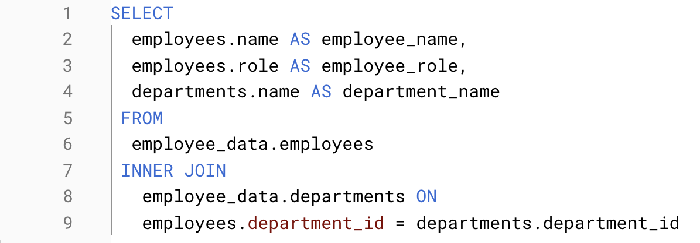
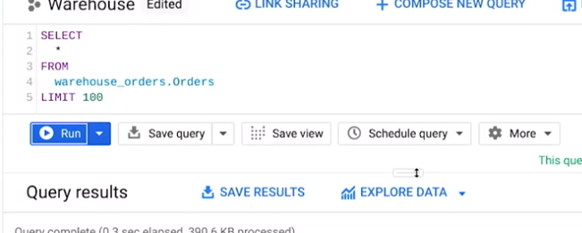
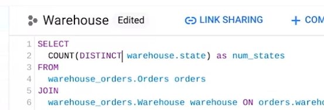
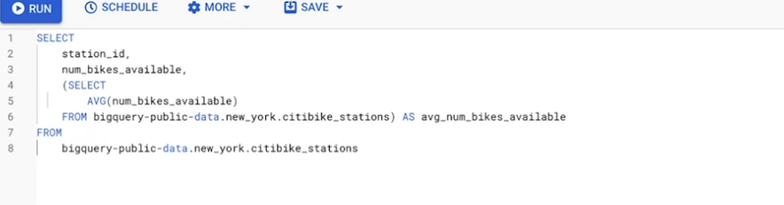
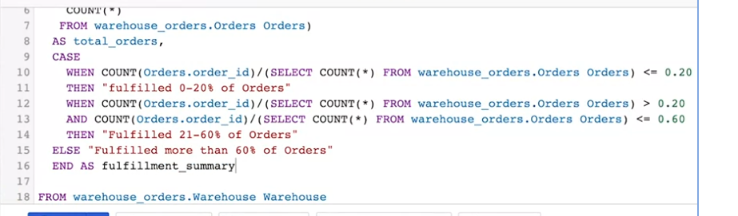

Week 22

Aggregation: Collecting or gathering many separate pieces into a whole.

Data aggregation: The process of gathering data from multiple sources in order to combine it into a single summarized collection.

Subquery: A query within another query

VLOOKUP (Vertical Lookup): A funciton that searches for a certain value in a column to return a corresponding piece of information.

Syntax: =VLOOKUP(value_to_serach,from:to,colum_nubmer,FALSE_for_exact_match/TRUE_for_close_match)

*VLOOKUP only returns the first match it finds.

*$sign for absolute reference

VALUE: A function that converts a text string that represents a number to a numerical value.

Troubleshooting questions:

- How should I prioritize these issues?
- In a single sentence, what’s the issue I’m facing?
- What resources can help me solve the problem?

MATCH: A function used to locate the posittion of a specific lookup value.

# VLOOKUP core concepts

Functions can be used to quickly find information and perform calculations using specific values. In this reading, you will learn about the importance of one such function, VLOOKUP, or Vertical Lookup, which searches for a certain value in a spreadsheet column and returns a corresponding piece of information from the row in which the searched value is found.

## __When do you need to use VLOOKUP? __

Two common reasons to use VLOOKUP are:

- Populating data in a spreadsheet
- Merging data from one spreadsheet with data in another

## __VLOOKUP syntax__

A VLOOKUP function is available in both Microsoft Excel and Google Sheets. You will be introduced to the general syntax in Google Sheets. (You can refer to the resources at the end of this reading for more information about VLOOKUP in Microsoft Excel.)

Here is the syntax.

![VLOOKUP(search_key, range, index, [is_sorted])](image-3.png)

### __search_key__

- The value to search for.
- For example, 42, "Cats", or I24.

### __range__

- The range to consider for the search.
- The first column in the range is searched to locate data matching the value specified by search_key.

### __index__

- The column index of the value to be returned, where the first column in range is numbered 1.
- If index is not between 1 and the number of columns in range, #VALUE! is returned.

### __is_sorted__

- Indicates whether the column to be searched (the first column of the specified range) is sorted. TRUE by default.
- It’s recommended to set is_sorted to FALSE. If set to FALSE, an exact match is returned. If there are multiple matching values, the content of the cell corresponding to the first value found is returned, and #N/A is returned if no such value is found.
- If is_sorted is TRUE or omitted, the nearest match (less than or equal to the search key) is returned. If all values in the search column are greater than the search key, #N/A is returned.

## __What if you get #N/A?__

As you have just read, #N/A indicates that a matching value can't be returned as a result of the VLOOKUP. The error doesn’t mean that anything is actually wrong with the data, but people might have questions if they see the error in a report. You can use the IFNA function to replace the #N/A error with something more descriptive, like “Does not exist.”

Here is the syntax.

### __value__

- This is a required value.
- The function checks if the cell value matches the value; such as #N/A.

### __value_if_na__

- This is a required value.
- The function returns this value if the cell value matches the value in the first argument; it returns this value when the cell value is #N/A.

## __Helpful VLOOKUP reminders__

- TRUE means an approximate match, FALSE means an exact match on the search key. If the data used for the search key is sorted, TRUE can be used.
- You want the column that matches the search key in a VLOOKUP formula to be on the left side of the data. VLOOKUP only looks at data to the right after a match is found. In other words, the index for VLOOKUP indicates columns to the right only. This may require you to move columns around before you use VLOOKUP.
- After you have populated data with the VLOOKUP formula, you may copy and paste the data as values only to remove the formulas so you can manipulate the data again.

## __VLOOKUP resources for Microsoft Excel__

VLOOKUP may slightly differ in Microsoft Excel, but the overall concepts can still be generally applied. Refer to the following resources if you are working with Excel.

- [H​ow to use VLOOKUP in Excel](https://support.microsoft.com/en-us/office/vlookup-function-0bbc8083-26fe-4963-8ab8-93a18ad188a1): This tutorial includes a video to help you get a general understanding of how the VLOOKUP function works in Excel, as well as practical examples to look through.
- [VLOOKUP in Excel tutorial](https://www.youtube.com/watch?v=d3BYVQ6xIE4): Follow along in this video lesson and learn how to write a VLOOKUP formula in Excel and master time-saving useful tips and tricks.
- [23 things you should know about VLOOKUP in Excel](https://exceljet.net/things-you-should-know-about-vlookup): Explore this list of 23 VLOOKUP facts as well as challenges you might run into, and start to learn how to master them.
- [How to use Excel's VLOOKUP function](https://edu.gcfglobal.org/en/excel-tips/how-to-use-excels-vlookup-function/1/): This article shares a specific example around how to apply VLOOKUP in your searches.
- [VLOOKUP in Excel vs Google Sheets](https://infoinspired.com/sheets-vs-excel-formula/vlookup-formula-in-excel-and-google-sheets/): This guide offers a VLOOKUP comparison of Excel and Google Sheets.

Use JOINS in SQL

Join: A SQL clause thatis used to combine rows from tow or more tables based on a related column.

Common JOINs:

- Inner
- Left
- Right
- Outer

Primary keys reference columns in which each value is unique

Foreign keys are primary keys in other tables

INNER JOIN: A function that returns records with matching values in both tables.

LEFT JOIN: A funciotn that will return all the revords from the left table and only the matching records from the right table.

(The table mentioned frist is left, and the table mentioned second is right.)

LEFT JOIN: A funciotn that will return all the revords from the right table and only the matching records from the left table.

OUTER JOIN: A function that comvines RIGHT and LEFT JOIN to return all matching records in both tables.

If the BigQuery editor flags the table names in your query as unrecognizable, include the dataset name by substituting __employee_data.employees__ for the employees table and __employee_data.departments__ for the departments table, as shown in line 6 and line 8 below:

COUNT in SQL: A query that returns the number of rows in a specified range.

COUNT DISTINCT: A query that only returns the distsinct values in a specified range.

eg use of LIMIT:

Aliasing: When you temporarity name a table or column in your query to make it easier to read and write.

eg use of COUNT DISTINCT:

Subquery: A SQL query that is nested inside a larger query.

eg run subquery inside query

HAVING: Allows your to add filter to your query instead of the underlying table that can only be used with aggregate funcitons.

CASE: Returns records with yoru conditions by allowing you to include if/then statements in your query.

eg CASE example

