Week 23

Common calculations formulas

=SUM(range)

=other operation

=MIN(range)

=MAX(range)

=COUNTIF(range,conditions)

**Summary table**: A table used to summarize statistical information about data.

**SUMIF**: A function that adds numeric data based on one condition.

Syntax: =SUMIF(range, condition,sum_range)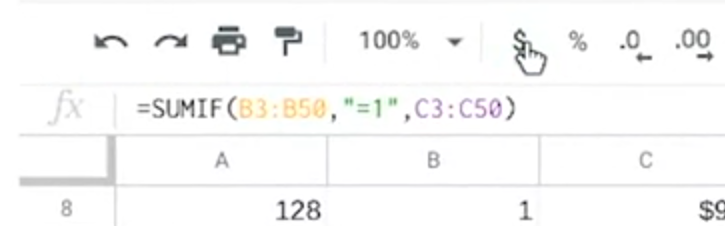

**SUMPRODUCT**: A function that multiplies arrays and returns the sum of those products.

Syntax: =SUMPRODUCT(array1,array2,....)

**Array**: A collection of values in cells.

**Profit margin**: A percentage that indicates how many cents of profit has been generated for each dollar of sale.

**Pivot tables**: Let you view data in multiple ways to find insights and trends.

**Calculated field**: A new field within a pivot table that carries out certain calculations based on the values of other fields.

# Elements of a pivot table

Previously, you learned that a pivot table is a tool used to sort, reorganize, group, count, total, or average data in spreadsheets. In this reading, you will learn more about the parts of a pivot table and how data analysts use them to summarize data and answer questions about their data.

Pivot tables make it possible to view data in multiple ways to identify insights and trends. They can help you quickly make sense of larger data sets by comparing metrics, performing calculations, and generating reports. They’re also useful for answering specific questions about your data.

A pivot table has four basic parts: rows, columns, values, and filters.

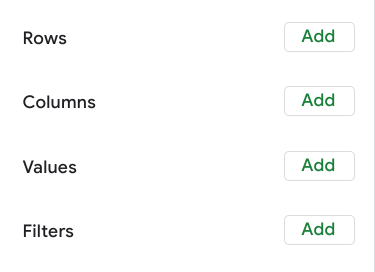

The rows of a pivot table organize and group data you select horizontally. For example, in the[ Working with pivot tables](https://www.coursera.org/learn/analyze-data/lecture/Jl8cZ/working-with-pivot-tables) video, the Release Date values were used to create rows that grouped the data by year.

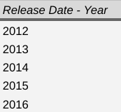

The columns organize and display values from your data vertically. Similar to rows, columns can be pulled directly from the data set or created using values. Values are used to calculate and count data. This is where you input the variables you want to measure. This is also how you create calculated fields in your pivot table. As a refresher, a calculated field is a new field within a pivot table that carries out certain calculations based on the values of other fields

In the previous movie data example, the Values editor created columns for the pivot table, including the SUM of Box Office Revenue, the AVERAGE of Box Office Revenue, and the COUNT of Box Office Revenue columns.

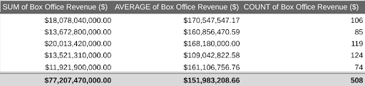

Finally, the filters section of a pivot table enables you to apply filters based on specific criteria — just like filters in regular spreadsheets! For example, a filter was added to the movie data pivot table so that it only included movies that generated less than $10 million in revenue.

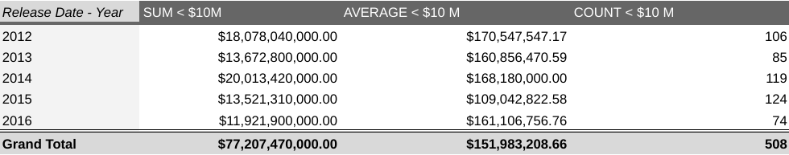

Being able to use all four parts of the pivot table editor will allow you to compare different metrics from your data and execute calculations, which will help you gain valuable insights.

## **Using pivot tables for analysis**

Pivot tables can be a useful tool for answering specific questions about a dataset so you can quickly share answers with stakeholders. For example, a data analyst working at a department store was asked to determine the total sales for each department and the number of products they each sold. They were also interested in knowing exactly which department generated the most revenue.

Instead of making changes to the original spreadsheet data, they used a pivot table to answer these questions and easily compare the sales revenue and the number of products sold by each department.

# Using pivot tables in the analysis

In this reading, you will learn how to create and use pivot tables for data analysis. You will also get some resources about pivot tables that you can save for your reference when you start creating pivot tables yourself. Pivot tables are a spreadsheet tool that lets you view data in multiple ways to find insights and trends.

Pivot tables allow you to make sense of large data sets by giving you tools to easily compare metrics, quickly perform calculations, and generate readable reports. You can create a pivot table to help you answer specific questions about your data. For example, if you were analyzing sales data, you could use pivot tables to answer questions like, “Which month had the most sales?” and “What products generated the most revenue this year?” When you need answers to questions about your data, pivot tables can help you cut through the clutter and focus on only the data you need.

## **Create your pivot table**

Before you can analyze data with pivot tables, you will need to create a pivot table with your data. The following includes the steps for creating a pivot table in Google Sheets, but most spreadsheet programs will have similar tools.

First, you will open the Data menu from the toolbar; there will be an option for the Pivot table.

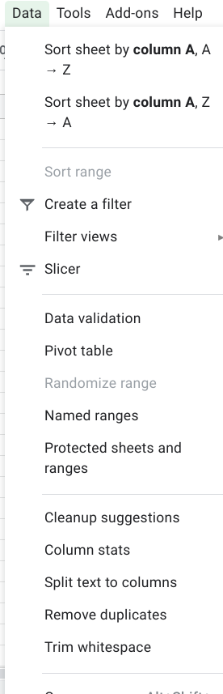

This pop-up menu will appear:

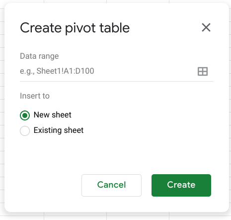

There is an option to select New sheet or Existing sheet and a Create button

Generally, you will want to create a new sheet for your pivot table to keep your raw data and your analysis separate. You can also store all of your calculations in one place for easy reference. Once you have created your pivot table, there will be a pivot table editor that you can access to the right of your data.

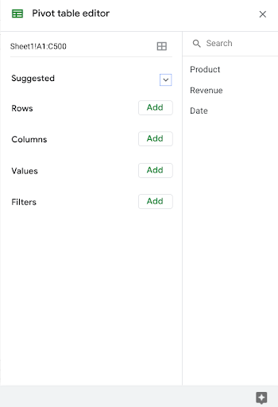

This is where you will be able to customize your pivot table, including what variables you want to include for your analysis.

## **Use your pivot table for analysis**

You can perform a wide range of analysis tasks with your pivot tables to quickly draw meaningful insights from your data, including performing calculations, sorting, and filtering your data. Below is a list of online resources that will help you learn about performing basic calculations in pivot tables as well as resources for learning about sorting and filtering data in your pivot tables.

### **Perform calculations**

Microsoft Excel

Google Sheets

[Calculate values in a pivot table](https://support.microsoft.com/en-us/office/calculate-values-in-a-pivottable-11f41417-da80-435c-a5c6-b0185e59da77): Microsoft Support’s introduction to calculations in Excel pivot tables. This is a useful starting point if you are learning how to perform calculations with pivot tables specifically in Excel.

[Create and use pivot tables](https://support.google.com/docs/answer/1272900?co=GENIE.Platform%3DDesktop&hl=en): This guide is focused on using pivot tables in Google Sheets and it provides instructions for creating calculated fields. This is a quick how-to guide you can save and reference as a quick reminder on how to add calculated fields.

[Pivot table calculated field example](https://exceljet.net/pivot-table/pivot-table-calculated-field-example): This resource includes a detailed example of a pivot table being used for calculations. This step-by-step process demonstrates how calculated fields work, and provides you with some idea of how they can be used for analysis.

[All about the calculated field in pivot tables](https://infoinspired.com/google-docs/spreadsheet/all-about-calculated-field-in-pivot-table-in-google-sheets/): This is a comprehensive guide to calculated fields for Google Sheets. If you are working with Sheets and are interested in learning more about pivot tables, this is a great resource.

[Pivot table calculated fields: step-by-step tutorial](https://powerspreadsheets.com/pivottable-calculated-fields/): This tutorial for creating your calculated fields in pivot tables is a really useful resource to save and bookmark for when you start to apply calculated fields to your spreadsheets.

[Pivot tables in Google Sheets](https://www.benlcollins.com/spreadsheets/pivot-tables-google-sheets/): This beginner’s guide covers the basics of pivot tables and calculated fields in Google Sheets and uses examples and how-to videos to help demonstrate these concepts.

### **Sort your data**

Microsoft Excel

Google Sheets

[Sort data in a pivot table or PivotChart](https://support.microsoft.com/en-us/office/sort-data-in-a-pivottable-or-pivotchart-e41f7107-b92d-44ef-861f-24430830450a): This is a Microsoft Support how-to guide to sorting data in pivot tables. This is a useful reference if you are working with Excel and are interested in checking out how filtering will appear in Excel specifically.

[Customize a pivot table](https://support.google.com/docs/answer/7572895?co=GENIE.Platform%3DDesktop&hl=en): This guide from Google Support focuses on sorting pivot tables in Google Sheets. This is a useful, quick reference if you are working on sorting data in Sheets and need a step-by-step guide.

[Pivot tables- Sorting data](https://www.tutorialspoint.com/excel_pivot_tables/excel_pivot_tables_sorting_data.htm): This tutorial for sorting data in pivot tables includes an example with real data that demonstrates how sorting in Excel pivot tables works. This example is a great way to experience the entire process from start to finish.

[How to sort pivot table columns](https://infoinspired.com/google-docs/spreadsheet/pivot-table-columns-in-custom-order-in-google-sheets/): This detailed guide uses real data to demonstrate how the sorting process for Google Sheet pivot tables will work. This is a great resource if you need a slightly more detailed guide with screenshots of the actual Sheets environment.

[How to sort a pivot table by value](https://exceljet.net/lessons/how-to-sort-a-pivot-table-by-value): This source uses an example to explain sorting by value in pivot tables. It includes a video, which is a useful guide if you need a demonstration of the process.

[Pivot table ascending and descending order](https://medium.com/actiondesk/pivot-table-ascending-descending-order-in-google-sheets-and-excel-1-minute-ultimate-beginners-8f9f4c560492): This 1-minute beginner’s guide is a great way to brush up on sorting in pivot tables if you are interested in a quick refresher.

### **Filter your data**

Microsoft Excel

Google Sheets

[Filter data in a pivot table](https://support.microsoft.com/en-us/office/filter-data-in-a-pivottable-cc1ed287-3a97-4e95-b377-ddfafe79fa8f): This resource from the Microsoft Support page provides an explanation of filtering data in pivot tables in Excel. If you are working in Excel spreadsheets, this is a great resource to have bookmarked for quick reference.

[Customize a pivot table](https://support.google.com/docs/answer/7572895?co=GENIE.Platform%3DDesktop&hl=en): This is the Google Support page on filtering pivot table data. This is a useful resource if you are working with pivot tables in Google Sheets and need a quick resource to review the process.

[How to filter Excel pivot table data](https://www.dummies.com/software/microsoft-office/excel/how-to-filter-excel-pivot-table-data/): This how-to guide for filtering data in pivot tables demonstrates the filtering process in an Excel spreadsheet with data and includes tips and reminders for when you start using these tools on your own.

[Filter multiple values in a pivot table](https://infoinspired.com/google-docs/spreadsheet/filter-multiple-values-in-pivot-table-sheets/): This guide includes details about how to filter for multiple values in Google Sheet pivot tables. This resource expands some of the functionality that you have already learned and sets you up to create more complex filters in Google Sheets.

### **Format your data**

Microsoft Excel

Google Sheets

[Design the layout and format of a PivotTable](https://support.microsoft.com/en-us/office/design-the-layout-and-format-of-a-pivottable-a9600265-95bf-4900-868e-641133c05a80): This Microsoft

Support article describes how to change the format of the PivotTable by applying a predefined style, banded rows, and conditional formatting.

[Create and edit pivot tables](https://support.google.com/a/users/answer/9308944#group_data_in_a_pivot_table): This Help Center article provides information about how to edit a pivot table to change its style and group data.

Pivot tables are a powerful tool that you can use to quickly perform calculations and gain meaningful insights into your data directly from the spreadsheet file you are working in! By using pivot table tools to calculate, sort, and filter your data, you can immediately make high-level observations about your data that you can share with stakeholders in reports.

But, like most tools we have covered in this course, the best way to learn is to practice. This was just a small taste of what you can do with pivot tables, but the more you work with pivot tables, the more you will discover.

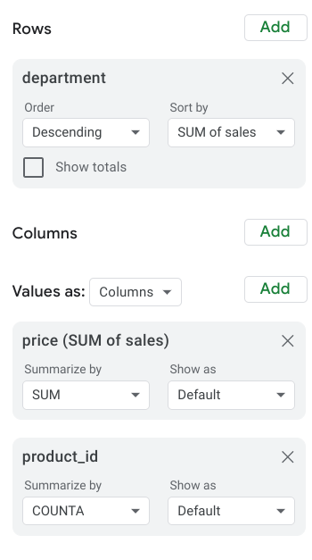

They used the department as the rows for this pivot table to the group and organize the rest of the sales data. Then, they input two Values as columns: the SUM of sales and a count of the products sold. They also sorted the data by the SUM of sales column to determine which department generated the most revenue.

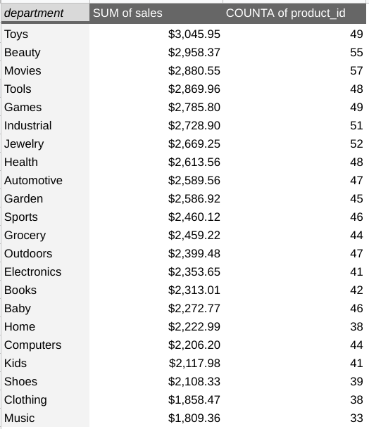

Now they know that the Toys department generated the most revenue!

Pivot tables are an effective tool for data analysts working with spreadsheets because they highlight key insights from the spreadsheet data without having to make changes to the spreadsheet. Coming up, you will create your pivot table to analyze data and identify trends that will be highly valuable to stakeholders.

**Operator**: A symbol that names the type of operating or calculation to be performed in a formula.

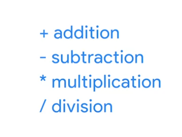

The syntax of a query is its structure.

**Modulo**: An operator (%) that returns the remainder when one number is divided by another.

**GROUP BY**: A command that groups rows that have the same values from a table into summary rows.

**EXTRACT**: A command lets us pull one part of a given date to use.

**Data validation process**: Checking and rechecking the quality of your data so that it is completely accurate, secure, and consistent.

# Types of data validation

This reading describes the purpose, examples, and limitations of six types of data validation. The first five are validation types associated with the data (type, range, constraint, consistency, and structure) and the sixth type focuses on the validation of application code used to accept data from user input.

As a junior data analyst, you might not perform all of these validations. But you could ask if and how the data was validated before you begin working with a dataset. Data validation helps to ensure the integrity of data. It also gives you confidence that the data you are using is clean. The following list outlines six types of data validation and the purpose of each and includes examples and limitations.

- Purpose: Check that the data matches the data type defined for a field.
- Example: Data values for school grades 1-12 must be a numeric data type.
- Limitations: The data value 13 would pass the data type validation but would be an unacceptable value. For this case, data range validation is also needed.

- Purpose: Check that the data falls within an acceptable range of values defined for the field.
- Example: Data values for school grades should be valued between 1 and 12.
- Limitations: The data value 11.5 would be in the data range and would also pass as a numeric data type. But, it would be unacceptable because there aren't half grades. For this case, data constraint validation is also needed.

- Purpose: Check that the data meets certain conditions or criteria for a field. This includes the type of data entered as well as other attributes of the field, such as a severalnumber of characters.
- Example: Content constraint: Data values for school grades 1-12 must be whole numbers.
- Limitations: The data value 13 is a whole number and would pass the content constraint validation. But, it would be unacceptable since 13 isn’t a recognized school grade. For this case, data range validation is also needed.

- Purpose: Check that the data makes sense in the context of other related data.
- Example: Data values for product shipping dates can’t be earlier than product production dates.
- Limitations: Data might be consistent but still incorrect or inaccurate. A shipping date could be later than a production date and still be wrong.

- Purpose: Check that the data follows or conforms to a set structure.
- Example: Web pages must follow a prescribed structure to be displayed properly.
- Limitations: A data structure might be correct with the data still incorrect. Content on a web page could be displayed properly and still contain the wrong information.

- Purpose: Check that the application code systematically performs any of the previously mentioned validations during user data input.
- Example: Common problems discovered during code validation include: more than one data type allowed, data range checking not done, or ending of text strings not well defined.
- Limitations: Code validation might not validate all possible variations with data input.

**Temporary table**: A database table that is created and exists temporarily on a database server.

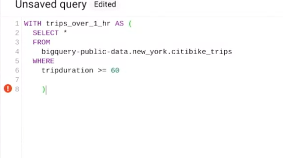

use WITH to create a temporary table.

SELECT INTO to create another temporary table

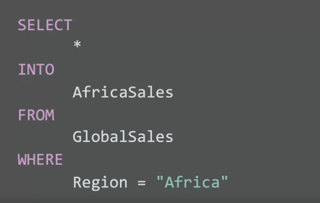

CREATE to create another temporary table.

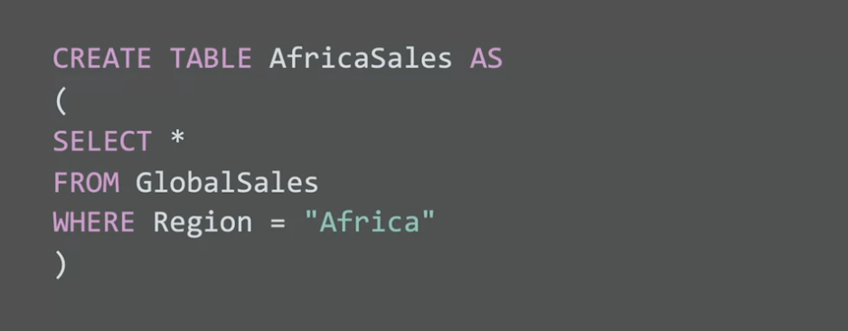
