Week 24

Data visualization: The graphic representation and presentation of data.

# Effective data visualizations

A data visualization, sometimes referred to as a “data viz,” allows analysts to properly interpret data. A good way to think of data visualization is that it can be the difference between utter confusion and really grasping an issue. Creating effective data visualizations is a complex task; there is a lot of advice out there, and it can be difficult to grasp it all. In this reading, you are going to learn some tips and tricks for creating effective data visualizations. First, you'll review two frameworks that are useful for thinking about how you can organize the information in your visualization. Second, you'll explore pre-attentive attributes and how they can be used to affect the way people think about your visualizations. From there, you'll do a quick review of the design principles that you should keep in mind when creating your visualization. You will end the reading by reviewing some practices that you can use to avoid creating misleading or inaccurate visualizations.

## __Frameworks for organizing your thoughts about visualization__

Frameworks can help you organize your thoughts about data visualization and give you a useful checklist to reference. Here are two frameworks that may be useful for you as you create your own data viz:

1)[ The McCandless Method](https://www.informationisbeautiful.net/visualizations/what-makes-a-good-data-visualization/)

You learned about the David McCandless method in the first lesson on effective data visualizations, but as a refresher, the McCandless Method lists four elements of good data visualization:

1. Information: the data you are working with
2. Story: a clear and compelling narrative or concept
3. Goal: a specific objective or function for the visual
4. Visual form: an effective use of metaphor or visual expression

Note: One useful way of approaching this framework is to notice the parts of the graphic where there is incomplete overlap between all four elements. For example, visual form without a goal, story, or data could be a sketch or even art. Data plus visual form without a goal or function is eye candy. Data with a goal but no story or visual form is boring. All four elements need to be at work to create an effective visual.

2)[ Kaiser Fung’s Junk Charts Trifecta Checkup](https://junkcharts.typepad.com/junk_charts/junk-charts-trifecta-checkup-the-definitive-guide.html)

This approach is a useful set of questions that can help consumers of data visualization critique what they are consuming and determine how effective it is. The Checkup has three questions:

1. What is the practical question?
2. What does the data say?
3. What does the visual say?

Note: This checklist helps you think about your data viz from the perspective of your audience and decide if your visual is communicating your data effectively to them or not. In addition to these frameworks, there are some other building blocks that can help you construct your data visualizations.

## __Pre-attentive attributes: marks and channels__

Creating effective visuals means leveraging what we know about how the brain works, and then using specific visual elements to communicate the information effectively. Pre-attentive attributes are the elements of a data visualization that people recognize automatically without conscious effort. The essential, basic building blocks that make visuals immediately understandable are called marks and channels.

### __Marks__

M​arks are basic visual objects like points, lines, and shapes. Every mark can be broken down into four qualities:

1. Position - Where a specific mark is in space in relation to a scale or to other marks

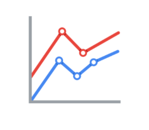

2. Size - How big, small, long, or tall a mark is

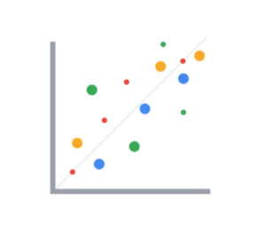

3. Shape - Whether a specific object is given a shape that communicates something about it

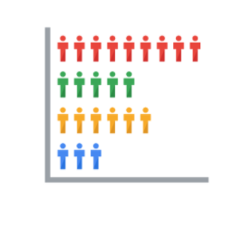

4. Color - What color the mark is

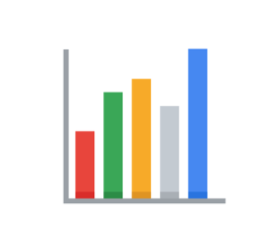

### __Channels__

C​hannels are visual aspects or variables that represent characteristics of the data. Channels are basically marks that have been used to visualize data. Channels will vary in terms of how effective they are at communicating data based on three elements:

1. Accuracy - Are the channels helpful in accurately estimating the values being represented?

For example, color is very accurate when communicating categorical differences, like apples and oranges. But it is much less effective when distinguishing quantitative data like 5 from 5.5.

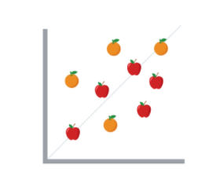

2. Popout - How easy is it to distinguish certain values from others?

There are many ways of drawing attention to specific parts of a visual, and many of them leverage pre-attentive attributes like line length, size, line width, shape, enclosure, hue, and intensity.

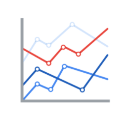

3. Grouping - How good is a channel at communicating groups that exist in the data?

Consider the proximity, similarity, enclosure, connectedness, and continuity of the channel.

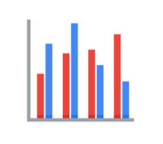

But, remember: the more you emphasize different things, the less that emphasis counts. The more you emphasize one single thing, the more that counts.

## __Design principles__

Once you understand the pre-attentive attributes of data visualization, you can go on to design principles for creating effective visuals. These design principles are important to your work as a data analyst because they help you make sure that you are creating visualizations that communicate your data effectively to your audience. By keeping these rules in mind, you can plan and evaluate your data visualizations to decide if they are working for you and your goals. And, if they aren’t, you can adjust them!

Principle

Description

Choose the right visual

One of the first things you have to decide is which visual will be the most effective for your audience. Sometimes, a simple table is the best visualization. Other times, you need a more complex visualization to illustrate your point.

Optimize the data-ink ratio

The data-ink entails focusing on the part of the visual that is essential to understanding the point of the chart. Try to minimize non-data ink like boxes around legends or shadows to optimize the data-ink ratio.

Use orientation effectively

Make sure the written components of the visual, like the labels on a bar chart, are easy to read. You can change the orientation of your visual to make it easier to read and understand.

Color

There are a lot of important considerations when thinking about using color in your visuals. These include using color consciously and meaningfully, staying consistent throughout your visuals, being considerate of what colors mean to different people, and using inclusive color scales that make sense for everyone viewing them.

Numbers of things

Think about how many elements you include in any visual. If your visualization uses lines, try to plot five or fewer. If that isn’t possible, use color or hue to emphasize important lines. Also, when using visuals like pie charts, try to keep the number of segments to less than seven since too many elements can be distracting.

## __Avoiding misleading or deceptive charts 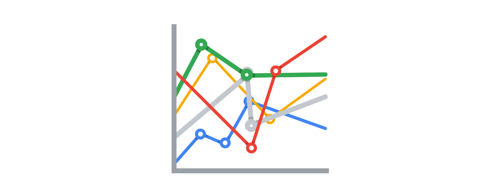__

As you are considering what kind of visualization to create and how to design it, you will want to be sure that you are not creating misleading or deceptive charts. As you have been learning, data analysis provides people with insights and knowledge they can use to make decisions. So, it is important that the visualizations you create are communicating your data accurately and truthfully. Here are some common errors to avoid so that your visualizations aren’t accidentally misleading:

What to avoid

Why

Cutting off the y-axis

Changing the scale on the y-axis can make the differences between different groups in your data seem more dramatic, even if the difference is actually quite small.

Misleading use of a dual y-axis

Using a dual y-axis without clearly labeling it in your data visualization can create extremely misleading charts.

Artificially limiting the scope of the data

If you only consider the part of the data that confirms your analysis, your visualizations will be misleading because they don’t take all of the data into account.

Problematic choices in how data is binned or grouped

It is important to make sure that the way you are grouping data isn’t misleading or misrepresenting your data and disguising important trends and insights.

Using part-to-whole visuals when the totals do not sum up appropriately

If you are using a part-to-whole visual like a pie chart to explain your data, the individual parts should add up to equal 100%. If they don’t, your data visualization will be misleading.

Hiding trends in cumulative charts

Creating a cumulative chart can disguise more insightful trends by making the scale of the visualization too large to track any changes over time.

Artificially smoothing trends

Adding smooth trend lines between points in a scatter plot can make it easier to read that plot, but replacing the points with just the line can actually make it appear that the point is more connected over time than it actually was.

Finally, keep in mind that data visualization is an art form, and it takes time to develop these skills. Over your career as a data analyst, you will not only learn how to design good data visualizations, but you will also learn how to evaluate good data visualizations. Use these tips to think critically about data visualization—both as a creator and as an audience member.

## __Further reading__

- [The beauty of data visualization](https://www.ted.com/talks/david_mccandless_the_beauty_of_data_visualization?language=en#t-150183): In this video, David McCandless explains the need for design to not just be beautiful, but for it to be meaningful as well. Data visualization must be able to balance function and form for it to be relevant to your audience.
- [‘The McCandless Method’ of data presentation](https://artscience.blog/home/the-mccandless-method-of-data-presentation): At first glance, this blog appears to be written by a David McCandless fan, and it is. However, it contains very useful information and provides an in-depth look at the 5-step process that McCandless uses to present his data.
- [Information is beautiful](https://informationisbeautiful.net/): Founded by McCandless himself, this site serves as a hub of sample visualizations that make use of the McCandless method. Explore data from the news, science, the economy, and so much more and learn how to make visual decisions based on facts from all kinds of sources.
- [Beautiful daily news](https://informationisbeautiful.net/beautifulnews/): In this McCandless collection, explore uplifting trends and statistics that are beautifully visualized for your creative enjoyment. A new chart is released every day so be sure to visit often to absorb the amazing things happening all over the world.
- [The Wall Street Journal Guide to Information Graphics: The Dos and Don'ts of Presenting Data, Facts, and Figures](https://www.amazon.com/Street-Journal-Guide-Information-Graphics/dp/0393072959): This is a comprehensive guide to data visualization, including chapters on basic data visualization principles and how to create useful data visualizations even when you find yourself in a tricky situation. This is a useful book to add to your data visualization library, and you can reference it over and over again.

Bar graphs: Use size contrast to compare two or more values.

Line graphs: Help your audience understand shifts or changes in your data.

Pie charts: Show how much each part of something makes up the whole.

Maps: Help organize data geographically.

# The beauty of visualizing

You will find that organizing your data and communicating your results are significant parts of a data analyst’s role. In this reading, you are going to navigate different resources for effective data visualization that will allow you to choose the best model to present your data.

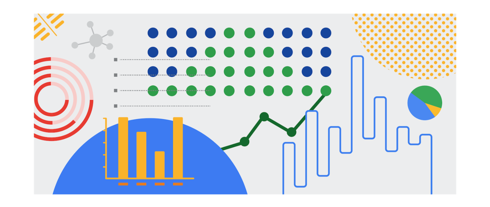

## Inspiration is in the air

__Data visualization__ is the graphical representation of data. But why should data analysts care about data visualization? Well your audience won’t always have the ability to interpret or understand the complex information that you relay to them so your job is to inform them of your analysis in a way that is meaningful, engaging, and easy to understand. Part of why data visualization is so effective is because people’s eyes are drawn to colors, shapes, and patterns, which makes those visual elements perfect for telling a story that goes beyond just the numbers.

Of course, one of the best ways to understand the importance of data visualization is to go through different examples of it. As a junior data analyst, you want to have several visualization options for your creative process whenever you need. Below is a list of resources that can inspire your next data-driven decisions, as well as teach you how to make your data more accessible to your audience:

- [The data visualization catalogue](https://datavizcatalogue.com/#google_vignette): Not sure where to start with data visualization? This catalogue features a range of different diagrams, charts, and graphs to help you find the best fit for your project. As you navigate each category, you will get a detailed description of each visualization as well as its function and a list of similar visuals.
- [The 25 best data visualizations](https://visme.co/blog/best-data-visualizations/): In this collection of images, explore the best examples of data that gets made into a stunning visual. Simply click on the link below each image to get an in-depth view of each project, and learn why making data visually appealing is so important.
- [10 data visualization blogs](https://www.tableau.com/learn/articles/best-data-visualization-blogs): Each link will lead you to a blog that is a fountain of information on everything from data storytelling to graphic data. Get your next great idea or just browse through some visual inspiration.
- [Information is beautiful](https://informationisbeautiful.net/wdvp/gallery-2019/): Founded by David McCandless, this gallery is dedicated to helping you make clearer, more informed visual decisions based on facts and data. These projects are made by students, designers, and even data analysts to help you gain insight into how they have taken their own data and turned it into visual storytelling.
- [Data studio gallery](https://datastudio.google.com/gallery?category=visualization): Information is vital, but information presented in a digestible way is even more useful. Browse through this interactive gallery and find examples of different types of data communicated visually. You can even use the data studio tool to create your own data-driven visual.

## Engage your audience

Remember: an important component of being a data analyst is the ability to communicate your findings in a way that will appeal to your audience. Data visualization has the ability to make complex (and even monotonous) information easily understood, and knowing how to utilize data visualization is a valuable skill to have. Your goal is always to help the audience have a conversation with the data so your visuals draw them into the conversation. This is especially true when you have to help your audience engage with a large amount of data, such as the flow of goods from one country to other parts of the world.

Histogram: A chart that shows how often data values fall into certain ranges.

Correlation charts: Show relationships among data.

Causation: Occurs when an action directly leads to an outcome.

# Correlation and causation

In this reading, you will examine correlation and causation in more detail. Let’s review the definitions of these terms:

- Correlation in statistics is the measure of the degree to which two variables move in relationship to each other. An example of correlation is the idea that “As the temperature goes up, ice cream sales also go up.” It is important to remember that correlation doesn’t mean that one event causes another. But, it does indicate that they have a pattern with or a relationship to each other. If one variable goes up and the other variable also goes up, it is a positive correlation. If one variable goes up and the other variable goes down, it is a negative or inverse correlation. If one variable goes up and the other variable stays about the same, there is no correlation.
- Causation refers to the idea that an event leads to a specific outcome. For example, when lightning strikes, we hear the thunder (sound wave) caused by the air heating and cooling from the lightning strike. Lightning causes thunder.

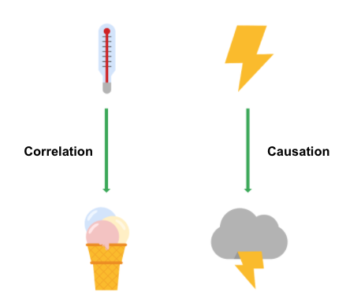

## __Why is differentiating between correlation and causation important? __

When you make conclusions from data analysis, you need to make sure that you don’t assume a causal relationship between elements of your data when there is only a correlation. When your data shows that outdoor temperature and ice cream consumption both go up at the same time, it might be tempting to conclude that hot weather causes people to eat ice cream. But, a closer examination of the data would reveal that every change in temperature doesn’t lead to a change in ice cream purchases. In addition, there might have been a sale on ice cream at the same time that the data was collected, which might not have been considered in your analysis.

Knowing the difference between correlation and causation is important when you make conclusions from your data since the stakes could be high. The next two examples illustrate the high stakes to health and human services.

### __Cause of disease__

For example, pellagra is a disease with symptoms of dizziness, sores, vomiting, and diarrhea. In the early 1900s, people thought that the disease was caused by unsanitary living conditions. Most people who got pellagra also lived in unsanitary environments. But, a closer examination of the data showed that pellagra was the result of a lack of niacin (Vitamin B3). Unsanitary conditions were related to pellagra because most people who couldn’t afford to purchase niacin-rich foods also couldn’t afford to live in more sanitary conditions. But, dirty living conditions turned out to be a correlation only.

### __Distribution of aid__

Here is another example. Suppose you are working for a government agency that provides food stamps. You noticed from the agency’s Google Analytics that people who qualify for food stamps are browsing the official website, but they are leaving the site without signing up for benefits. You think that the people visiting the site are leaving because they aren’t finding the information they need to sign up for food stamps. Google Analytics can help you find clues (correlations), like the same people coming back many times or how quickly people leave the page. One of those correlations might lead you to the actual cause, but you will need to collect additional data, like in a survey, to know exactly why people coming to the site aren’t signing up for food stamps. Only then can you figure out how to increase the sign-up rate.

## __Key takeaways __

In your data analysis, remember to:

- Critically analyze any correlations that you find
- Examine the data’s context to determine if a causation makes sense (and can be supported by all of the data)
- Understand the limitations of the tools that you use for analysis

## __Further information__

You can explore the following article and training for more information about correlation and causation:

- [Correlation is not causation](https://towardsdatascience.com/correlation-is-not-causation-ae05d03c1f53): This article describes the impact to a business when correlation and causation are confused.
- [Correlation and causation](https://www.khanacademy.org/test-prep/praxis-math/praxis-math-lessons/gtp--praxis-math--lessons--statistics-and-probability/a/gtp--praxis-math--article--correlation-and-causation--lesson) (Khan Academy lesson): This lesson describes correlation and causation along with a working example. Follow the examples of the analysis and notice if there is a positive correlation between frostbite and sledding accidents.

Static visualizations: Do not change over time unless they’re edited.

Dynamic visualizations: Visualizations that ar5e interactive or change over time.

# The wonderful world of visualizations

As a data analyst, you will often be tasked with relaying information and data that your audience might not readily understand. Presenting your data visually is an effective way to communicate complex information and engage your stakeholders. One question to ask yourself is: “what is the best way to tell the story within my data?” This reading includes several options for you to choose from (although there are many more).

## __Line chart __

A line chart is used to track changes over short and long periods of time. When smaller changes exist, line charts are better to use than bar graphs. Line charts can also be used to compare changes over the same period of time for more than one group.

Let’s say you want to present the graduation frequency for a particular high school between the years 2008-2012. You would input your data in a table like this:

Year

Graduation rate

2008

87

2009

89

2010

92

2011

92

2012

96

From this table, you are able to present your data in a line chart like this:

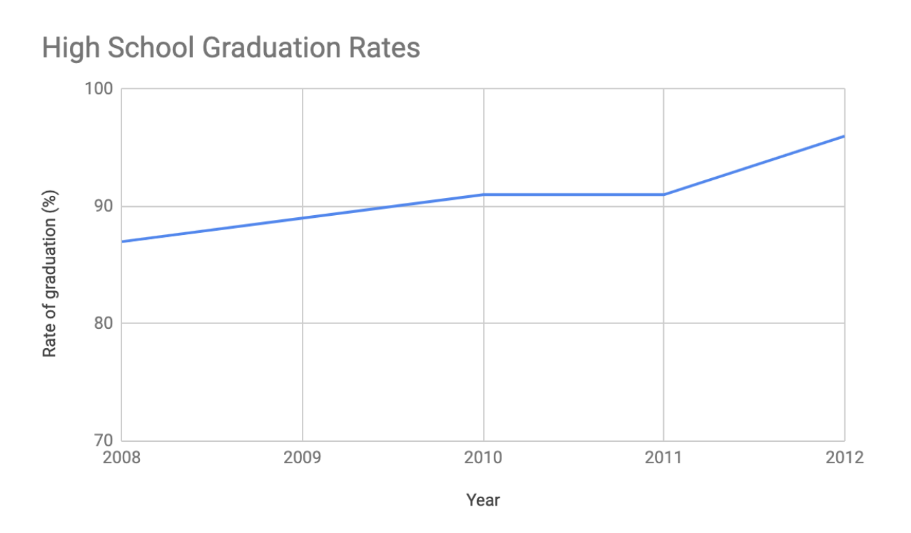

Maybe your data is more specific than above. For example, let’s say you are tasked with presenting the difference of graduation rates between male and female students. Then your chart would resemble something like this:

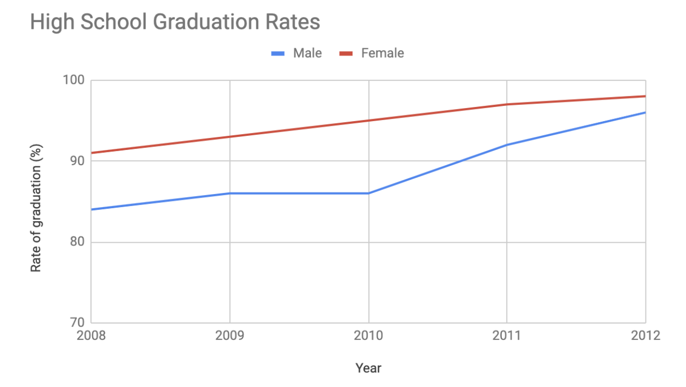

## __Column chart __

Column charts use size to contrast and compare two or more values, using height or lengths to represent the specific values.

The below is example data concerning sales of vehicles over the course of 5 months:

Month

Vehicles sold

August

2,800

September

3,700

October

3,750

November

4,300

December

4,600

Visually, it would resemble something like this:

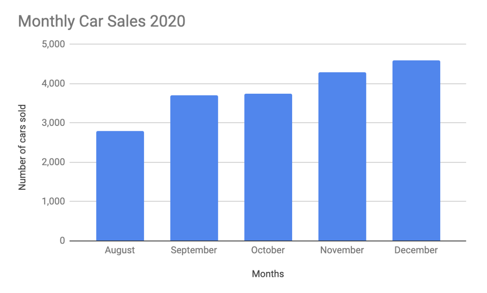

What would this column chart entail if we wanted to add the sales data for a competing car brand?

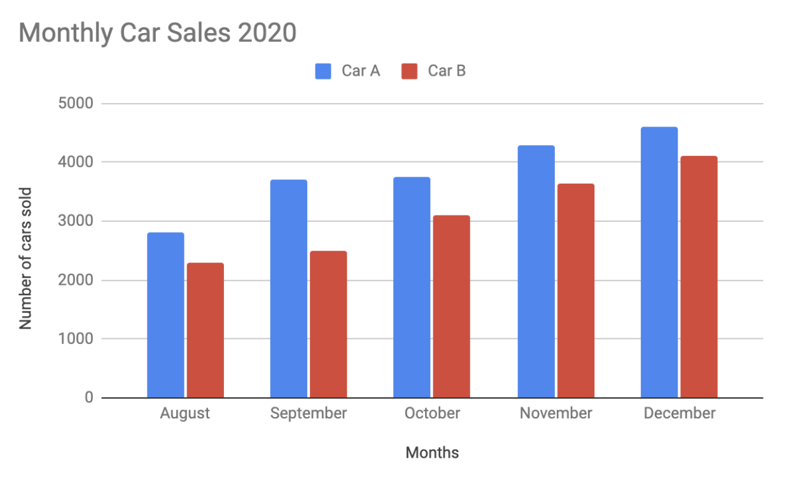

## __Heatmap __

Similar to bar charts, heatmaps also use color to compare categories in a data set. They are mainly used to show relationships between two variables and use a system of color-coding to represent different values. The following heatmap plots temperature changes for each city during the hottest and coldest months of the year.

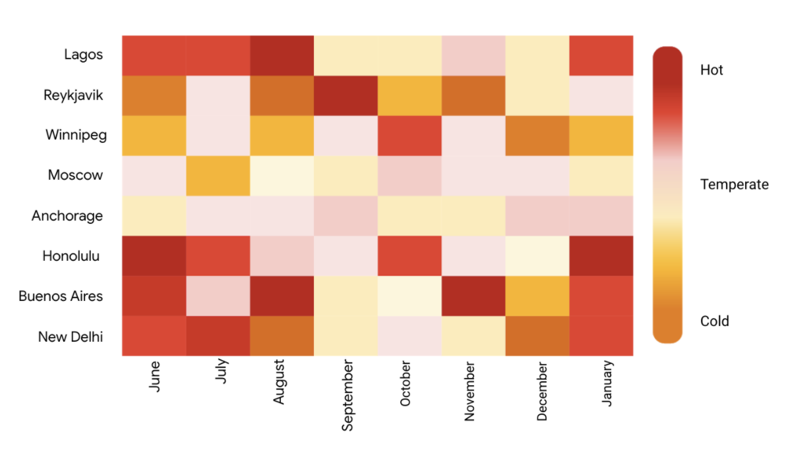

## __Pie chart__

The pie chart is a circular graph that is divided into segments representing proportions corresponding to the quantity it represents, especially when dealing with parts of a whole.

For example, let’s say you are determining favorite movie categories among avid movie watchers. You have gathered the following data:

Movie category

Preference

Comedy

41%

Drama

11%

Sci-fi

3%

Romance

17%

Action

28%

Visually, it would resemble something like this:

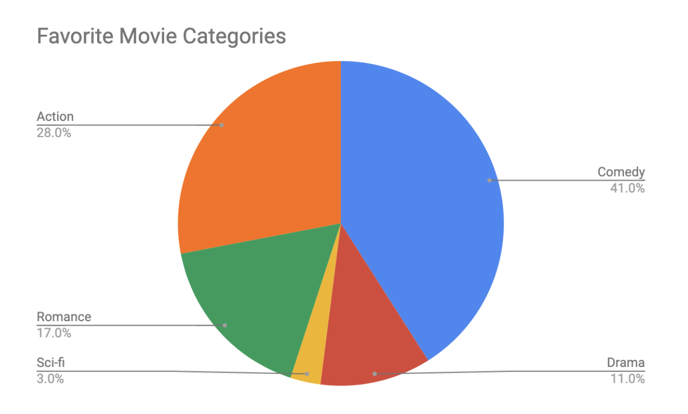

Action- 28%

Comedy- 41%

Romance- 17%

Sci-fi- 3%

Drama- 11%

## __Scatter plot__

Scatter plots show relationships between different variables. Scatter plots are typically used for two variables for a set of data, although additional variables can be displayed.

For example, you might want to show data of the relationship between temperature changes and ice cream sales. It would resemble something like this:

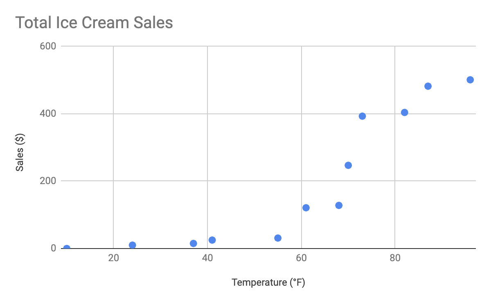

As you may notice, the higher the temperature got, the more demand there was for ice cream – so the scatter plot is great for showing the relationship between the two variables.

## __Distribution graph__

A distribution graph displays the spread of various outcomes in a dataset.

Let’s apply this to real data. To account for its supplies, a brand new coffee shop owner wants to measure how many cups of coffee their customers consume, and they want to know if that information is dependent on the days and times of the week. That distribution graph would resemble something like this:

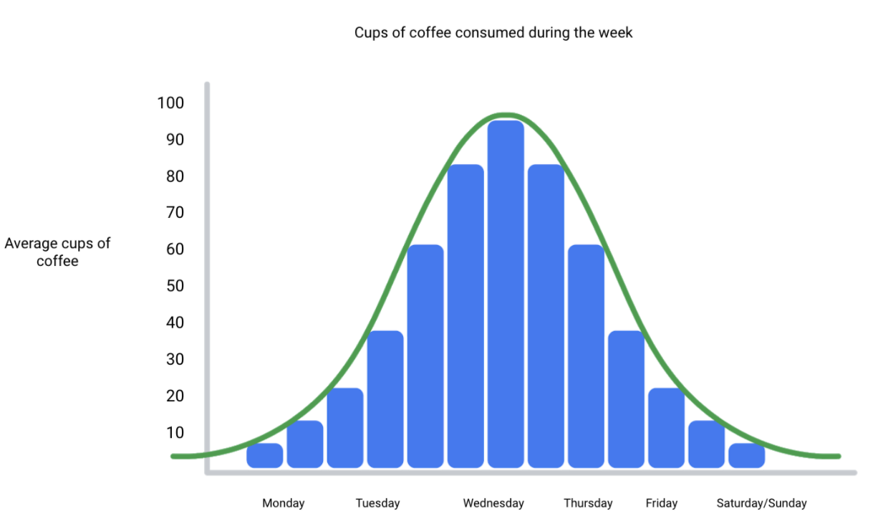

From this distribution graph, you may notice that the amount of coffee sales steadily increases from the beginning of the week, reaching the highest point mid-week, and then decreases towards the end of the week.

If outcomes are categorized on the x-axis by distinct numeric values (or ranges of numeric values), the distribution becomes a histogram. If data is collected from a customer rewards program, they could categorize how many customers consume between one and ten cups of coffee per week. The histogram would have ten columns representing the number of cups, and the height of the columns would indicate the number of customers drinking that many cups of coffee per week.

Reviewing each of these visual examples, where do you notice that they fit in relation to your type of data? One way to answer this is by evaluating patterns in data. Meaningful patterns can take many forms, such as:

- Change: This is a trend or instance of observations that become different over time. A great way to measure change in data is through a line or column chart.
- Clustering: A collection of data points with similar or different values. This is best represented through a distribution graph.
- Relativity: These are observations considered in relation or in proportion to something else. You have probably seen examples of relativity data in a pie chart.
- Ranking: This is a position in a scale of achievement or status. Data that requires ranking is best represented by a column chart.
- Correlation: This shows a mutual relationship or connection between two or more things. A scatter plot is an excellent way to represent this type of data pattern.

## __Studying your data__

Data analysts are tasked with collecting and interpreting data as well as displaying data in a meaningful and digestible way. Determining how to visualize your data will require studying your data’s patterns and converting it using visual cues. Feel free to practice your own charts and data in spreadsheets. Simply input your data in the spreadsheet, highlight it, then insert any chart type and view how your data can be visualized based on what you choose.

# Data grows on decision trees

With so many visualization options out there for you to choose from, how do you decide what is the best way to represent your data?

A decision tree is a decision-making tool that allows you, the data analyst, to make decisions based on key questions that you can ask yourself. Each question in the visualization decision tree will help you make a decision about critical features for your visualization. Below is an example of a basic decision tree to guide you towards making a data-driven decision about which visualization is the best way to tell your story. Please note that there are many different types of decision trees that vary in complexity, and can provide more in-depth decisions.

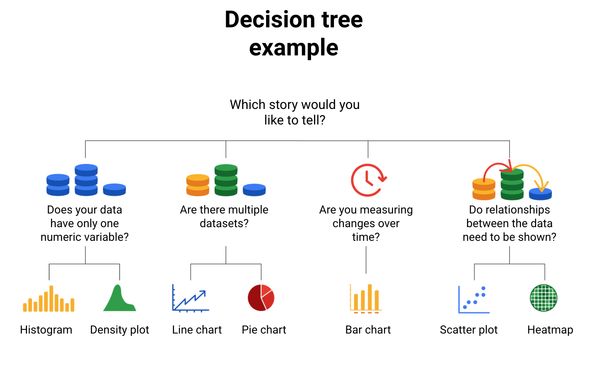

-Does your data have only one numeric variable? Histogram or Density plot

-Are there multiple data sets?  Line chart or pie chart

-Are you measuring changes over time? Bar chart

-Do relationships between the data need to be shown? Scatter plot or heatmap

## __Begin with your story__

Start off by evaluating the type of data you have and go through a series of questions to determine the best visual source:

- Does your data have only one numeric variable? If you have data that has one, continuous, numerical variable, then a histogram or density plot are the best methods of plotting your categorical data. Depending on your type of data, a bar chart can even be appropriate in this case. For example, if you have data pertaining to the height of a group of students, you will want to use a histogram to visualize how many students there are in each height range:

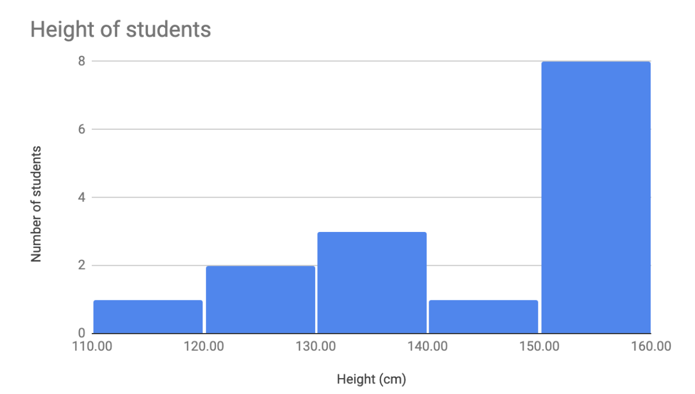

- Are there multiple datasets? For cases dealing with more than one set of data, consider a line or pie chart for accurate representation of your data. A line chart will connect multiple data sets over a single, continuous line, showing how numbers have changed over time. A pie chart is good for dividing a whole into multiple categories or parts. An example of this is when you are measuring quarterly sales figures of your company. Below are examples of this data plotted on both a line and pie chart.

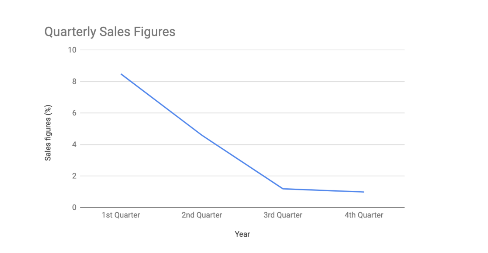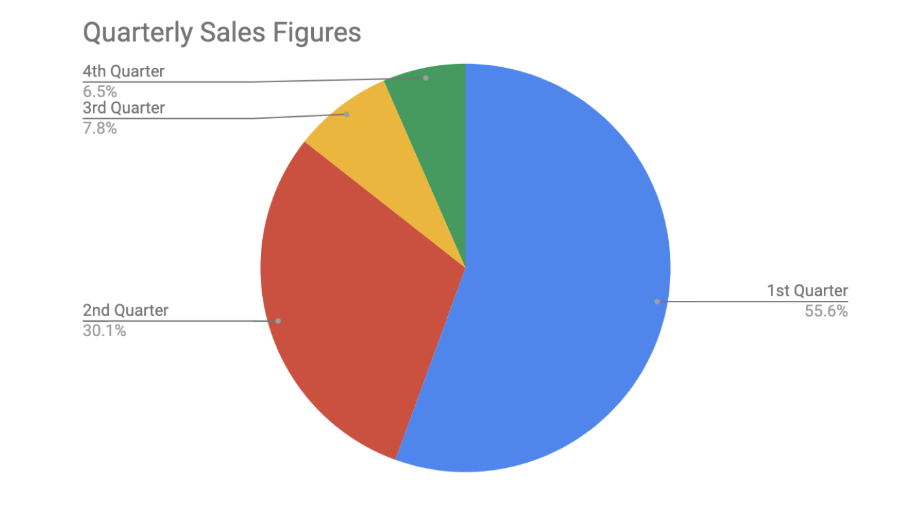

- Are you measuring changes over time? A line chart is usually adequate for plotting trends over time. However, when the changes are larger, a bar chart is the better option. If, for example, you are measuring the number of visitors to NYC over the past 6 months, the data would look like this:

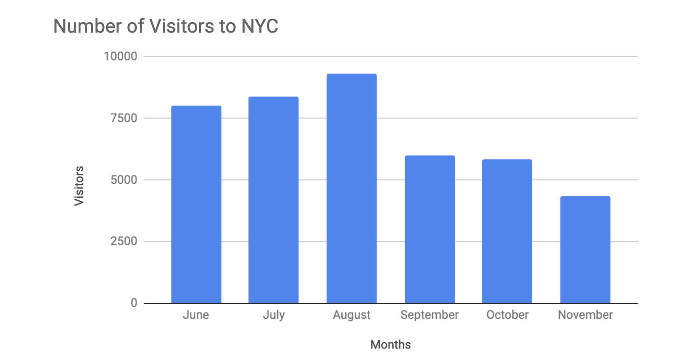

- Do relationships between the data need to be shown? When you have two variables for one set of data, it is important to point out how one affects the other. Variables that pair well together are best plotted on a scatter plot. However, if there are too many data points, the relationship between variables can be obscured so a heat map can be a better representation in that case. If you are measuring the population of people across all 50 states in the United States, your data points would consist of millions so you would use a heat map. If you are simply trying to show the relationship between the number of hours spent studying and its effects on grades, your data would look like this:

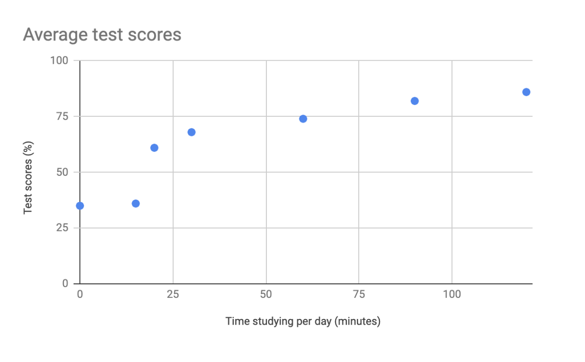

## __A​dditional resources__

The decision tree example used in this reading is one of many. There are multiple decision trees out there with varying levels of details that you can use to help guide your visual decisions. If you want more in-depth insight into more visual options, explore the following resources:

- [From data to visualization](https://www.data-to-viz.com/): This is an excellent analysis of a larger decision tree. With this comprehensive selection, you can search based on the kind of data you have or click on each  graphic example for a definition and proper usage.
- [Selecting the best chart](https://www.youtube.com/watch?v=C07k0euBpr8): This two-part YouTube video can help take the guesswork out of data chart selection. Depending on the type of data you are aiming to illustrate, you will be guided through when to use, when to avoid, and several examples of best practices.[ Part 2](https://www.youtube.com/watch?v=qGaIB-bRn-A) of this video provides even more examples of different charts, ensuring that there is a chart for every type of data out there.

The elements of art:

- Line
- Shape
- Color
- Space
- Movement

# Principles of design

In this reading, you are going to learn more about using the elements of art and principles of design to create effective visualizations. So far, we have learned that communicating data visually is a form of art. Now, it's time to explore the nine design principles for creating beautiful and effective data visualizations that can be informative and appeal to all audiences.

After we go through the various design principles, spend some time examining the visual examples to ensure that you have a thorough understanding of how the principle is put into practice. Let’s get into it!

## __Nine basic principles of design __

There are nine basic principles of design that data analysts should think about when building their visualizations.

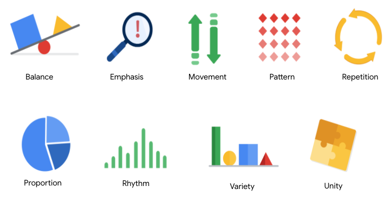

1. Balance: The design of a data visualization is balanced when the key visual elements, like color and shape, are distributed evenly. This doesn’t mean that you need complete symmetry, but your visualization shouldn’t have one side distracting from the other. If your data visualization is balanced, this could mean that the lines used to create the graphics are similar in length on both sides, or that the space between objects is equal. For example,[ this column chart](https://developers.google.com/chart/interactive/docs/gallery/columnchart) (also shown below) is balanced; even though the columns are different heights and the chart isn’t symmetrical, the colors, width, and spacing of the columns keep this data visualization balanced. The colors provide sufficient contrast to each other so that you can pay attention to both the motivation level and the energy level displayed.

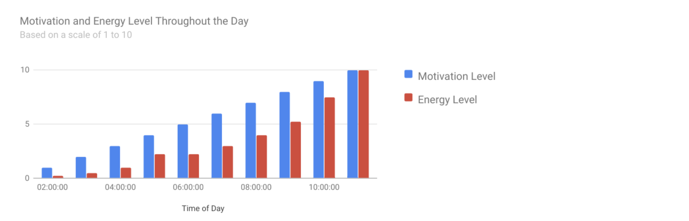

2. Emphasis: Your data visualization should have a focal point, so that your audience knows where to concentrate. In other words, your visualizations should emphasize the most important data so that users recognize it first. Using color and value is one effective way to make this happen. By using contrasting colors, you can make certain that graphic elements—and the data shown in those elements—stand out.

For example, you will notice a heat map data visualization below from[ The Pudding’s “Where Slang Comes From"](https://pudding.cool/2017/02/new-slang/) article. This heat map uses colors and value intensity to emphasize the states where search interest is highest. You can visually identify the increase in the search over time from low interest to high interest. This way, you are able to quickly grasp the key idea being presented without knowing the specific data values.

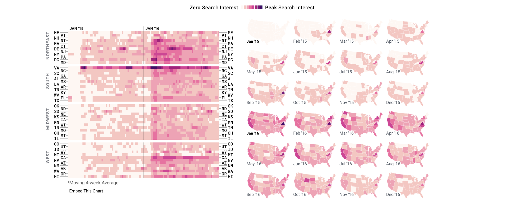

3. Movement: Movement can refer to the path the viewer’s eye travels as they look at a data visualization, or literal movement created by animations. Movement in data visualization should mimic the way people usually read. You can use lines and colors to pull the viewer’s attention across the page.

For example, notice how the average line in[ this combo chart](https://developers.google.com/chart/interactive/docs/gallery/combochart) (also shown below) draws your attention from left to right. Even though this example isn’t moving, it still uses the movement principle to guide viewers’ understanding of the data.

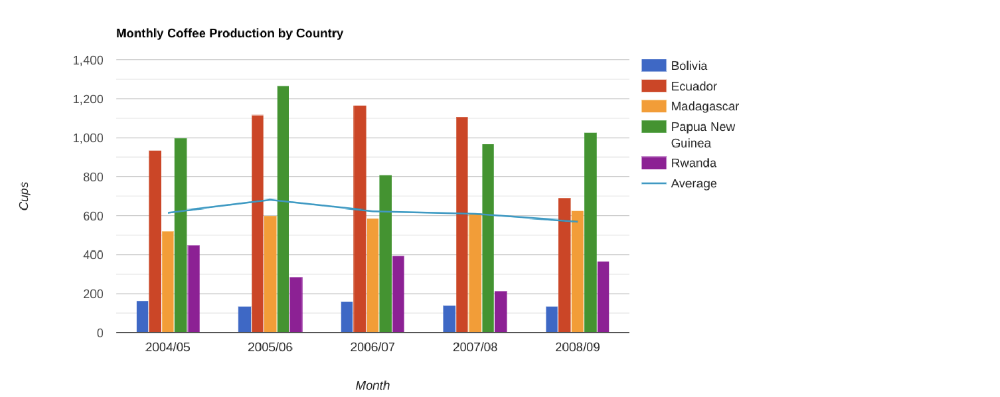

4. Pattern: You can use similar shapes and colors to create patterns in your data visualization. This can be useful in a lot of different ways. For example, you can use patterns to highlight similarities between different data sets, or break up a pattern with a unique shape, color, or line to create more emphasis.

In the example below, the different colored categories of[ this stacked column chart](https://developers.google.com/chart/interactive/docs/gallery/barchart) (also shown below) are a consistent pattern that makes it easier to compare book sales by genre in each column. Notice in the chart that the Fantasy & Sci Fi category (royal blue) is increasing over time even as the general category (green) is staying about the same.

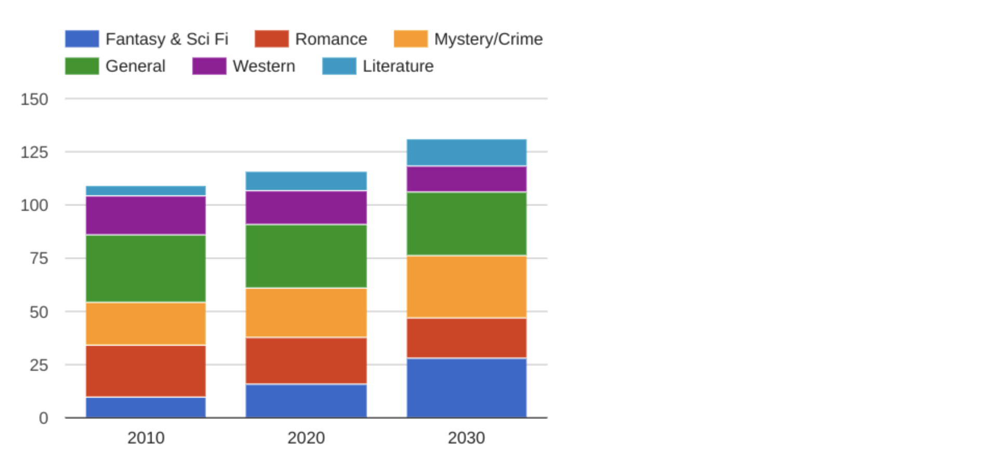

5. Repetition: Repeating chart types, shapes, or colors adds to the effectiveness of your visualization. Think about the book sales chart from the previous example: the repetition of the colors helps the audience understand that there are distinct sets of data. You may notice this repetition in all of the examples we have reviewed so far. Take some time to review each of the previous examples and notice the elements that are repeated to create a meaningful visual story.

6. Proportion: Proportion is another way that you can demonstrate the importance of certain data. Using various colors and sizes helps demonstrate that you are calling attention to a specific visual over others. If you make one chart in a dashboard larger than the others, then you are calling attention to it. It is important to make sure that each chart accurately reflects and visualizes the relationship among the values in it. In[ this dashboard](https://developers.google.com/chart/interactive/docs/gallery/controls) (also shown below), the slice sizes and colors of the pie chart compared to the data in the table help make the number of donuts eaten by each person the focal point.

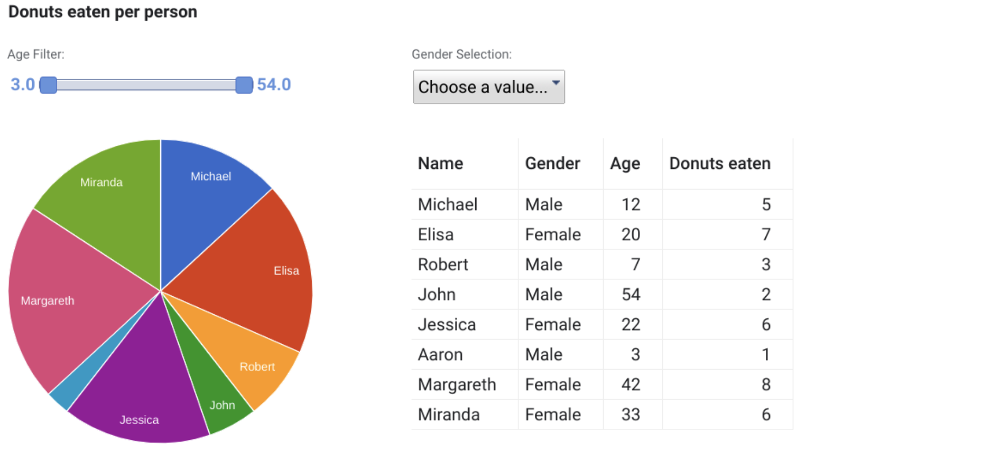

These first six principles of design are key considerations that you can make while you are creating your data visualization. These next three principles are useful checks once your data visualization is finished. If you have applied the initial six principles thoughtfully, then you will probably recognize these next three principles within your visualizations already.

7. Rhythm: This refers to creating a sense of movement or flow in your visualization. Rhythm is closely tied to the movement principle. If your finished design doesn’t successfully create a flow, you might want to rearrange some of the elements to improve the rhythm.

8. Variety: Your visualizations should have some variety in the chart types, lines, shapes, colors, and values you use. Variety keeps the audience engaged. But it is good to find balance since too much variety can confuse people. The variety you include should make your dashboards and other visualizations feel interesting and unified.

9. Unity: The last principle is unity. This means that your final data visualization should be cohesive. If the visual is disjointed or not well organized, it will be confusing and overwhelming.

Being a data analyst means learning to think in a lot of different ways. These nine principles of design can help guide you as you create effective and interesting visualizations.

Data composition: Combining the individual parts in a visualization and displaying them together as a whole.

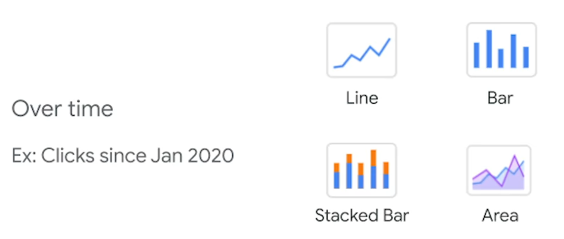

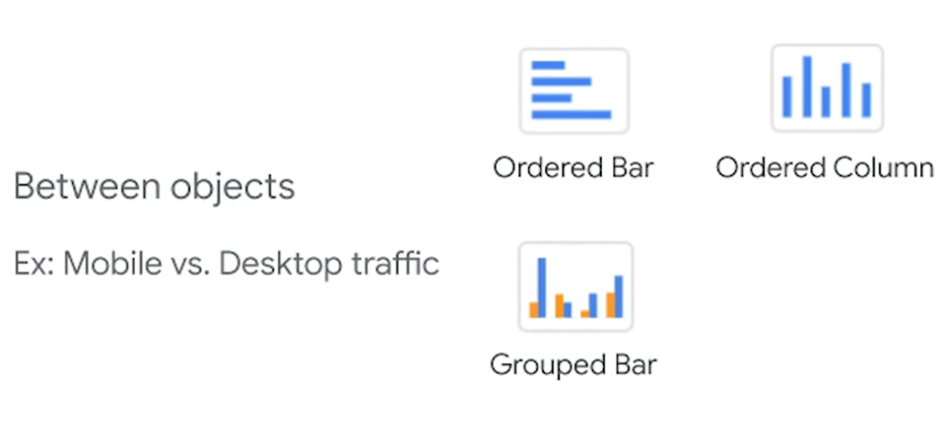

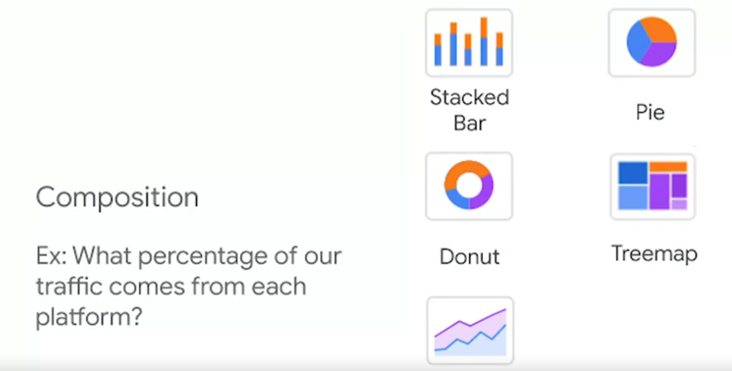

Elements for effective visuals:

- Clear meaning
- Sophisticated use of contrast
- Refined execution

# Data is beautiful

At this point, you might be asking yourself: What makes a good visualization? Is it the data you use? Or maybe it is the story that it tells? In this reading, you are going to learn more about what makes data visualizations successful by exploring David McCandless’ elements of successful data visualization and evaluating three examples based on those elements. Data visualization can change our perspective and allow us to notice data in new, beautiful ways. A picture is worth a thousand words—that’s true in data too! You will have the option to save all of the data visualization examples that are used throughout this reading; these are great examples of successful data visualization that you can use for future inspiration.

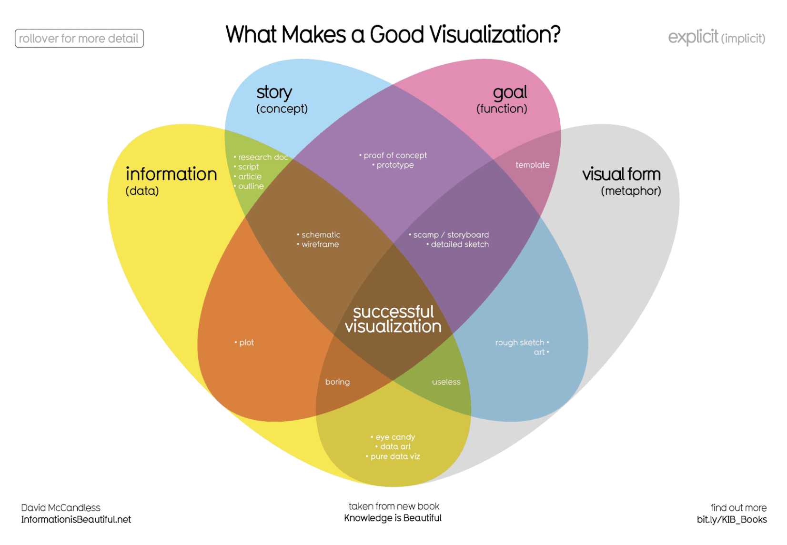

## __Four elements of successful visualizations__

The Venn diagram by David McCandless identifies four elements of successful visualizations:

- Information (data): The information or data that you are trying to convey is a key building block for your data visualization. Without information or data, you cannot communicate your findings successfully.
- Story (concept): Story allows you to share your data in meaningful and interesting ways. Without a story, your visualization is informative, but not really inspiring.
- Goal (function): The goal of your data visualization makes the data useful and usable. This is what you are trying to achieve with your visualization. Without a goal, your visualization might still be informative, but can’t generate actionable insights.
- Visual form (metaphor): The visual form element is what gives your data visualization structure and makes it beautiful. Without visual form, your data is not visualized yet.

All four of these elements are important on their own, but a successful data visualization balances all four. For example, if your data visualization has only two elements, like the information and story, you have a rough outline. This can be really useful in your early planning stages, but is not polished or informative enough to share. Even three elements are not quite enough— you need to consider all four to create a successful data visualization.

In the next part of this reading, you will use these elements to examine two data visualization examples and evaluate why they are successful.

## __Example 1: Visualization of dog breed comparison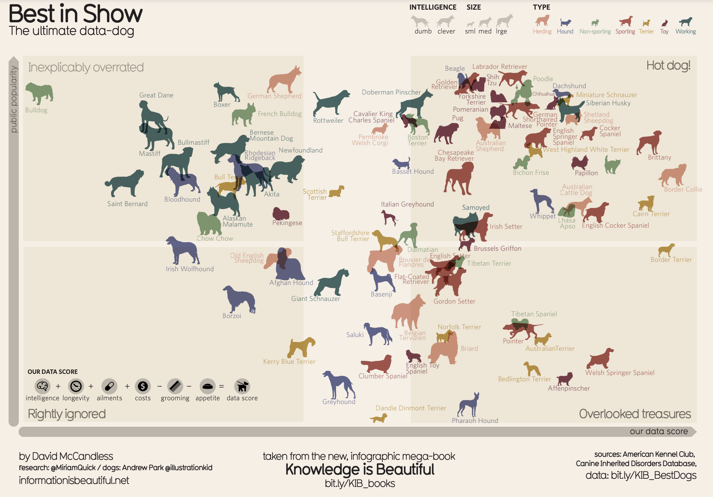__

It uses two axes, popularity and data score, to place different dog breeds on a four-square chart. The squares are labelled “Inexplicably Overrated,” “The Rightly Ignored,” “Hot Dogs!,” and “Overlooked Treasures.” Different dog breeds, visualized with plotted points shaped like dogs, are distributed on the chart based on their popularity and their data score.

Save this data visualization as a PDF by clicking the file below:

__IIB-LICENSED_Best-in-Show.pdf__PDF File

[Open file](https://d18ky98rnyall9.cloudfront.net/9_ukt6X2QOu7pLel9tDrfw_359529dc0bd647de843a11274ca5ace9_IIB-LICENSED_Best-in-Show.pdf?Expires=1642032000&Signature=cZ7up1bHUk9u6h9KxtlqebRylVUoyw41X4PJCrDL1e8bkO1DaytpTaK7upIkNNoGof544030b~onjy1v~~oY7~8NKgAjHdeo0Jnf0wwmsoyATB2KyAYeQ-z4G1F~4sbokI2AmUtvcbIrrMSDfNWJ162ML06HiYG4BiAFsuAToRU_&Key-Pair-Id=APKAJLTNE6QMUY6HBC5A)

### __View the data__

The Best in Show visualization uses data about different dog breeds from the American Kennel Club. The data has been compiled in a spreadsheet. Click the link below and select "Use Template" to view the data.

Link to the template:[ KIB - Best in Show](https://docs.google.com/spreadsheets/d/1l_HfF5EaN-QgnLc2UYdCc7L2CVrk0p3VdGB1godOyhk/template/preview)

Or, if you don't have a Google account, download the file below.

__KIB - Best in Show (public)__XLSX File

[Download file](https://d18ky98rnyall9.cloudfront.net/-tlQpnbgR2-ZUKZ24GdvPg_5754482a15824030bab88668386dde06_KIB---Best-in-Show-public-.xlsx?Expires=1642032000&Signature=PeacZ9gwf5~5Yvwa9GLMIIzdPQKxOHRJib~oAcanTWRGrqZSXlNk6BhUMfKxXLZkYUD7nwIpw5AoUKDT9g1Nm26kyy9x9wKAaVl8ucSdmA3a2KtnJzO3LtmaBvwVHGLe7tMQMnZlDyZQXlYdYGlpcpCTCwSiZMSFg3LtrDH9L~A_&Key-Pair-Id=APKAJLTNE6QMUY6HBC5A)

### __Examine the four elements__

This visualization compares the popularity of different dog breeds to a more objective data score. Consider how it uses the elements of successful data visualization:

- Information (data): If you view the data, you can explore the metrics being illustrated in the visualization.
- Story (concept): The visualization shows which dogs are overrated, which are rightly ignored, and those that are really hot dogs! And, the visualization reveals some overlooked treasures you may not have known about previously.
- Goal (function): The visualization is interested in exploring the relationship between popularity and the objective data scores for different dog breeds. By comparing these data points, you can learn more about how different dog breeds are perceived.
- Visual form (metaphor): In addition to the actual four-square structure of this visualization, other visual cues are used to communicate information about the dataset. The most obvious is that the data points are represented as dog symbols. Further, the size of a dog symbol and the direction the dog symbol faces communicate other details about the data.

## __Example 2: Visualization of rising sea levels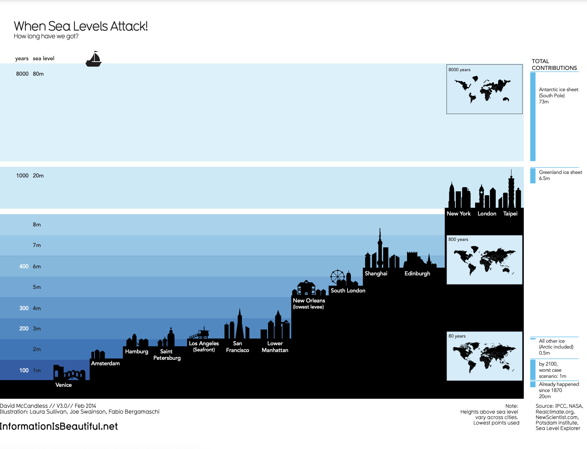__

demonstrates how much sea levels are projected to rise over the course of 8,000 years. On the y-axis, it lists both the number of years and the sea level in meters. From right to left, starting with the lowest sea level, the chart includes silhouettes of different cities around the world to demonstrate how long it would take for most of the world to be underwater. It also includes inset maps of the continents and how they would appear at different times as sea levels continue to rise.

Save this data visualization as a PDF by clicking the file below:

__IIB-LICENSED_Sea-Levels.pdf__PDF File

[Open file](https://d18ky98rnyall9.cloudfront.net/5eB5YE1QSPSgeWBNUKj0MQ_64cb4212fa57404a9a1d0274cc8ae8ba_IIB-LICENSED_Sea-Levels.pdf?Expires=1642032000&Signature=HOYj2j5X32wQn-8GWnb~JTBg87XfhBGP9~Al~y1SuEzNgXJg8WO9aL1mshK0feW4t0F3vbO5j0vYQF4Q4M9-3rc0c044LJBlf36a-YwTg-RT5urO6fyw78AXY5agSGr8mgXf5MMDOYuvSPrLbTVpWO9lkM0rorLKv4pWHTdLvdk_&Key-Pair-Id=APKAJLTNE6QMUY6HBC5A)

### __Examine the four elements__

This When Sea Levels Attack visualization illustrates how much sea levels are projected to rise over the course of 8,000 years. The silhouettes of different cities with different sea levels, rising from right to left, helps to drive home how much of the world will be affected as sea levels continue to rise. Here is how this data visualization stacks up using the four elements of successful visualization:

- Information (data): This visualization uses climate data on rising sea levels from a variety of sources, including NASA and the Intergovernmental Panel on Climate Change. In addition to that data, it also uses recorded sea levels from around the world to help illustrate how much rising sea levels will affect the world.
- Story (concept): The visualization tells a very clear story: Over the course of 8,000 years, much of the world as we know it will be underwater.
- Goal (function): The goal of this project is to demonstrate how soon rising sea levels are going to affect us on a global scale. Using both data and the visual form, this visualization makes rising sea levels feel more real to the audience.
- Visual form (metaphor): The city silhouettes in this visualization are a beautiful way to drive home the point of the visualization. It gives the audience a metaphor for how rising sea levels will affect the world around them in a way that showing just the raw numbers can’t do. And for a more global perspective, the visualization also uses inset maps.

## __Key takeaways__

Notice how each of these visualizations balance all four elements of successful visualization. They clearly incorporate data, use storytelling to make that data meaningful, focus on a specific goal, and structure the data with visual forms to make it beautiful and communicative. The more you practice thinking about these elements, the more you will be able to include them in your own data visualizations.

Design thinking: A process used to solve complex problems in a user-centric way.

Five phases of the design process:

- Empathize

Think about the need of your audience.

- Define

Think about which data to show in visualization

- Ideate

Generate your own data visualization ideas.

- Prototype

Build prototype of your visualization.

- Test

Share with others and ask for advice.

# Design thinking for visualization improvement

Design thinking for data visualization involves five phases:

1. Empathize: Thinking about the emotions and needs of the target audience for the data visualization
2. Define: Figuring out exactly what your audience needs from the data
3. Ideate: Generating ideas for data visualization
4. Prototype: Putting visualizations together for testing and feedback
5. Test: Showing prototype visualizations to people before stakeholders see them

As interactive dashboards become more popular for data visualization, new importance has been placed on efficiency and user-friendliness. In this reading, you will learn how design thinking can improve an interactive dashboard. As a junior analyst, you wouldn’t be expected to create an interactive dashboard on your own, but you can use design thinking to suggest ways that developers can improve data visualizations and dashboards.

## __An example: online banking dashboard__

Suppose you are an analyst at a bank that has just released a new dashboard in their online banking application. This section describes how you might explore this dashboard like a new user would, consider a user’s needs, and come up with ideas to improve data visualization in the dashboard. The dashboard in the banking application has the following data visualization elements:

- Monthly spending is shown as a donut chart that reflects different categories like utilities, housing, transportation, education, and groceries.
- When customers set a budget for a category, the donut chart shows filled and unfilled portions in the same view.
- Customers can also set an overall spending limit, and the dashboard will automatically assign the budgeted amounts (unfilled areas of the donut chart) to each category based on past spending trends.

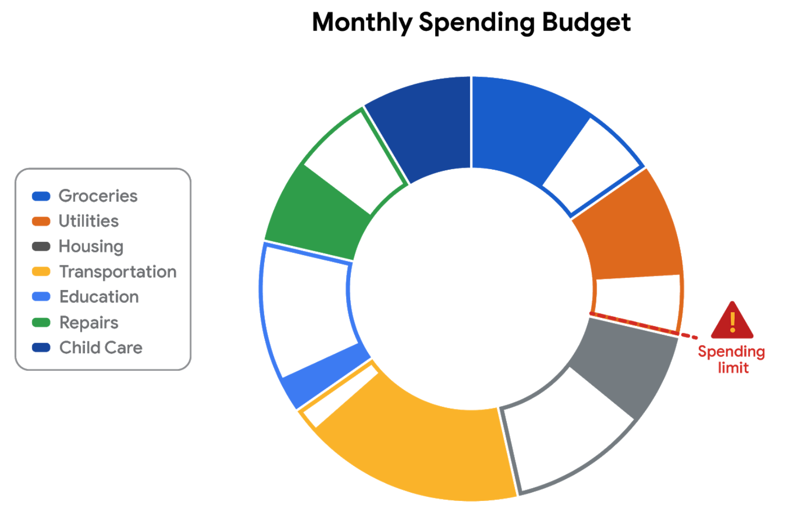

### __E​mpathize__

First, empathize by putting yourself in the shoes of a customer who has a checking account with the bank.

- Do the colors and labels make sense in the visualization?
- How easy is it to set or change a budget?
- When you click on a spending category in the donut chart, are the transactions in the category displayed?

What is the main purpose of the data visualization? If you answered that it was to help customers stay within budget or to save money, you are right! Saving money was a top customer need for the dashboard.

### __D​efine__

Now, imagine that you are helping dashboard designers define other things that customers might want to achieve besides saving money.

What other data visualizations might be needed?

- Track income (in addition to spending)
- Track other spending that doesn’t neatly fit into the set categories (this is sometimes called discretionary spending)
- Pay off debt

Can you think of anything else?

### __I​deate__

Next, ideate additional features for the dashboard and share them with the software development team.

- What new data visualizations would help customers?
- Would you recommend bar charts or line charts in addition to the standard donut chart?
- Would you recommend allowing users to create their own (custom) categories?

Can you think of anything else?

### __P​rototype__

Finally, developers can prototype the next version of the dashboard with new and improved data visualizations.

### __T​est__

Developers can close the cycle by having you (and others) test the prototype before it is sent to stakeholders for review and approval.

## __Key takeaways__

This design thinking example showed how important it is to:

- Understand the needs of users
- Generate new ideas for data visualizations
- Make incremental improvements to data visualizations over time

You can refer to the following articles for more information about design thinking:

- [Three Critical Aspects of Design Thinking for Big Data Solutions](https://dataconomy.com/2019/05/three-critical-aspects-of-design-thinking-for-big-data-solutions/)
- [Data and Design Thinking: Why Use Data in the Design Process?](https://www.enginess.io/insights/data-and-design-thinking)

Headline: A line of words printed in large letters at the top of the visualization to communicate what data is being presented.

Subtitle: Supports the headline by adding more context and description.

Legend: Identified the meaning of various elements in data visualization.

# Pro tips for highlighting key information

Headlines, subtitles, labels, and annotations help you turn your data visualizations into more meaningful displays. After all, you want to invite your audience into your presentation and keep them engaged. When you present a visualization, they should be able to process and understand the information you are trying to share in the first five seconds. This reading will teach you what you can do to engage your audience immediately.

If you already know what headlines, subtitles, labels and annotations do, go to the guidelines and style checks at the end of this reading. If you don’t, these next sections are for you.

## __Headlines that pop__

A headline is a line of words printed in large letters at the top of a visualization to communicate what data is being presented. It is the attention grabber that makes your audience want to read more. Here are some examples:

- [Which Generation Controls the Senate?](https://i.redd.it/rw0vrjakuoc61.png): This headline immediately generates curiosity. Refer to the[ subreddit post](https://www.reddit.com/r/dataisbeautiful/comments/l1yly6/oc_which_generation_controls_the_senate/) in the dataisbeautiful community, r/dataisbeautiful, on January 21, 2021.
- [Top 10 coffee producers](https://ichef.bbci.co.uk/news/976/cpsprodpb/65D8/production/_100827062_chart-globalcoffeeproduction-iskhe-nc.png): This headline immediately informs how many coffee producers are ranked. Read the full article:[ bbc.com/news/business-43742686](https://www.bbc.com/news/business-43742686).

Check out the chart below. Can you identify what type of data is being represented? Without a headline, it can be hard to figure out what data is being presented. A graph like the one below could be anything from average rents in the tri-city area, to sales of competing products, or daily absences at the local elementary, middle, and high schools.

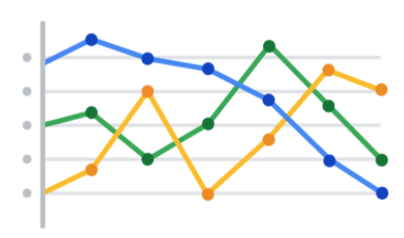

Turns out, this illustration is showing average rents in the tri-city area. So, let’s add a headline to make that clear to the audience. Adding the headline, “Average Rents in the Tri-City Area” above the line chart instantly informs the audience what it is comparing.

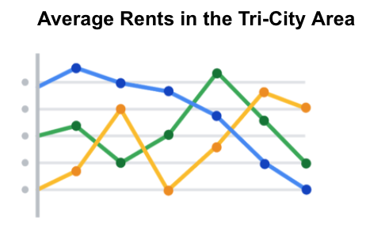

## __Subtitles that clarify__

A subtitle supports the headline by adding more context and description. Adding a subtitle will help the audience better understand the details associated with your chart. Typically, the text for subtitles has a smaller font size than the headline.

In the average rents chart, it is unclear from the headline “Average Rents in the Tri-City Area” which cities are being described. There are tri-cities near San Diego, California (Oceanside, Vista, and Carlsbad), tri-cities in the San Francisco Bay Area (Fremont, Newark, and Union City), tri-cities in North Carolina (Raleigh, Durham, and Chapel Hill), and tri-cities in the United Arab Emirates (Dubai, Ajman, and Sharjah).

We are actually reporting the data for the tri-city area near San Diego. So adding “Oceanside, Vista, and Carlsbad” becomes the subtitle in this case. This subtitle enables the audience to quickly identify which cities the data reflects.

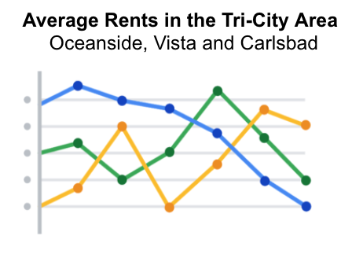

## __Labels that identify__

A label in a visualization identifies data in relation to other data. Most commonly, labels in a chart identify what the x-axis and y-axis show. Always make sure you label your axes. We can add “Months (January - June 2020)” for the x-axis and “Average Monthly Rents ($)” for the y-axis in the average rents chart.

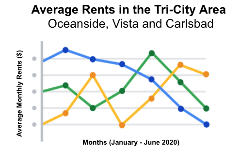

Data can also be labeled directly in a chart instead of through a chart legend. This makes it easier for the audience to understand data points without having to look up symbols or interpret the color coding in a legend.

We can add direct labels in the average rents chart. The audience can then identify the data for Oceanside in yellow, the data for Carlsbad in green, and the data for Vista in blue.

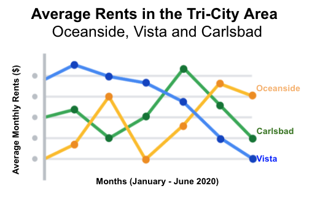

## __Annotations that focus__

An annotation briefly explains data or helps focus the audience on a particular aspect of the data in a visualization.

Suppose in the average rents chart that we want the audience to pay attention to the rents at their highs. Annotating the data points representing the highest average rents will help people focus on those values for each city.

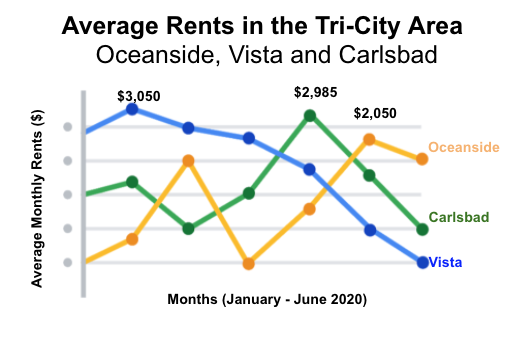

## __Guidelines and pro tips__

Refer to the following table for recommended guidelines and style checks for headlines, subtitles, labels, and annotations in your data visualizations. Think of these guidelines as guardrails. Sometimes data visualizations can become too crowded or busy. When this happens, the audience can get confused or distracted by elements that aren’t really necessary. The guidelines will help keep your data visualizations simple, and the style checks will help make your data visualizations more elegant.

Visualization

components

Guidelines

Style checks

Headlines

- Content: Briefly describe the data

- Length: Usually the width of the data frame

- Position: Above the data

- Use brief language

- Don’t use all caps

- Don’t use italic

- Don’t use acronyms

- Don't use abbreviations

- Don’t use humor or sarcasm

Subtitles

- Content: Clarify context for the data

- Length: Same as or shorter than headline

- Position: Directly below the headline

- Use smaller font size than headline

- Don’t use undefined words

- Don’t use all caps, bold, or italic

- Don’t use acronyms

- Don't use abbreviations

Labels

- Content: Replace the need for legends

- Length: Usually fewer than 30 characters

- Position: Next to data or below or beside axes

- Use a few words only

- Use thoughtful color-coding

- Use callouts to point to the data

- Don’t use all caps, bold, or italic

Annotations

- Content: Draw attention to certain data

- Length: Varies, limited by open space

- Position: Immediately next to data annotated

- Don’t use all caps, bold, or italic

- Don't use rotated text

- Don’t distract viewers from the data

You want to be informative without getting too detailed. To meaningfully communicate the results of your data analysis, use the right visualization components with the right style. In other words, let simplicity and elegance work together to help your audience process the data you are sharing in five seconds or less.

Ways to make data visualizations accessible:

- Labeling
- Text alternatives
- Text-based format
- Distinguishing
- Simplify

# Designing a chart in 60 minutes

By now, you understand the principles of design and how to think like a designer. Among the many options of data visualization is creating a chart, which is a graphical representation of data.

Choosing to represent your data via a chart is usually the most simple and efficient method. Let’s go through the entire process of creating any type of chart in 60 minutes. The goal here is to develop a prototype or mock up of your chart that you can quickly present to an audience. This will also enable you to have a sense of whether or not the chart is communicating the information that you want.

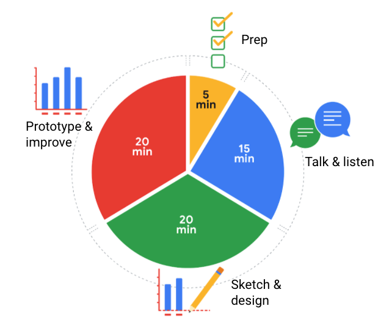

5 minutes- prep

15 minutes- talk & listen

20 minutes- prototype & improve

20 minutes- sketch & design

Follow this high level 60-minute chart to guide your thinking whenever you begin working on a data visualization.

Prep (5 min): Create the mental and physical space necessary for an environment of comprehensive thinking. This means allowing yourself room to brainstorm *how* you want your data to appear while considering the amount and type of data that you have.

Talk and listen (15 min): Identify the object of your work by getting to the “ask behind the ask” and establishing expectations. Ask questions and really concentrate on feedback from stakeholders regarding your projects to help you hone how to lay out your data.

Sketch and design (20 min): Draft your approach to the problem. Define the timing and output of your work to get a clear and concise idea of what you are crafting.

Prototype and improve (20 min): Generate a visual solution and gauge its effectiveness at accurately communicating your data. Take your time and repeat the process until a final visual is produced. It is alright if you go through several visuals until you find the perfect fit.

## __Key takeaway__

This is a great overview you can use when you need to create a visualization in a short amount of time. As you become more experienced in data visualization, you will find yourself creating your own process. You will get a more detailed description of different visualization options in the next reading, including line charts, bar charts, scatter plots, and more. No matter what you choose, always remember to take the time to prep, identify your objective, take in feedback, design, and create.
