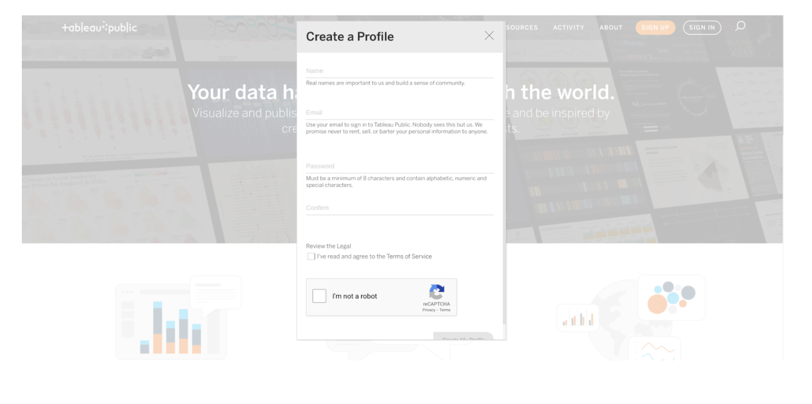
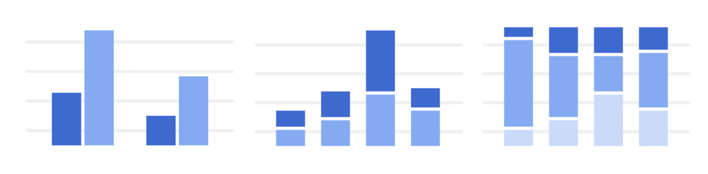
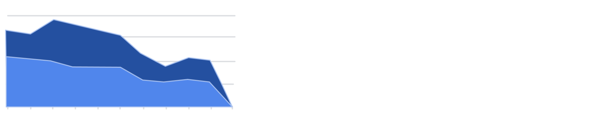

Week 25

Tableau: A business intelligence and analytics platform that helps people see, understand, and make decisions with data\.

# Logging in to Tableau Public

Tableau Public is a free platform to publicly share and explore data visualizations online\. Anyone can create visualizations using either Tableau Desktop Professional Edition or the free Tableau Public Edition\. With millions of inspiring data visualizations \(or “vizzes” as we affectionately call them\), anyone can check out vizzes about an array of public data topics, encouraging growth within the community\.

In this reading, we will discuss how you can create a profile for using Tableau Public\. We will also introduce you to some of the existing public data galleries available to you\. Finally, we will end the reading with a list of resources that you can use to continue to learn about Tableau on your own\.

## __Creating a Tableau Public profile__

Coming up, you are going to be using Tableau Public to explore data visualizations yourself\. But first, you are going to learn how to sign up for a Tableau Public profile and how to access the Google Career Certificates Gallery\. This will give you access to the data visualizations created in the lesson videos\. Keep in mind that once you create a profile, you can use it to access both Tableau Public as well as Tableau desktop\.

To get started, go to the Tableau Public home page at[ public\.tableau\.com](https://public.tableau.com/en-us/s/)\. Once you navigate to that page, you can create your account by clicking on the Sign Up button in the top\-right corner of the screen\. A pop up dialog box will appear asking you for basic profile information\. Enter the requested information and click on Create My Profile once the button becomes available\. If the button doesn’t become available, you may have missed a place where you need to fill out requested information\.

Once you have created your account, you will be able to explore public datasets and check out other creators’ work\.

## __Visualization galleries __

One of the coolest features of Tableau Public is the public gallery, where you can explore what visualizations other people have created\. In addition, you have the option to explore the data behind the visualizations, as well as download visualizations that you may want to explore in detail later on\. You can find the gallery from the header on the home page, or use the search function, which appears as a magnifying glass icon, to explore data and vizzes about particular topics\.

Here are a few useful links within Tableau Public:

- [Public Gallery](https://public.tableau.com/en-us/s/viz-gallery): These are data visualizations created by other users that you can scroll through\.
- [Featured Gallery](https://public.tableau.com/en-us/gallery/?tab=featured&type=featured): This is a collection of featured data visualizations created by other users\. This is a great source of inspiration\.
- [Viz of the Day](https://public.tableau.com/en-us/gallery/?tab=viz-of-the-day&type=viz-of-the-day): Tableau Public features a new data viz every day; check back for new visualizations daily\!
- [Google Career Certificates page on Tableau Public](https://public.tableau.com/profile/grow.with.google#!/): This gallery contains all of the visualizations created in the video lessons; you can explore these examples more here\.
- [Tableau Public resources page](https://public.tableau.com/en-us/s/resources): This links to the resources page, including some how\-to videos and sample data\.
- [Tableau user forum](https://community.tableau.com/s/): Search for answers and connect with other users in the community on the forum page\.

# Visualizations in spreadsheets and Tableau

This reading summarizes the seven primary chart types: column, line, pie, horizontal bar, area, scatter, and combo\. Then, it describes how visualizations in spreadsheets compare to those in Tableau\.

## __Primary chart types in spreadsheets__

In spreadsheets, charts are graphical representations of data from one or more sheets\. Although there are many variations to choose from, we will focus on the most broadly applicable charts to give you a sense of what is possible in a spreadsheet\. As you review these examples, keep in mind that these are meant to give you an overview of visualizations rather than a detailed tutorial\. Another reading in this program will describe the applicable steps and process to create a chart more specifically\. When you are in an application, you can always select Help from the menu bar for more information\.

- To create a chart In Google Sheets, select the data cells, click Insert from the main menu, and then select Chart\. You can set up and customize the chart in the dialog box on the right\.
- To create a chart in Microsoft Excel, select the data cells, click Insert from the main menu, and then select the chart type\. Tip: You can optionally click Recommended Charts to view Excel’s recommendations for the data you selected and then select the chart you like from those shown\.

These are the primary chart types available:

- Column \(vertical bar\): a column chart allows you to display and compare multiple categories of data by their values\.

- Line: a line chart showcases trends in your data over a period of time\. The last line chart example is a combo chart which can include a line chart\. Refer to the description for the combo chart type\.

- Pie: a pie chart is an easy way to visualize what proportion of the whole each data point represents\.

- Horizontal bar: a bar chart functions similarly to a column chart, but is flipped horizontally\.

- Area: area charts allow you to track changes in value across multiple categories of data\.

- Scatter: scatter plots are typically used to display trends in numeric data\.

- Combo: combo charts use multiple visual markers like columns and lines to showcase different aspects of the data in one visualization\. The example below is a combo chart that has a column and line chart together\.

You can find more information about other charts here:

- [Types of charts and graphs in Google Sheets:](https://support.google.com/docs/answer/190718?hl=en) a Google Help Center page with a list of chart examples you can download\.
- [Excel Charts](https://www.tutorialspoint.com/excel_charts/excel_charts_types.htm): a tutorial outlining all of the different chart types in Excel, including some subcategories\.

## __How visualizations differ in Tableau__

As you have also learned, Tableau is an analytics platform that helps data analysts display and understand data\. Most if not all of the charts that you can create in spreadsheets are available in Tableau\. But, Tableau offers some distinct charts that aren’t available in spreadsheets\. These are handy guides to help you select chart types in Tableau:

- [Which chart or graph is right for you?](http://www.tableau.com/sites/default/files/media/which_chart_v6_final_0.pdf) This presentation covers 13 of the most popular charts in Tableau\.
- [The Ultimate Cheat Sheet on Tableau Charts](https://towardsdatascience.com/the-ultimate-cheat-sheet-on-tableau-charts-642bca94dde5)\. This blog describes 24 chart variations in Tableau and guidelines for use\.

The following are visualizations that are more specialized in Tableau with links to examples or the steps to create them:

- Highlight tables appear like tables with conditional formatting\. Review the[ steps to build a highlight table](https://help.tableau.com/current/pro/desktop/en-us/buildexamples_highlight.htm)\.
- Heat maps show intensity or concentrations in the data\. Review the[ steps to build a heat map](https://help.tableau.com/current/pro/desktop/en-us/buildexamples_highlight.htm)\.
- Density maps show concentrations \(like a population density map\)\. Refer to[ instructions to create a heat map for density](https://help.tableau.com/current/pro/desktop/en-us/maps_howto_heatmap.htm)\.
- Gantt charts show the duration of events or activities on a timeline\. Review the[ steps to build a Gantt chart](https://help.tableau.com/current/pro/desktop/en-us/buildexamples_gantt.htm)\.
- Symbol maps display a mark over a given longitude and latitude\. Learn more from this[ example of a symbol map](https://interworks.com/blog/ccapitula/2014/08/18/tableau-essentials-chart-types-symbol-map/)\.
- Filled maps are maps with areas colored based on a measurement or dimension\. Explore an[ example of a filled map](https://interworks.com/blog/ccapitula/2014/09/23/tableau-essentials-chart-types-filled-map/)\.
- Circle views show comparative strength in data\. Learn more from this[ example of a circle view](https://interworks.com/blog/ccapitula/2014/10/17/tableau-essentials-chart-types-circle-view/)\.
- Box plots also known as box\-and whiskers charts show the distribution of values along a chart axis\. Refer to the[ steps to build a box plot](https://help.tableau.com/current/pro/desktop/en-us/buildexamples_boxplot.htm)\.
- Bullet graphs compare a primary measure with another and can be used instead of dial gauge charts\. Review the[ steps to build a bullet graph](https://help.tableau.com/current/pro/desktop/en-us/qs_bullet_graphs.htm)\.
- Packed bubble charts display data in clustered circles\. Review the[ steps to build a packed bubble chart](https://help.tableau.com/current/pro/desktop/en-us/buildexamples_bubbles.htm)\.

## __Key takeaway__

This reading described the chart types you can create in spreadsheets and introduced visualizations that are more unique to Tableau\.

A diverging palette displays two ranges of values using color intensity to indicate magnitude\. Intensity is a color’s brightness or dullness\.
