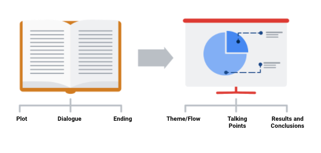
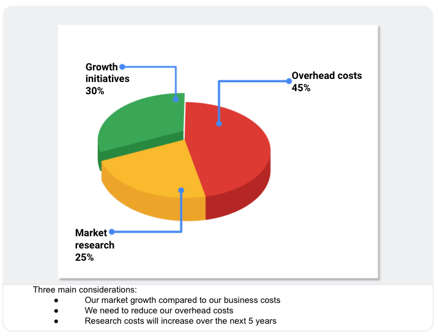
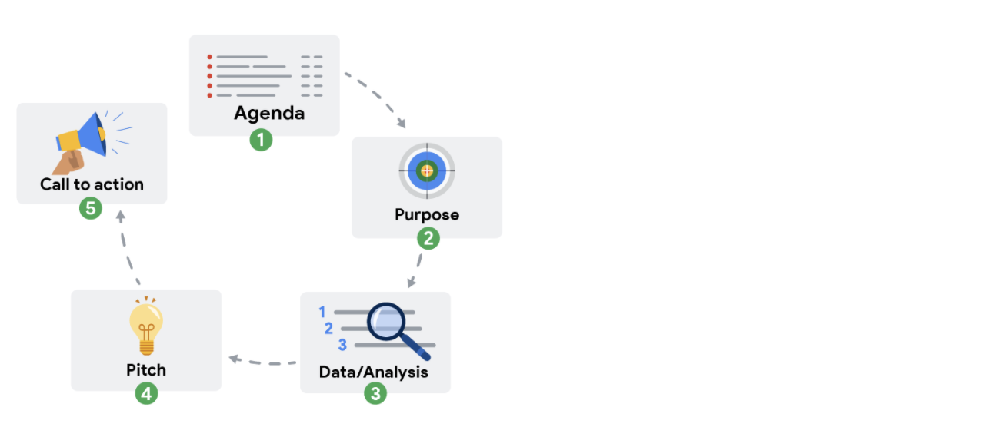

Week 27

The art and science of an effective presentation

The framework of your presentation starts with your understanding of the business task.

Purpose of framework:

- Help you focus on the most important information
- Create logical connections that tie back to the business task
- Give your audience context to better understand your data

Weaving data into your presentation

- Help your audience to understand what data was available during data collection.
- Establish the initial hypothesis.
- Show solution using visualization and data

The McCandless Method

- Introduce the graphic by name
- Answer obvious questions before they’re asked
- State the insight of your graphic
- Call out data to support that insight
- Tell your audience why it matters

# Step-by-step critique of a presentation

This reading provides an orientation of two upcoming videos:

- Connor: Messy example of a data presentation
- Connor: Good example of a data presentation

To get the most out of these videos, you should watch them together (back to back). In the first video, Connor introduces a presentation that is confusing and hard to follow. In the second video, he returns to talk about what can be done to improve it and help the audience better understand the data and conclusions being shared.

## **Messy data presentation**

In the first video, watch and listen carefully for the specific reasons the “messy” presentation falls short. Here is a preview:

- No story or logical flow
- No titles
- Too much text
- Inconsistent format (no theme)
- No recommendation or conclusion at the end

### **Messy presentation: people don’t know where to focus their attention**

The main problem with the messy presentation is the lack of a logical flow. Notice also how the data visualizations are hard to understand and appear without any introduction or explanation. The audience has no sense of what they are looking at and why.  When people in the audience have to figure out what the data means without any help, they can end up being lost, confused, and unclear about any actions they need to take.

## **Good data presentation**

In the second video, numerous best practices are applied to create a better presentation on the same topic. This “good” presentation is so much easier to understand than the messy one! Here is a preview:

- Title and date the presentation was last updated
- Flow or table of contents
- Transition slides
- Visual introduction to the data (also used as a repeated theme)
- Animated bullet points
- Annotations on top of visuals
- Logic and progression
- Limitations to the data (caveats) - what the data can’t tell you

**Tip**: As you watch this video, take notes about what Connor suggests to create a good presentation. You can keep these notes in your journal. When you create your own presentations, refer back to your notes. This will help you to develop your own thinking about the quality of presentations.

### **Good presentation: people are logically guided through the data**

The good presentation logically guides the audience through the data – from the objectives at the beginning all the way to the conclusions at the end. Notice how the data visualizations are introduced using a common theme and are thoughtfully placed before each conclusion. A good presentation gives people in the audience the facts and data, helps them understand what the data means, and provides takeaways about how they can use their understanding to make a change or do some good.

Two key responsibilities of data analysts:

- Analyze the data
- Present your findings effectively

Presentation tips:

- Channel your excitement
- Start with the broader ideas
- Use the five-second rule

Wait five seconds after showing a data visualization

Ask if they understand

Give your audience another five seconds

Tell them the conclusion

- Preparation is the key

Use this guide to help make your presentation stand out as you tell your data story. Follow the recommended tips and slide sequence in this guide for a presentation that will truly impress your audience.

You can also **download this guide as a PDF**, so you can reference it in the future:

__Sharing your data findings in presentations _ Tips and Tricks.pdf__PDF File

[Open file](https://d18ky98rnyall9.cloudfront.net/_LwuiIoNSYq8LoiKDUmKxw_e8ff903b66b943ddaea3b8517fe8a3af_Sharing-your-data-findings-in-presentations-_-Tips-and-Tricks.pdf?Expires=1642204800&Signature=dFhlZlEAtlUKqvcfvXzj6AU2Oa3kJTQ8V-LhCfpLOPgMrB1GT3LP-qW~qaadq-ZPHwOAPfRvMHkMVHkqNEVf9yRqmflgg0Jvbsp-Ibim1UHHjpYZJ~IUbedH6XmrLsD3X61nrz0AYoppNUna2~yskgQGygtmXtY1U84ityoP0IU_&Key-Pair-Id=APKAJLTNE6QMUY6HBC5A)

## Telling your data story (tips and tricks to present your data and results)

Use the following tips and sample layout to build your own presentation.

### **Tip 1: Know your flow**

Just like in any good story, a data story must have a good plot (theme and flow), good dialogue (talking points), and a great ending or big reveal (results and conclusions). One flow could be an overview of what was analyzed followed by resulting trends and potential areas for further exploration.

- In order to develop the right flow for your presentation, keep your audience in mind. Ask yourself these two questions to help you define the overall flow and build out your presentation.

### Who is my audience?
- If your intended audience is executives, board members, directors, or other C-level (C-Suite) executives, your storytelling should be kept at a high level. This audience will want to hear about your story but might not have time to hear the *entire* story. Executives tend to focus on endings that encourage improving, correcting, or inventing things. Keep your presentation brief and spend most of your time on your results and recommendations. Refer to an upcoming topic in this reading—Tip 3: end with your recommendations.
- If your intended audience is stakeholders and managers, they might have more time to learn about how you performed your analysis and they might ask more data-specific questions. Be prepared with talking points about the aspects of your analysis that led you to your final results and conclusions.
- If your intended audience is other analysts and individual contributors, you will have the most freedom—and perhaps the most time—to go more deeply into the data, processes, and results.

### What is the purpose of my presentation?
- If the goal of your presentation is to request or recommend something at the end, like a sales pitch, you can have each slide work toward the recommendations at the end.
- If the goal of your presentation is to focus on the results of your analysis, each slide can help mark the path to the results. Be sure to include plenty of breadcrumbs (views of the data analysis steps) to demonstrate the path you took with the data.
- If the goal of your presentation is to provide a report on the data analysis, your slides should clearly summarize your data and key findings. In this case, it is alright to let the data be the star or speak for itself.

### **Tip 2: Prepare talking points and limit text on slides**

As you create each slide in your presentation, prepare **talking points** (also called **speaker notes**) on what you will say.

Don’t forget that you will be talking at the same time that your audience is reading your slides. If your slides start becoming more like documents, you should rethink what you will say so that you can remove some text from the slides. Make it easy for your audience to skim read the slides while still paying attention to what you are saying. In general, follow the five-second rule. Your audience should not be spending more than five seconds reading any block of text on a slide.

Knowing exactly what you will say when explaining each slide throughout your presentation also creates a natural flow to your story. Talking points help you avoid awkward pauses between topics. Slides that summarize data can also be repetitive (and boring). If you prepare a variety of interesting talking points about the data, you can keep your audience alert and paying attention to the data and its analysis.

### **Tip 3: End with your recommendations**

When climbing a mountain, getting to the top is the goal. Making recommendations at the end of your presentation is like getting to the mountaintop.

- Useone slide for your recommendations at the end. Be clear and concise.
- If you are recommending that something be done, provide next steps and describe what you would consider a successful outcome.

### **Tip 4: Allow enough time for the presentation and questions**

Assume that everyone in your audience is busy. Keep your presentation on topic and as short as possible by:

- Being aware of your timing. This applies to the total number of slides and the time you spend on each slide.
- Presenting your data efficiently. Make sure that every slide tells a unique and important part of your data story. If a slide isn’t that unique, you might think about combining the information on that slide with another slide.
- Saving enough time for questions at the end or allowing enough time to answer questions throughout your presentation.

## Putting it all together: Your slide deck layout

In this section, we will describe how to put everything together in a sample slide deck layout.

### **First slide: Agenda**

Provide a high-level bulleted list of the topics you will cover and the amount of time you will spend on each. Every company’s norms are different, but in general, most presentations run from 30 minutes to an hour at most. Here is an example of a 30-minute agenda:

- Introductions (4 minutes)
- Project overview and goals (5 minutes)
- Data and analysis (10 minutes)
- Recommendations (3 minutes)
- Actionable steps (3 minutes)
- Questions (5 minutes)

### **Second slide: Purpose**

Everyone might not be familiar with your project or know why it is important. They didn’t spend the last couple of weeks thinking about the analysis and results of your project like you did. This slide summarizes the purpose of the project and why it is important to the business for your audience.

Here is an example of a purpose statement:

*Service center consolidation is an important cost savings initiative. The aim of this project was to determine the impact of service center consolidation on customer response times. *

### **Third slide: Data/analysis**

First, It really is possible to tell your data story in a single slide if you summarize the key things about your data and analysis. You may have supporting slides with additional data or information in an appendix at the end of the presentation.

But, if you choose to tell your story using more than one slide, keep the following in mind:

- Slides typically have a logical order (beginning, middle, and end) to fully build the story.
- Each slide should logically introduce the slide that follows it. Visual cues from the slides or verbal cues from your talking points should let the audience know when you will go on to the next slide.
- Remember not to use too much text on the slides. When in doubt, refer back to the second tip on preparing talking points and limiting the text on slides.
- The high-level information that people read from the slides shouldn’t be the same as the information you provide in your talking points. There should be a nice balance between the two to tell a good story. You don’t want to simply read or say the words on the slides.

For extra visuals on the slides, use animations. For example, you can:

- Fade in one bullet point at a time as you discuss each on a slide.
- Only display the visual that is relevant to what you are talking about (fade out non-relevant visuals).
- Use arrows or callouts to point to a specific area of a visual that you are using.

### **Fourth slide: Recommendations**

If you have been telling your story well in the previous slides, the recommendations will be obvious to your audience. This is when you might get a lot of questions about how your data supports your recommendations. Be ready to communicate how your data backs up your conclusion or recommendations in different ways. Having multiple words to state the same thing also helps if someone is having difficulty with one particular explanation.

### **Fifth slide: Call to action**

Sometimes the call to action can be combined with the recommendations slide. If there are multiple actions or activities recommended, a separate slide is best.

- Recall our example of a purpose statement:

*Service center consolidation is an important cost savings initiative. The aim of this project was to determine the impact of service center consolidation on customer response times. *

Suppose the data analysis showed that service center consolidation negatively impacted customer response times. A call to action might be to examine if processes need to change to bring customer response times back to what they were before the consolidation.

## Wrapping it up: Getting feedback

After you present to your audience, think about how you told your data story and how you can get feedback for improvement. Consider asking your manager or another data analyst for candid thoughts about your storytelling and presentation overall. Feedback is great to help you improve. When you have to write a brand new data story (or a sequel to the one you already told), you will be ready to impress your audience even more!

Presentation pro tips:

Your audience

- Will not always see the steps you took to reach a conclusion
- Has a lot on their mind
- Is easily distracted

How you speak

- Keep your sentences short
- Build-in intentional pauses
- Keep the pitch of your sentences level

Be mindful of nervous habits

- Stay still and move with purpose
- Practice good posture
- Make positive eye contact

These are skills that you can practice with every presentation

Anticipate the question

Understand your stakeholder’s expectations

Make sure you have a clear understanding of the objective and what the stakeholders wanted (If you misunderstood your stakeholders’ expectations or the project objectives, you won’t be able to correctly answer their questions)

The colleague test: do a test-run of your presentation

Work with your team to anticipate questions and draft responses

Be prepared to consider any limitations of your data by:

- Critically analyzing the correlations
- Looking at the context
- Understanding the strengths and weaknesses of the tools

# Preparing for the Q&A

When working on any project, it is important to understand from the beginning what stakeholders expect of you. This reading will be all about preparing questions to ask before planning your data gathering and presentations.

There are many things to consider before you begin asking and answering possible questions – like the objective, stakeholder expectations, and if there are any limitations. Make sure you have everything covered before you begin. The checklist below identifies ten tasks that you should engage in to be well prepared for your Q&A:

## **Before the presentation**

1. Assemble and prepare your questions.
2. Discuss your presentation with your manager, other analysts, or other friendly contacts in your organization.
3. Ask a manager or other analysts what sort of questions were normally asked by your specific audience in the past.
4. Seek comments, feedback, and questions on the deck or the document of your analysis.
5. At least 24 hours ahead of the presentation, try and brainstorm tricky questions or unclear parts you may come across- this helps avoid surprises.
6. It never hurts to practice what you will be presenting, to account for any missing information or simply to calm your nerves.

## **During the presentation**

1. Be prepared to respond to the things that you find and effectively and accurately explain your findings.
2. Address potential questions that may come up.
3. Avoid having a single question derail a presentation and propose following-up offline.
4. Put supplementary visualizations and content in the appendix to help answer questions.

## **Practice makes perfect**

Preparing for a presentation or a meeting doesn’t have to be intimidating. If you invest time into knowing your audience, crafting your notes, doing necessary research and organizing your data, then there is very little reason why your audience will not be engaged, even impressed.

Types of objections

- About the data

Where you got the data

What systems it came from

What transformations happened to it

How fresh and accurate is the data

- About your analysis

Is your analysis reproducible

Who did you get feedback from

- About your findings

Do these findings exist in previous time periods

Did you control for the differences in your data

Responding possible objections

- Communicate any assumptions
- Explain why your analysis might be different than expected
- Acknowledge that those objections are valid and take steps to investigate further

Listen to the whole question

Repeat the question (if necessary)

Understand the context

Involve the whole audience

Keep your responses short and to the point
