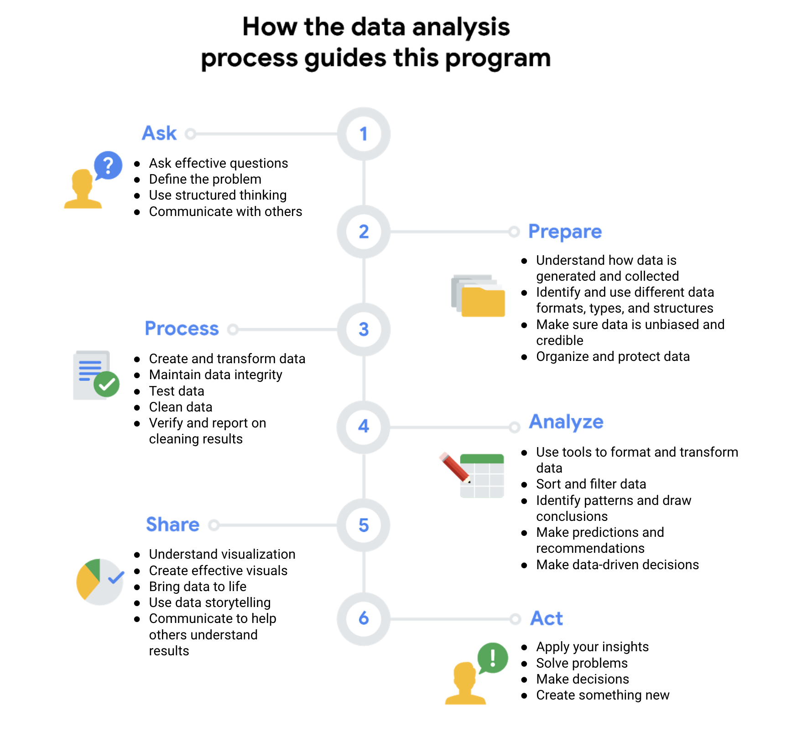

Week 3

Learning about data phases and tools

__Data life cycle:__

__Planning__

__Capture \(send various data to database\)__

__Manage \(secure data\)__

__Analyze__

Ask: understanding expectations of stakeholders, find obstacles\.

Prepare

Process: cleaning, removing outliers, correct inconsistency\.

Analyze: spreadsheets and sequel \(SQL\)\.

Share: visualization, R programming language\.

Act:

__Archive \(save data when no longer need\)__

__Destroy \(protect private info\)__

Stakeholders: People who have invested time and resources into a project and are interested in the outcome\.

Data analyst tools

## Spreadsheets

Data analysts rely on spreadsheets to collect and organize data\. Two popular spreadsheet applications you will probably use a lot in your future role as a data analysts are Microsoft Excel and Google Sheets\.

Spreadsheets structure data in a meaningful way by letting you

- Collect, store, organize, and sort information
- Identify patterns and piece the data together in a way that works for each specific data project
- Create excellent data visualizations, like graphs and charts\.

## Databases and query languages

A database is a collection of structured data stored in a computer system\. Some popular Structured Query Language \(SQL\) programs include MySQL, Microsoft SQL Server, and BigQuery\.

Query languages

- Allow analysts to isolate specific information from a database\(s\)
- Make it easier for you to learn and understand the requests made to databases
- Allow analysts to select, create, add, or download data from a database for analysis

## Visualization tools

Data analysts use a number of visualization tools, like graphs, maps, tables, charts, and more\. Two popular visualization tools are Tableau and Looker\.

These tools

- Turn complex numbers into a story that people can understand
- Help stakeholders come up with conclusions that lead to informed decisions and effective business strategies
- Have multiple features

            \- Tableau's simple drag\-and\-drop feature lets users create interactive graphs in dashboards and

               worksheets

            \- Looker communicates directly with a database, allowing you to connect your data right to the visual

                tool you choose

A career as a data analyst also involves using programming languages, like R and Python, which are used a lot for statistical analysis, visualization, and other data analysis\.

## Key takeaway

You have a lot of tools as a data analyst\. This is a first glance at the possibilities, and you will explore many of these tools in\-depth throughout this program\.

Spreadsheets

Databases

Software applications

Data stores \- accessed using a query language \(e\.g\. SQL\)

Structure data in a row and column format

Structure data using rules and relationships

Organize information in cells

Organize information in complex collections

Provide access to a limited amount of data

Provide access to huge amounts of data

Manual data entry

Strict and consistent data entry

Generally one user at a time

Multiple users

Controlled by the user

Controlled by a database management system

The Plan and Ask phases both involve planning and asking questions, but they tackle different subjects\. The Ask phase in the data analysis process focuses on big\-picture strategic thinking about business goals\. However, the Plan phase focuses on the fundamentals of the project, such as what data you have access to, what data you need, and where you’re going to get it\.
