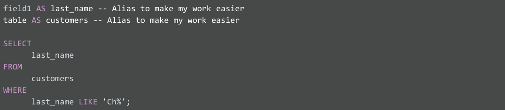

Week 4

Attribute: a characteristic or quality of data used to label a column in a table\.

Observation: All of the attributes for something contained in a row of the data table\.

Formula: a set of instructions that performs a specific action using the data in a spreadsheet\.

Query: A request for data or information from a database\.

SELECT element\_a, element\_b FROM database\_name WHERE conditions\_a AND conditions\_b

WHERE conditions

In the query shown above, the SELECT clause identifies the column you want to pull data from by name, field1, and the FROM clause identifies the table where the column is located by name, table\. Finally, the WHERE clause narrows your query so that the database returns only the data with an exact value match or the data that matches a certain condition that you want to satisfy\.

For example, if you are looking for a specific customer with the last name Chavez, the WHERE clause would be:

WHERE field1 = 'Chavez'

However, if you are looking for all customers with a last name that begins with the letters “Ch," the WHERE clause would be:

WHERE field1 LIKE 'Ch%'

You can conclude that the LIKE clause is very powerful because it allows you to tell the database to look for a certain pattern\! The percent sign \(%\) is used as a wildcard to match one or more characters\. In the example above, both Chavez and Chen would be returned\. Note that in some databases an asterisk \(\*\) is used as the wildcard instead of a percent sign \(%\)\.

Comments

Some tables aren’t designed with descriptive enough naming conventions\. In the example, field1 was the column for a customer’s last name, but you wouldn’t know it by the name\. A better name would have been something such as last\_name\. In these cases, you can place comments alongside your SQL to help you remember what the name represents\. Comments are text placed between certain characters, /\* and \*/, or after two dashes \(\-\-\) as shown below\.

Image of SQL statements with comments shown between /\* and \*/ and after \-\-

Comments can also be added outside of a statement as well as within a statement\. You can use this flexibility to provide an overall description of what you are going to do, step\-by\-step notes about how you achieve it, and why you set different parameters/conditions\.

\-This is an important query used later to join with the accounts table\. SELECT rowkey, Info\.date, Info\.code FROM Publishers

The more comfortable you get with SQL, the easier it will be to read and understand queries at a glance\. Still, it never hurts to have comments in a query to remind yourself of what you’re trying to do\. This also makes it easier for others to understand your query if your query is shared\. As your queries become more and more complex, this practice will save you a lot of time and energy to understand complex queries you wrote months or years ago\.

Aliases

You can also make it easier on yourself by assigning a new name or alias to the column or table names to make them easier to work with \(and avoid the need for comments\)\. This is done with a SQL AS clause\. In the example below, the alias last\_name has been assigned to field1 and the alias customers assigned to table\. These aliases are good for the duration of the query only\. An alias doesn’t change the actual name of a column or table in the database\.

### __Example of a query with aliases__

____
