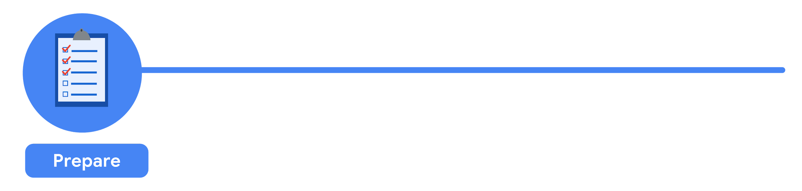
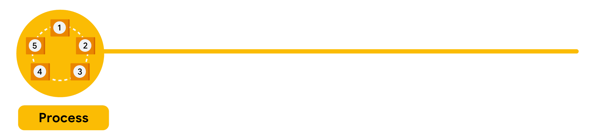
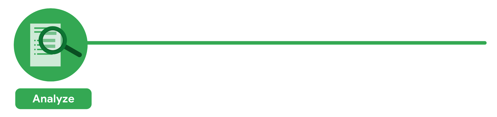
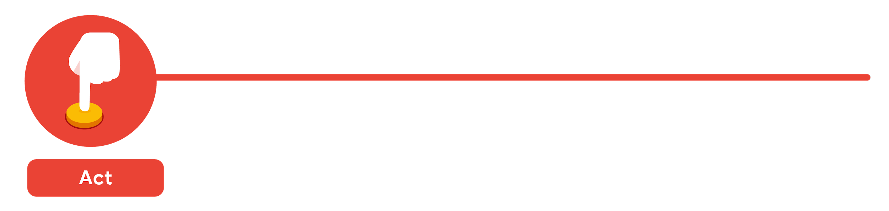
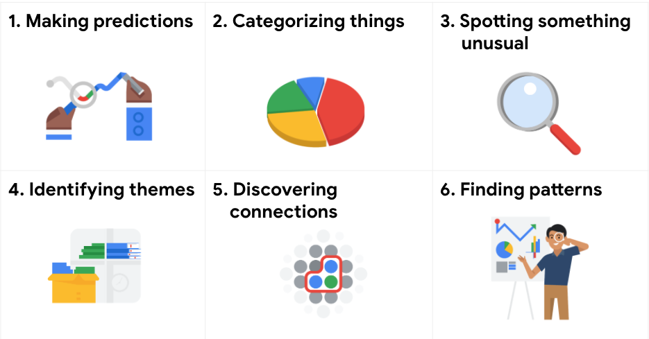
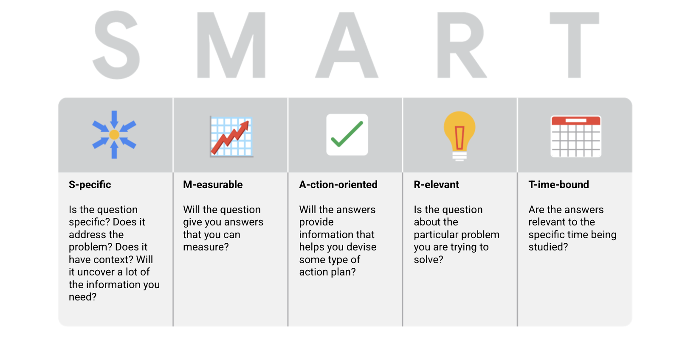

Week 6

**Structured thinking**: The process of recognizing the current problem or situation, organizing available information, revealing gaps and opportunities, and identifying the options.

## From issue to action: The six data analysis phases

There are six data analysis phases that will help you make seamless decisions: ask, prepare, process, analyze, share, and act. Keep in mind, these are different from the data life cycle, which describes the changes data goes through over its lifetime. Let’s walk through the steps to see how they can help you solve problems you might face on the job.

## Step 1: Ask

It’s impossible to solve a problem if you don’t know what it is. These are some things to consider:

- Define the problem you’re trying to solve
- Make sure you fully understand the stakeholder’s expectations
- Focus on the actual problem and avoid any distractions
- Collaborate with stakeholders and keep an open line of communication
- Take a step back and see the whole situation in context

### **Questions to ask yourself in this step:**

1. What are my stakeholders saying their problems are?
2. Now that I’ve identified the issues, how can I help the stakeholders resolve their questions?

## Step 2: Prepare

You will decide what data you need to collect in order to answer your questions and how to organize it so that it is useful. You might use your business task to decide:

- What metrics to measure
- Locate data in your database
- Create security measures to protect that data

### **Questions to ask yourself in this step:**

1. What do I need to figure out how to solve this problem?
2. What research do I need to do?

## Step 3: Process

Clean data is the best data and you will need to clean up your data to get rid of any possible errors, inaccuracies, or inconsistencies. This might mean:

- Using spreadsheet functions to find incorrectly entered data
- Using SQL functions to check for extra spaces
- Removing repeated entries
- Checking as much as possible for bias in the data

### **Questions to ask yourself in this step:**

1. What data errors or inaccuracies might get in my way of getting the best possible answer to the problem I am trying to solve?
2. How can I clean my data so the information I have is more consistent?

## Step 4: Analyze

You will want to think analytically about your data. At this stage, you might sort and format your data to make it easier to:

- Perform calculations
- Combine data from multiple sources
- Create tables with your results

### **Questions to ask yourself in this step:**

1. What story is my data telling me?
2. How will my data help me solve this problem?
3. Who needs my company’s product or service? What type of person is most likely to use it?

## Step 5: Share

Everyone shares their results differently so be sure to summarize your results with clear and enticing visuals of your analysis using data viz tools like graphs or dashboards. This is your chance to show the stakeholders you have solved their problem and how you got there. Sharing will certainly help your team:

- Make better decisions
- Make more informed decisions
- Lead to stronger outcomes
- Successfully communicate your findings

### **Questions to ask yourself in this step:**

1. How can I make what I present to the stakeholders engaging and easy to understand?
2. What would help me understand this if I were the listener?

## Step 6: Act

Now it’s time to act on your data. You will take everything you have learned from your data analysis and put it to use. This could mean providing your stakeholders with recommendations based on your findings so they can make data-driven decisions.

### **Questions to ask yourself in this step:**

1. How can I use the feedback I received during the share phase (step 5) to actually meet the stakeholder’s needs and expectations?

These six steps can help you to break the data analysis process into smaller, manageable parts, which is called structured thinking. This process involves four basic activities:

1. Recognizing the current problem or situation
2. Organizing available information
3. Revealing gaps and opportunities
4. Identifying your options

When you are starting out in your career as a data analyst, it is normal to feel pulled in a few different directions with your role and expectations. Following processes like the ones outlined here and using structured thinking skills can help get you back on track, fill in any gaps and let you know exactly what you need.

### **Making predictions**

A company that wants to know the best advertising method to bring in new customers is an example of a problem requiring analysts to make predictions. Analysts with data on location, type of media, and number of new customers acquired as a result of past ads can't guarantee future results, but they can help predict the best placement of advertising to reach the target audience.

### **Categorizing things**

An example of a problem requiring analysts to categorize things is a company's goal to improve customer satisfaction. Analysts might classify customer service calls based on certain keywords or scores. This could help identify top-performing customer service representatives or help correlate certain actions taken with higher customer satisfaction scores.

### **Spotting something unusual**

A company that sells smart watches that help people monitor their health would be interested in designing their software to spot something unusual. Analysts who have analyzed aggregated health data can help product developers determine the right algorithms to spot and set off alarms when certain data doesn't trend normally.

### **Identifying themes**

User experience (UX) designers might rely on analysts to analyze user interaction data. Similar to problems that require analysts to categorize things, usability improvement projects might require analysts to identify themes to help prioritize the right product features for improvement. Themes are most often used to help researchers explore certain aspects of data. In a user study, user beliefs, practices, and needs are examples of themes.

By now you might be wondering if there is a difference between categorizing things and identifying themes. The best way to think about it is: categorizing things involves assigning items to categories; identifying themes takes those categories a step further by grouping them into broader themes.

### **Discovering connections**

A third-party logistics company working with another company to get shipments delivered to customers on time is a problem requiring analysts to discover connections. By analyzing the wait times at shipping hubs, analysts can determine the appropriate schedule changes to increase the number of on-time deliveries.

### **Finding patterns**

Minimizing downtime caused by machine failure is an example of a problem requiring analysts to find patterns in data. For example, by analyzing maintenance data, they might discover that most failures happen if regular maintenance is delayed by more than a 15-day window.

- Specific: Does the question focus on a particular car feature?
- Measurable: Does the question include a feature rating system?
- Action-oriented: Does the question influence creation of different or new feature packages?
- Relevant: Does the question identify which features make or break a potential car purchase?
- Time-bound: Does the question validate data on the most popular features from the last three years?
