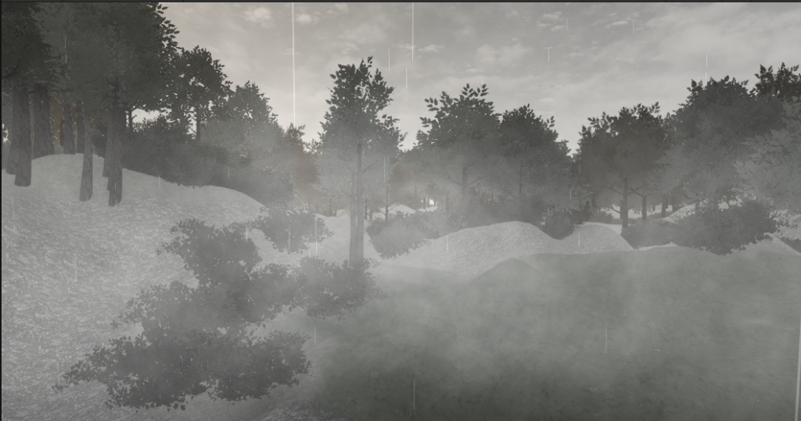

https://www.youtube.com/watch?v=wetFCRTlSp8&t=264s

Gray-75 is a story about a patient with Alzheimer's disease. Wandering in his memory, the main character has to find out the most important element in life. By visiting this story, the player could experience the life of an elder with memory loss. More importantly, we want the players to value their time and treat the most important thing carefully.

## The project is available on (but not avaliable now because the LFS limitation)

[https://github.com/Trance-0/Gray-75](https://github.com/Trance-0/Gray-75)

(If I had enough time, I would try to make the page shorter.)

## Where is the name come from

To build the reminiscence of the main character, we decide to build the game in gray, like the old photos from the past. In the post-processing stage, we use gray lens with 75 percent of gray. Moreover, the fog in the scene is 75% gray.

## Reason to build the project

I could hardly remember where the first idea come from. At first, it is just a virtual space in my mind to store my imagination. You know, children in adolescents would always have some fancy ideas but hesitate to share them with others. In my primary school. My mind is a monochrome lighthouse. Suffering from the education system in China, I didn't have time or intention to think about what my future might look like and don't know where to go, Thus, the lighthouse would be the best representation of my soul. To penetrate the mists and fogs and see the world clearly. Even guide others if possible.

After I learned knowledge about game development, the first thing I do is create, visualize the world in my mind. The natural impulse of realizing my imagination cannot be stopped easily. Thus, I gathered some of my classmates who are also interested in computer science to build the project.

## What is the story telling

There are many stories I want to tell in the game, but the main topic might be **the meaning of life**. I know it sounds vague and unrealistic. But this is what I believe to be important for everyone. After getting into high school, I started to think about the question of my interest, my dream. Then the story appeared. If someday (there must be a day like that) when I get old and stand on the edge of life and death, what can I do to reduce my pain and pass away with pleasure and joy?

Then I build the game to show this scenario. The player would experience the memory fragments in the elder's mind, to see the incomplete life and change them before it is too late.

We always believe there is something called tomorrow and we can do something important later, but tomorrow never comes. What we can only do is fully utilize the only present we can have, the present.

## What challenge you have confronted when developing this game

Since I have been asked this question in Initialview, I would like to share some content about it.

The greatest challenge we are facing is that **we underestimate the difficulties of making a puzzle game.**

We started developing this game after a short online meeting, without any plots, without any reference, without any materials available. Linfeng and I have two different understandings of the plot and we just build the game with such conflicts. After Hellen checked the game-making plan last week, she was surprised by the messy story, which is just like the memory fragments we want to create. We plan to build the entire project consisting of 4 rooms in the winter vacation of 2021, but the fact is that the demo still remained unfinished till now (2021.11.9). We don't know how hard it is to build a perfect game plot. We don't know how many bugs we have to fix when the player is running in the game scene. We know almost nothing about the game development process and just "follow our hearts" till they diverge completely.

Till recent month we start to reconsider the plot design and try to get some advice from our friends. We shared the demo with numerous bugs with our teacher and other game lovers in our class. Finally, we build a plan with specific details and none in my team wanted to add more things in-game. However, in recent weeks, everyone is completing their applications and doesn't have time to build the projects anymore, this project might update slowly with little effort paid.

## When can I play this game

We (at least I) will continue updating this project after submitting our applications to the colleges. In Q1/Q2 of 2022, we will try to pass the project to the students in lower grades with a strong interest in computer science or game development. Since Changsha lacks this kind of resources to teach high school students to learn game development in Unity Engine with real practice, we will build a game development club in our school and help students realize their ideas in-game with technical supports. Of course, we will finish the demo during the winter vacation of 2022. But the other rooms might not be available for a long period of time...

## Can I get some preview of the other part of the projects

This is the current design of the second room, an infinite forest.

This science demonstrates a spring trip of the main character when he was lost in the forest and trying to find a way out. The player cannot get out of the forest unless he or she triggers the right objects and meets the requirement.

In this room, I want to show the loss of the player in adolescent age, when he starts to discover the true meaning of life like me.
