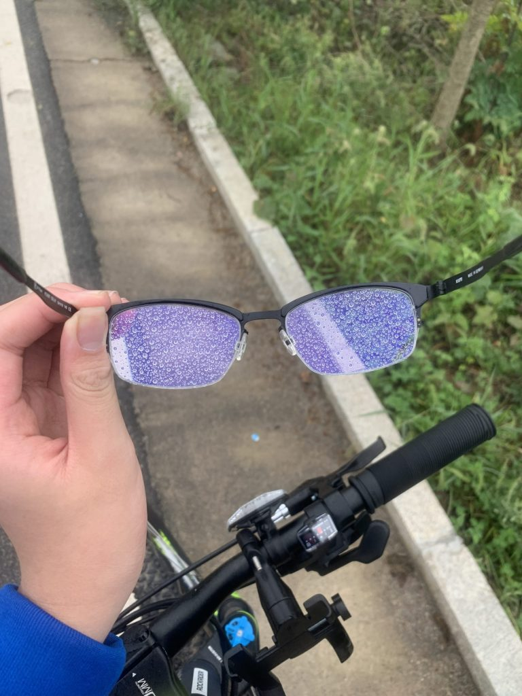
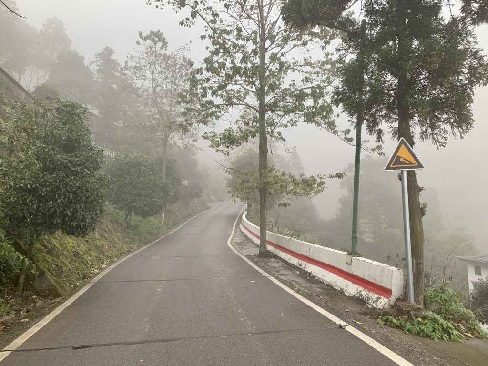
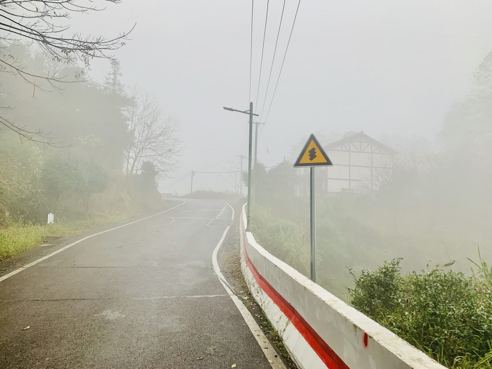
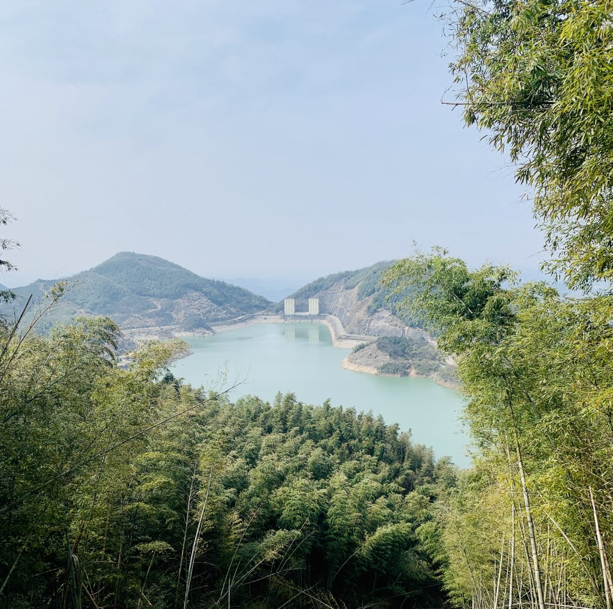
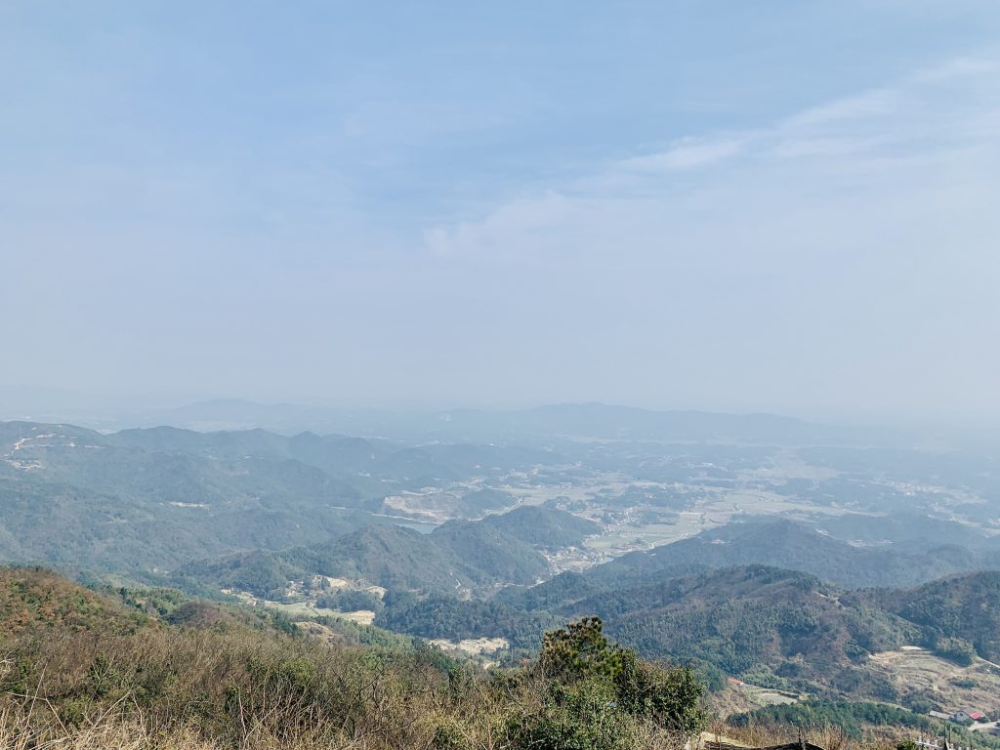

最早的时候，我也没想过我会去爬山，去爬黑麋峰。 慢慢的，我向着更远的地方启航， 沉醉于探索的喜悦中。我可以，不借助外力，用自己的双脚丈量这个世界。 前几次上山，山上阴云密布，细雨均匀的分散在黑麋峰的空气中。   回想起之前大雾在山中仙游的记忆独自一人攀登高峰，不知道前路在何方，也不知道回去的路到底在哪里。我独自一人漫游于云雾之中，迷失在白色的虚无，那种感觉是那么空虚与寂寞。  去过黑麋峰，去过很多次，和朋友，和父亲，和自己。每次总会有不同的收获，最重要的，是活着的感觉。每次筋疲力尽的回到家中，才会意识到自己有多么的幸福。慢慢的前进，需要的是坚定的决心。   然而这并非旅程的结束，高睿灵发现有一条陡坡似乎还在山间延伸。牌子显示山上还有一座古寺。我们将自行车推上了山坡，突然发现这个坡比我们想象中的要长的多，陡得多。超过了45°的斜坡，留下的只有一个选择，推车。等到到达了真正的山顶，我已经筋疲力尽了，腿在椅子上完全不想抬起来。静静坐了十几分钟。在此，除了山顶的气象站，没有什么比我们更高了。 终于，我拿出了我的干粮，薯片雪碧，在山顶上享受至高无上的惬意。天空的蓝色是那么的纯净，在这一刻，心中只有腿的麻木与薯片的香脆可口，以及阳光照射在身上的温暖，一切其他的东西显得那么暗淡无光。生活本就是如此的纯粹，每天太阳都会照常升起，薯片雪碧触手可及，而我们却常常忽视他们的存在，忙碌的奔走于大街小巷之中，为了那多出来的几分快乐，忙碌于世间. 

#### 人群密度

##### 低

#### 道路舒适度

##### 高，标准马路

#### 骑行路程

##### 极长

#### 综合推荐

##### 骑行必去
