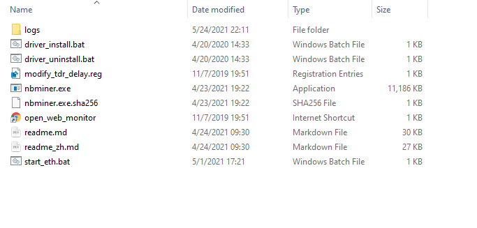
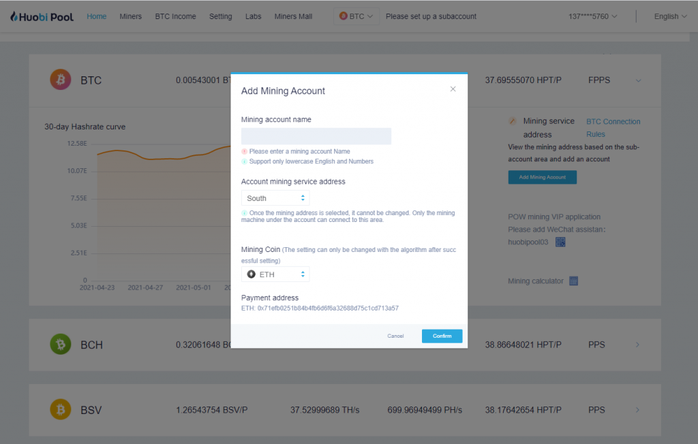
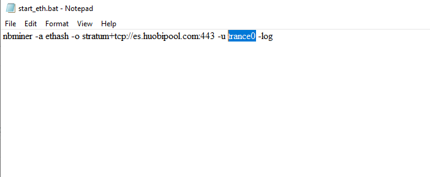
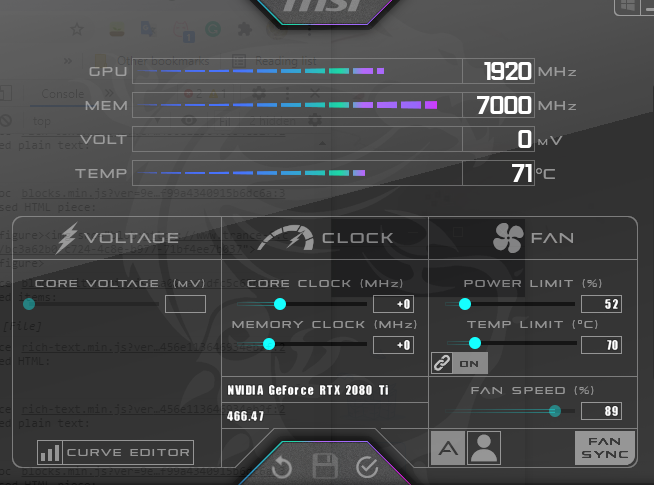
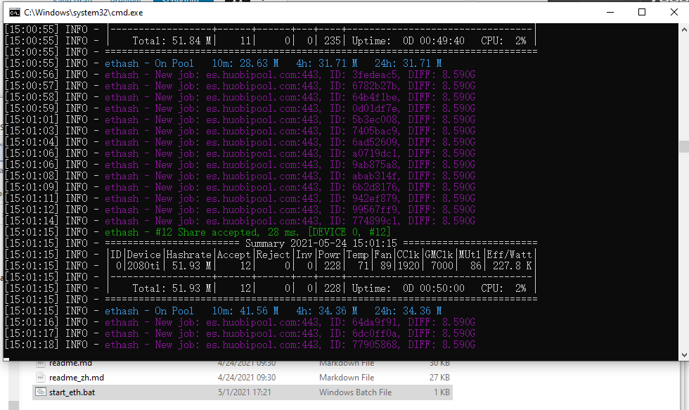
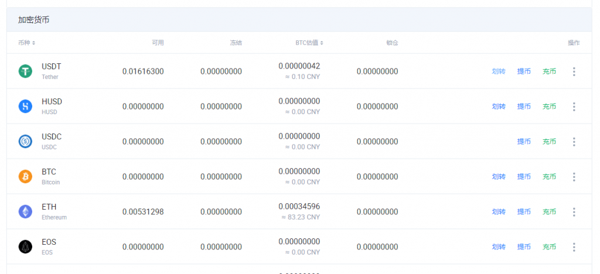
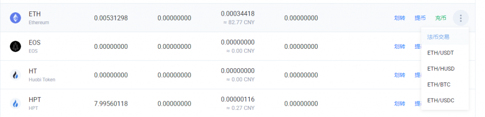
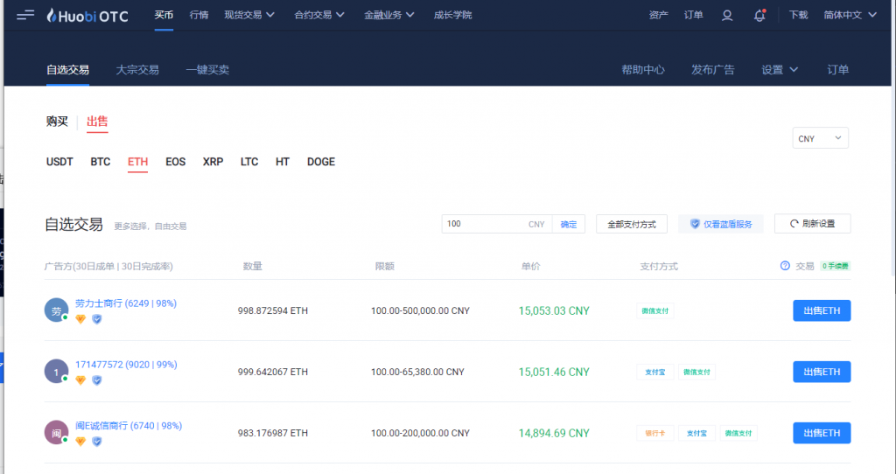
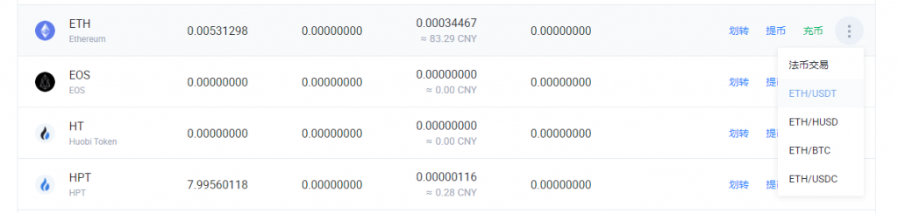
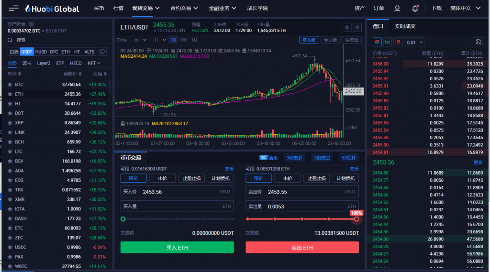

Disclaimers:
1. Every machine has its own quirks. Don't push it. Don't be brutal. If something blows up, don't come crying to me.
2. Don't get too attached to the money. Prices go up and down — that's normal. High return, high risk. There's no free lunch.
3. *Never* spend real money buying crypto. If you only sell, never buy, you can never lose — at worst you make less.
4. This article is aimed at gamers with too much free time who happen to be curious about crypto. Mining-farm operators, please move along; the yield here is too low for you.

What you'll need:
1. A GPU with more than 6 GB of VRAM.
2. A reasonably calm mindset.
3. Some electricity and the gear to keep that GPU running hard.
4. Good cooling/ventilation.

Setup:
[1. Register at the Huobi Pool](https://www.hpt.com/pow/miners?coin=eth)
2. Download NBMiner: [https://github.com/NebuTech/NBMiner/releases](https://github.com/NebuTech/NBMiner/releases)
3. Delete the scripts you don't need.



Here `start_eth` is the script for mining Ether. Remember to edit it.

4. Open a sub-account for mining in Huobi Pool. (Configure it as you like.)



`mining account name` corresponds to your sub-account's name.

5. Edit the script and put the sub-account name in the right place. (Don't accidentally mine for someone else — that money is gone for good.)



The highlighted area is my own sub-account name. Don't copy it.

```
nbminer -a ethash -o stratum+tcp://es.huobipool.com:443 -u mining_account_name -log
```

6. Use a tool to crank the GPU fans up and make sure airflow is good. This step matters a lot — it directly affects how long your GPU lasts. I usually keep the temperature below 70°C to be safe.



The screenshot here is MSI Afterburner.

7. Double-click the script to start mining.



8. Sell the crypto. Open the Huobi exchange [https://www.huobi.com/zh-cn/](https://www.huobi.com/zh-cn/) and log in with your pool account.


Click **Assets** and select the spot account. (We'll use Ether as the example.)

PS. Everything has to be transferred to a fiat account before it can be sold. Click **Transfer** to move the crypto over.



(1) Sell crypto directly.



Click the three dots and choose **Fiat Trading** (you'll need to bind a payout account first), then follow the prompts.



Sell as much as you want. *Never buy.* If you only sell, you can't lose money — unless your power bill is bigger than your earnings.

(2) Risk transfer (using USDT).



Click the three dots and choose **ETH/USDT** trading (again, bind a payout account first).



USDT is Huobi's base crypto and acts roughly like a USD-pegged store of value, with a price close to 1 dollar.

Usually you can just slide everything to the max and click sell. There are other options — limit price, etc. — but selling at the limit is fast and there's no waiting.

After that, just follow flow (1) to sell USDT.

References:
[https://www.bilibili.com/video/BV1Pv411a7xU](https://www.bilibili.com/video/BV1Pv411a7xU)
[https://www.hpt.com/pow/help/3/all?from=home](https://www.hpt.com/pow/help/3/all?from=home)
[https://github.com/NebuTech/NBMiner](https://github.com/NebuTech/NBMiner)
