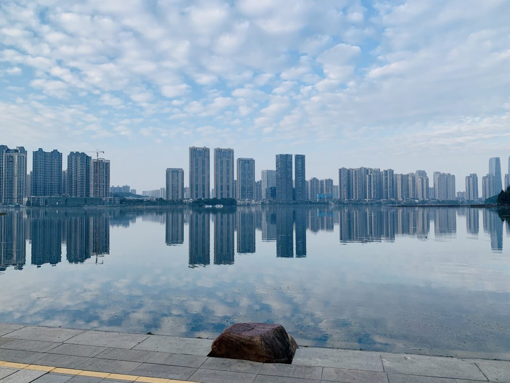
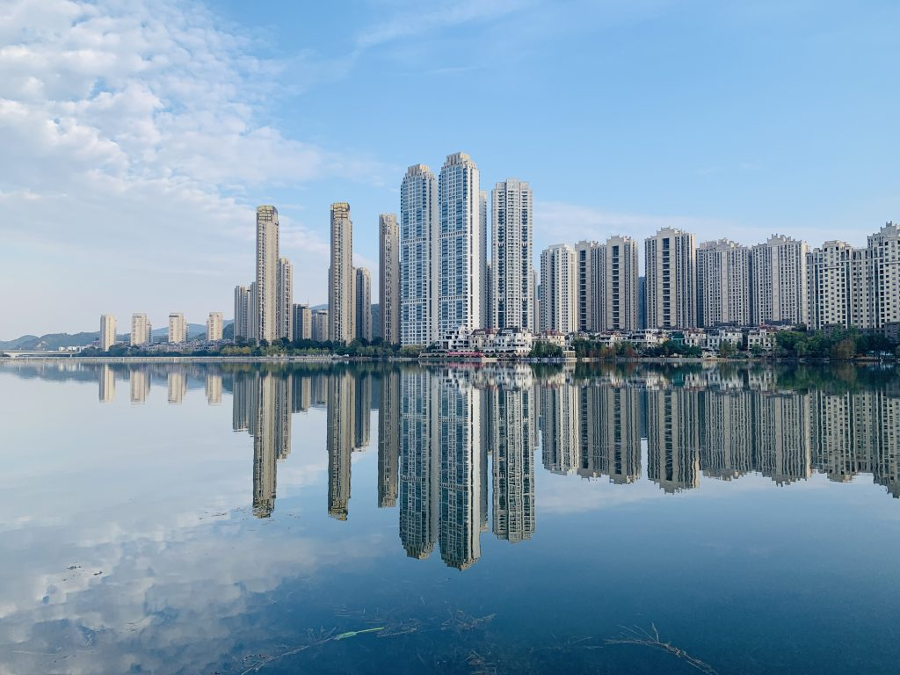
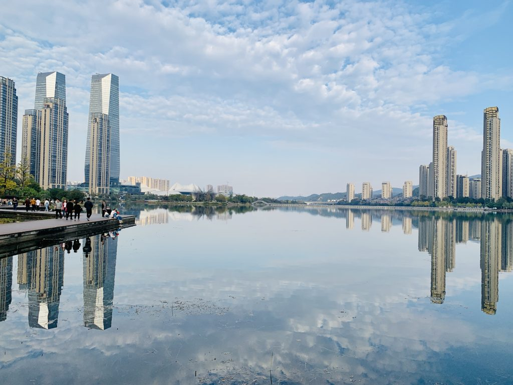

 The first time I came back here was to see an elementary-school classmate. We hadn't talked in a long time, and our lives had grown quite different. We didn't say much when we met — just rode our bikes together and slowly remembered things from before. *Stay in touch*, he said. The strange thing was that he seemed to know I was studying programming just by looking at me, while I had no idea how my own appearance had changed.   Life is brief, and the people who pass through it slowly drift away. What they leave behind is a fragment of a fond memory — light, like water, but with a faint sweetness if you taste it carefully.

#### Crowd density

##### High

#### Road comfort

##### Low — many sections are blocked off and impassable

#### Riding distance

##### Moderate

#### Overall recommendation

##### Decent
