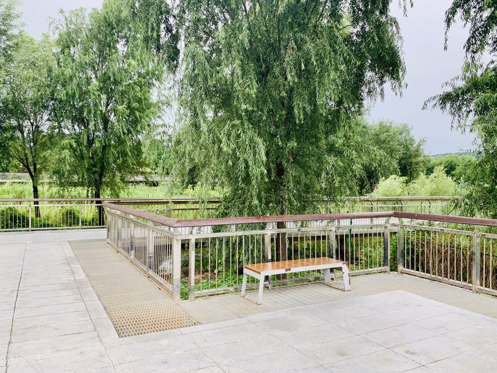
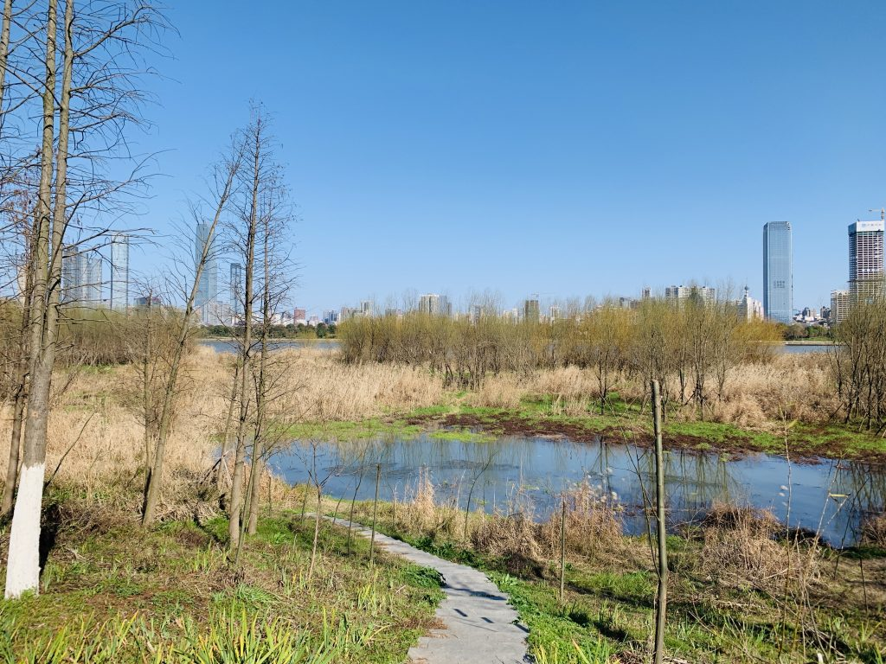
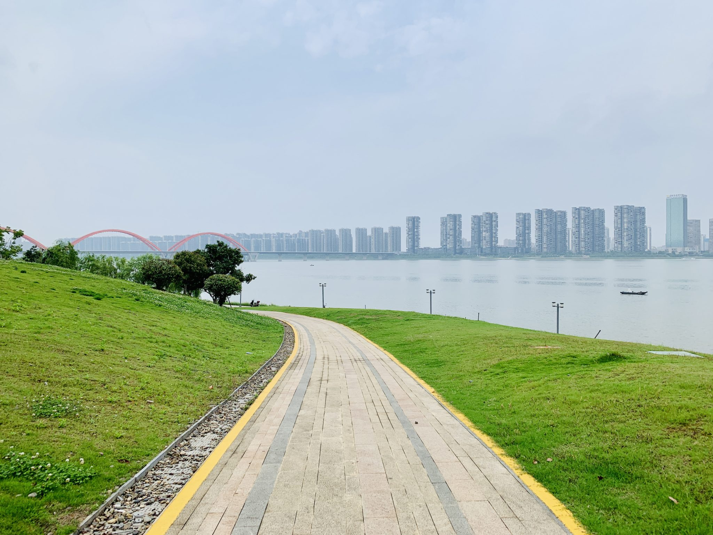
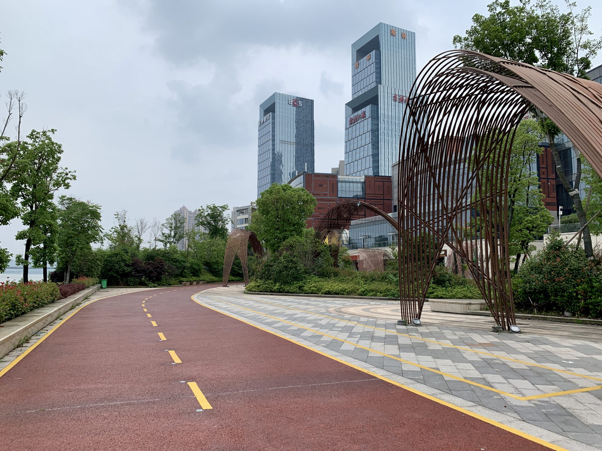
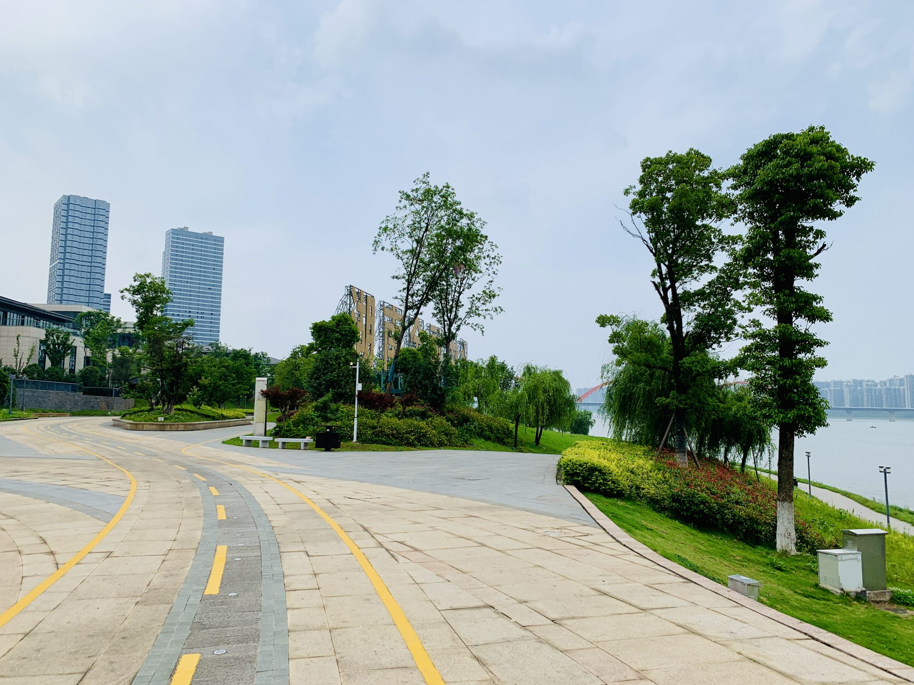
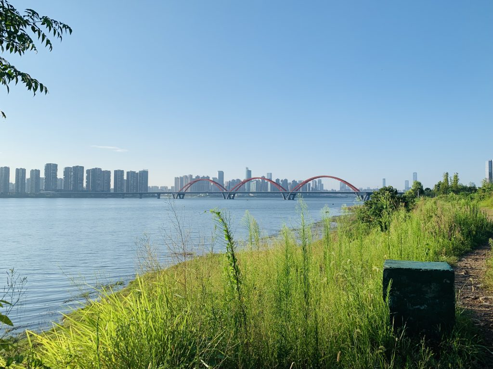
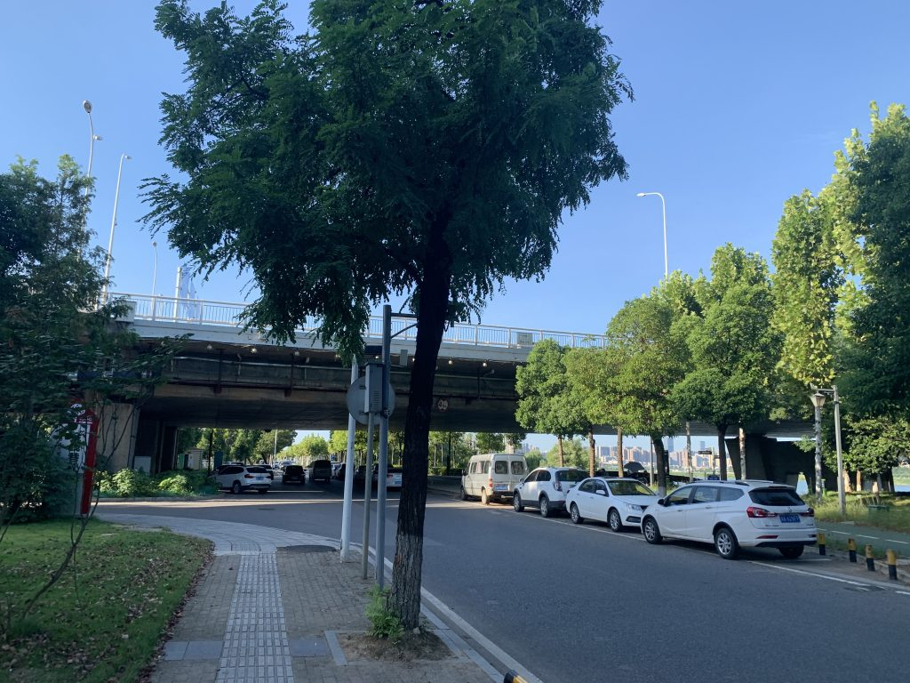
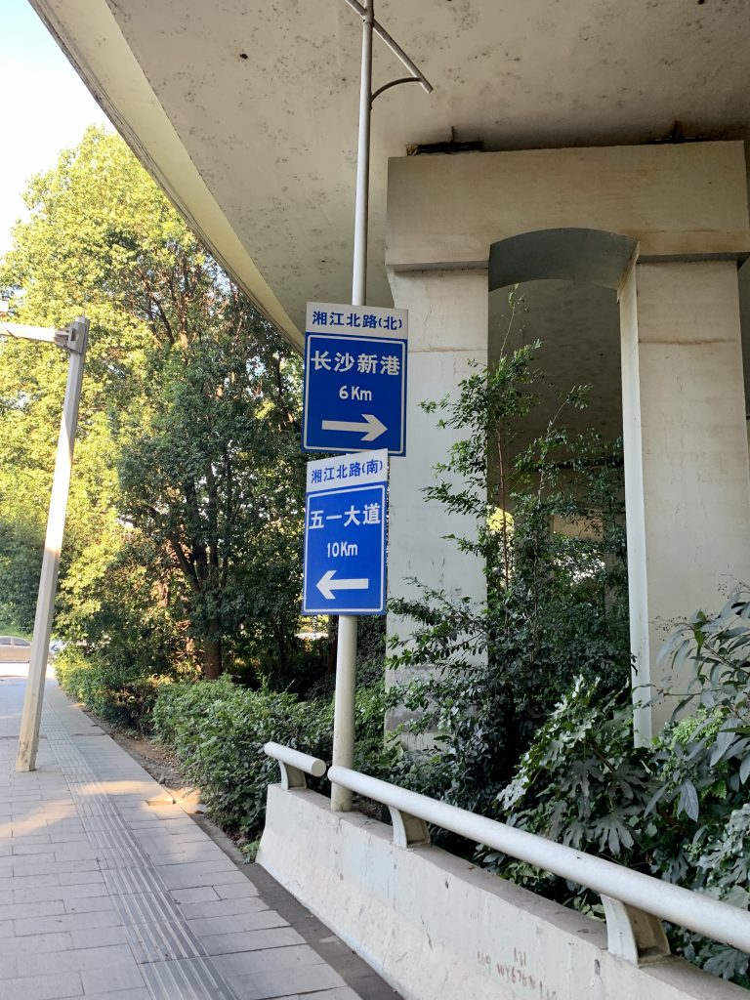

 湘江是我学自行车的起源，当年共享单车盛行的时候，我和爷爷周末就会在江边玩，长长的自行车道吸引我探索他的尽头，奈何时间有限，仅凭人力很难看到这条江边小径的尽头。于是我开始学自行车，终于得以探索湘江。  那年秋天，我学会了骑自行车，漫游在湘江边上长长的自行车道，河岸边有涨潮是的间歇湖，河西的江边，四季都有不同的景色。 冬天，我一路向北，探索河西的北岸，道路蜿蜒曲折，仿佛永远也探索不完。

Previous Next 啊，我错了，原来河西北岸也只能延伸到这里。  河西的最南边也不例外。   河东的北岸似乎到这里就没路可走了

#### 人群密度

##### 适中

#### 道路舒适度

##### 适中，道路种类繁多，自行车通行无阻

#### 骑行路程

##### 适中，沿江风光带很长，可以自由选择路线

#### 综合推荐

##### 新手快乐区
