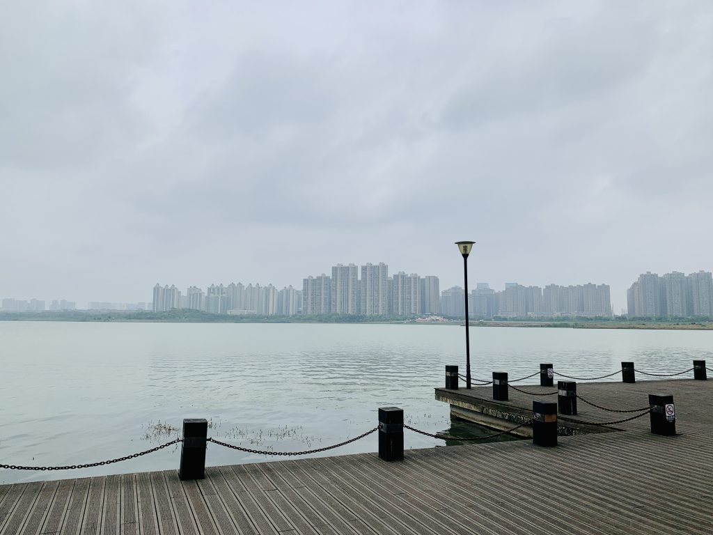
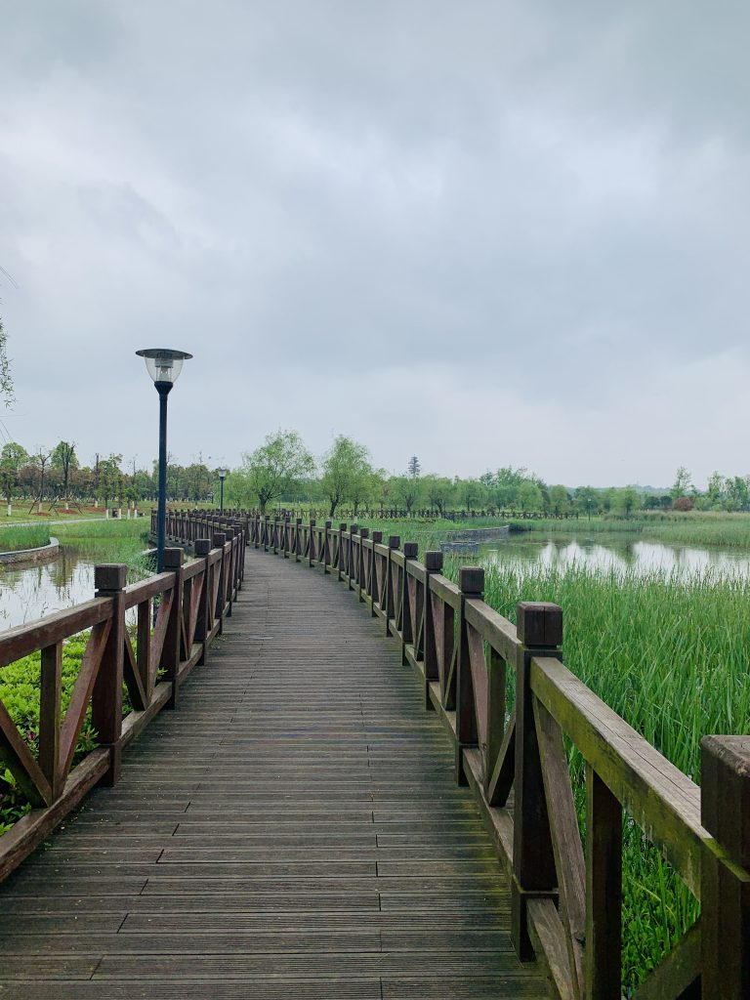
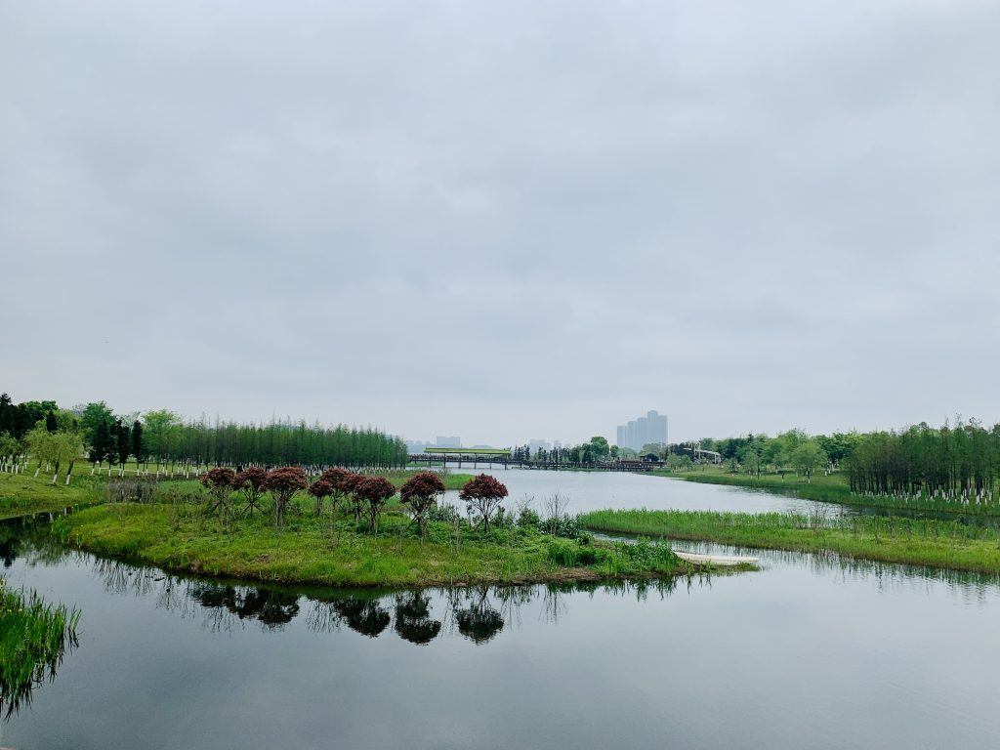

  长沙的梅雨季，天空总是阴沉沉的，总感觉马上就要下雨，但就是没下，那天我到松雅湖也是这样的场景。在来到这里前，我怎么也想不到长沙还能藏下这么大的湖，要不是我骑自行车可能永远也找不到。  因为是阴天，松雅湖边也没有什么人，骑行非常顺利，这里还有租用自行车的地方，经常看见一家人骑着大四轮自行车在湖边观光。因为是湖边，地形也没有什么高低起伏，一路平坦。 湖岸的湿地，也别有一番风味，阴沉的天空下，生命也在慢慢诞生。岸边没有重复的景色，每一处都是全新的视觉体验。   回头望去，才发现自己已经绕湖一周。

#### 人群密度

##### 适中

#### 道路舒适度

##### 极好，全程流畅通行，专用自行车道

#### 骑行路程

##### 适中

#### 综合推荐

##### 休闲胜地
